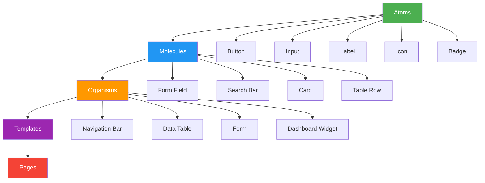

# Component Library

> **Project:** [Project Name]
> **Version:** [X.Y] | **Status:** [Draft | Under Review | Approved]
> **Last Updated:** [YYYY-MM-DD]
>
> ⚠️ **Note:** This document *specifies* components. The visual component library lives in Figma. The code component library lives in the frontend repo.

## 1. Purpose

> The component library defines reusable UI components — their appearance, behavior, and usage guidelines.

## 2. Component Hierarchy (Atomic Design)



## 3. Atoms

### 3.1 Button

| Variant | Style | Usage |
|---------|-------|-------|
| [Primary] | [Blue bg, white text, rounded] | [Primary CTAs] |
| [Secondary] | [White bg, blue border, blue text] | [Secondary actions] |
| [Danger] | [Red bg, white text] | [Destructive actions] |
| [Ghost] | [No bg, blue text] | [Tertiary actions] |
| [Icon] | [Square, icon only] | [Toolbar actions] |

**States:**

| State | Visual | Behavior |
|-------|--------|---------|
| [Default] | [Standard style] | [Clickable] |
| [Hover] | [Darken 10%] | [Pointer cursor] |
| [Active] | [Darken 20%] | [Pressed state] |
| [Disabled] | [50% opacity] | [Not clickable] |
| [Loading] | [Spinner replaces text] | [Not clickable] |

### 3.2 Input

| Variant | Style | Usage |
|---------|-------|-------|
| [Text] | [Border, rounded, placeholder] | [Single-line text] |
| [Textarea] | [Border, rounded, multi-line] | [Long text] |
| [Select] | [Border, dropdown arrow] | [Options from list] |
| [Checkbox] | [Square, check mark] | [Boolean selection] |
| [Radio] | [Circle, filled dot] | [Single selection from group] |
| [Date] | [Text + calendar icon] | [Date selection] |

**States:**

| State | Visual | Behavior |
|-------|--------|---------|
| [Default] | [Gray border] | [Clickable, focusable] |
| [Focus] | [Blue border, 2px] | [Receives keyboard input] |
| [Filled] | [Gray border, text present] | [Editable] |
| [Error] | [Red border, error message below] | [Needs correction] |
| [Disabled] | [Gray bg, 50% opacity] | [Not editable] |

### 3.3 Badge

| Variant | Color | Usage |
|---------|-------|-------|
| [Draft] | [Gray] | [Draft status] |
| [Submitted] | [Blue] | [Submitted status] |
| [Approved] | [Green] | [Approved status] |
| [Rejected] | [Red] | [Rejected status] |
| [Pending] | [Orange] | [Pending status] |

## 4. Molecules

### 4.1 Form Field

```
┌─────────────────────────────────────┐
│  Label *                             │
│  ┌─────────────────────────────┐    │
│  │  Placeholder text            │    │
│  └─────────────────────────────┘    │
│  Helper text or error message        │
└─────────────────────────────────────┘
```

| Element | Specification |
|---------|--------------|
| [Label] | [14px, 600 weight, above input] |
| [Input] | [40px height, 12px padding, 1px border] |
| [Helper] | [12px, gray, below input] |
| [Error] | [12px, red, below input] |
| [Required] | [Red asterisk after label] |

### 4.2 Card

```
┌─────────────────────────────────────┐
│  Title                               │
│  ───────────────────────────────    │
│  Content area                        │
│  Flexible height                     │
│                                       │
│  ───────────────────────────────    │
│  [Action 1]  [Action 2]              │
└─────────────────────────────────────┘
```

| Element | Specification |
|---------|--------------|
| [Border Radius] | [8px] |
| [Shadow] | [Low — 0 1px 3px rgba(0,0,0,0.12)] |
| [Padding] | [16px] |
| [Title] | [18px, 600 weight] |
| [Content] | [14px, 400 weight] |
| [Actions] | [Right-aligned, 8px gap] |

## 5. Organisms

### 5.1 Navigation Bar

```
┌─────────────────────────────────────────────────────────────┐
│  [Logo]    Home | New Request | My Requests    [🔔] [👤 ▼] │
└─────────────────────────────────────────────────────────────┘
```

| Element | Specification |
|---------|--------------|
| [Height] | [64px] |
| [Background] | [White, low shadow] |
| [Logo] | [Left, 40px height] |
| [Nav Items] | [Center, 14px, horizontal] |
| [User Actions] | [Right, icons + avatar] |
| [Active Item] | [Blue text, bottom border] |

### 5.2 Data Table

```
┌─────────────────────────────────────────────────────────────┐
│  [Search...]  [Filters ▼]  [Export]                         │
├──────┬────────┬─────────┬──────────┬────────┬──────────────┤
│  ID  │ Type   │ Amount  │ Customer │ Status │ Actions      │
├──────┼────────┼─────────┼──────────┼────────┼──────────────┤
│ 001  │ VIP    │ $15,000 │ Sarah    │ ● Queue│ [👁️] [✅]    │
├──────┼────────┼─────────┼──────────┼────────┼──────────────┤
│ 002  │ Corp   │ $50,000 │ Bob      │ ● Queue│ [👁️] [✅]    │
├──────┼────────┼─────────┼──────────┼────────┼──────────────┤
│ 003  │ Std    │ $3,000  │ Alice    │ ● Rev  │ [👁️] [✅]    │
└──────┴────────┴─────────┴──────────┴────────┴──────────────┘
│  [< Prev]  Page 1 of 5  [Next >]    Showing 1-20 of 100   │
└─────────────────────────────────────────────────────────────┘
```

## 6. Component Status

| Component | Design | Code | Documentation | Status |
|-----------|--------|------|--------------|--------|
| [Button] | ✅ | ✅ | ✅ | ✅ Complete |
| [Input] | ✅ | ✅ | ✅ | ✅ Complete |
| [Badge] | ✅ | ✅ | ✅ | ✅ Complete |
| [Form Field] | ✅ | ✅ | ✅ | ✅ Complete |
| [Card] | ✅ | ✅ | ✅ | ✅ Complete |
| [Navigation Bar] | ✅ | 🔄 | ⬜ | 🔄 In Progress |
| [Data Table] | ✅ | 🔄 | ⬜ | 🔄 In Progress |
| [Modal] | ✅ | ⬜ | ⬜ | ⬜ Not Started |
| [Toast] | ✅ | ⬜ | ⬜ | ⬜ Not Started |

---

## Related Documents

| Document | Relationship |
|----------|-------------|
| [[Design System]] | System this library is part of |
| [[Style Guide]] | Visual standards |
| [[UI Mockups]] | Mockups using these components |

---

> **Template Standard:** Based on ISO 9241-210, Atomic Design (Brad Frost)
> **Usage:** Components are the *building blocks* of the UI. Design once, use everywhere. Keep design and code components in sync.
