# Design System

> **Project:** [Project Name]
> **Version:** [X.Y] | **Status:** [Draft | Under Review | Approved]
> **Last Updated:** [YYYY-MM-DD]

---

## 1. Purpose

> The design system is the single source of truth for design decisions — tokens, components, patterns, and guidelines that ensure consistency across the product.

## 2. Design System Structure

```mermaid
flowchart TD
    DS[Design System] --> FOUND[Foundations]
    DS --> TOKENS[Design Tokens]
    DS --> COMP[Components]
    DS --> PATTERNS[Patterns]
    DS --> GUIDELINES[Guidelines]

    FOUND --> F1[Colors]
    FOUND --> F2[Typography]
    FOUND --> F3[Spacing]
    FOUND --> F4[Icons]
    FOUND --> F5[Grid]

    TOKENS --> T1[CSS Variables]
    TOKENS --> T2[JSON Tokens]
    TOKENS --> T3[Figma Variables]

    COMP --> C1[Atoms]
    COMP --> C2[Molecules]
    COMP --> C3[Organisms]

    PATTERNS --> P1[Forms]
    PATTERNS --> P2[Tables]
    PATTERNS --> P3[Navigation]
    PATTERNS --> P4[Error Handling]

    GUIDELINES --> G1[Accessibility]
    GUIDELINES --> G2[Responsive]
    GUIDELINES --> G3[Animation]
    GUIDELINES --> G4[Content]

    style DS fill:#1a237e,color:#fff
    style FOUND fill:#4CAF50,color:#fff
    style TOKENS fill:#2196F3,color:#fff
    style COMP fill:#FF9800,color:#fff
    style PATTERNS fill:#9C27B0,color:#fff
    style GUIDELINES fill:#607D8B,color:#fff
```



## 3. Design Tokens

### 3.1 Color Tokens

```css
:root {
  /* Primary */
  --color-primary: #2196F3;
  --color-primary-light: #64B5F6;
  --color-primary-dark: #1976D2;

  /* Semantic */
  --color-success: #4CAF50;
  --color-warning: #FF9800;
  --color-error: #f44336;
  --color-info: #2196F3;

  /* Neutral */
  --color-bg: #F5F5F5;
  --color-surface: #FFFFFF;
  --color-text-primary: #212121;
  --color-text-secondary: #757575;
  --color-border: #E0E0E0;
}
```

### 3.2 Typography Tokens

```css
:root {
  /* Font Family */
  --font-family: 'Inter', sans-serif;

  /* Font Sizes */
  --text-xs: 12px;
  --text-sm: 14px;
  --text-base: 16px;
  --text-lg: 18px;
  --text-xl: 24px;
  --text-2xl: 32px;

  /* Font Weights */
  --font-normal: 400;
  --font-medium: 500;
  --font-semibold: 600;
  --font-bold: 700;

  /* Line Heights */
  --leading-tight: 1.25;
  --leading-normal: 1.5;
  --leading-relaxed: 1.75;
}
```

### 3.3 Spacing Tokens

```css
:root {
  --space-xs: 4px;
  --space-sm: 8px;
  --space-md: 16px;
  --space-lg: 24px;
  --space-xl: 32px;
  --space-2xl: 48px;
  --space-3xl: 64px;
}
```

### 3.4 Shadow Tokens

```css
:root {
  --shadow-sm: 0 1px 3px rgba(0,0,0,0.12);
  --shadow-md: 0 4px 6px rgba(0,0,0,0.16);
  --shadow-lg: 0 10px 20px rgba(0,0,0,0.19);
}
```

## 4. Component Standards

| Component | Design File | Code | Documentation | Status |
|-----------|-----------|------|--------------|--------|
| [Button] | [Figma] | [React] | [Storybook] | ✅ |
| [Input] | [Figma] | [React] | [Storybook] | ✅ |
| [Card] | [Figma] | [React] | [Storybook] | ✅ |
| [Table] | [Figma] | [React] | [Storybook] | 🔄 |
| [Modal] | [Figma] | [React] | [Storybook] | ⬜ |
| [Toast] | [Figma] | [React] | [Storybook] | ⬜ |

## 5. Pattern Library

| Pattern | Description | Usage |
|---------|-----------|-------|
| [Form Pattern] | [Multi-step form with validation] | [Request submission] |
| [Table Pattern] | [Filterable, sortable data table] | [Work queue, lists] |
| [Navigation Pattern] | [Top nav + breadcrumbs] | [All pages] |
| [Error Pattern] | [Inline errors + toast notifications] | [All error states] |

## 6. Design System Tools

| Tool | Purpose | URL |
|------|---------|-----|
| [Figma] | [Design files] | [Link] |
| [Storybook] | [Component documentation] | [Link] |
| [CSS Variables] | [Design tokens in code] | [Source] |
| [Figma Tokens] | [Token sync] | [Plugin] |

---

## Related Documents

| Document | Relationship |
|----------|-------------|
| [[Style-Guide]] | Visual standards |
| [[Component-Library]] | Component specifications |
| [[UI-Mockups]] | Mockups using the system |

---

> **Template Standard:** Based on ISO 9241-210
> **Usage:** The design system is a *living document* — update it as the product evolves. Keep design and code in sync.
