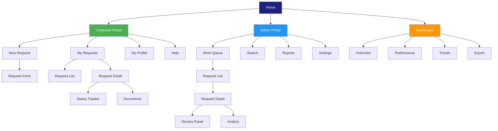

# Information Architecture (IA)

> **Project:** [Project Name]
> **Version:** [X.Y] | **Status:** [Draft | Under Review | Approved]
> **Last Updated:** [YYYY-MM-DD]

---

## 1. Purpose

> Information Architecture defines how content is organized, labeled, and navigated. It answers: "Where do I find X?" and "How do I get there?"

## 2. IA Model



## 3. Navigation Structure

### 3.1 Customer Portal Navigation

| Level 1 | Level 2 | Level 3 | URL |
|---------|--------|--------|-----|
| [Home] | | | [/] |
| [New Request] | | | [/requests/new] |
| [My Requests] | | | [/requests] |
| | [Request Detail] | | [/requests/:id] |
| | | [Status Tracker] | [/requests/:id/status] |
| | | [Documents] | [/requests/:id/documents] |
| [My Profile] | | | [/profile] |
| [Help] | | | [/help] |

### 3.2 Admin Portal Navigation

| Level 1 | Level 2 | Level 3 | URL |
|---------|--------|--------|-----|
| [Dashboard] | | | [/admin] |
| [Work Queue] | | | [/admin/queue] |
| | [Request Detail] | | [/admin/requests/:id] |
| | | [Review Panel] | [/admin/requests/:id/review] |
| | | [Documents] | [/admin/requests/:id/documents] |
| | | [History] | [/admin/requests/:id/history] |
| [Search] | | | [/admin/search] |
| [Reports] | | | [/admin/reports] |
| | [Standard Reports] | | [/admin/reports/standard] |
| | [Custom Reports] | | [/admin/reports/custom] |
| [Settings] | | | [/admin/settings] |
| | [Users] | | [/admin/settings/users] |
| | [Roles] | | [/admin/settings/roles] |
| | [Rules] | | [/admin/settings/rules] |

## 4. Content Hierarchy

### 4.1 Request Detail Page — Content Hierarchy

```
Request Detail
├── Header
│   ├── Request ID
│   ├── Status Badge
│   ├── Priority Indicator
│   └── Quick Actions (Approve / Reject / Escalate)
├── Main Content (70%)
│   ├── Request Information
│   │   ├── Type
│   │   ├── Amount
│   │   ├── Description
│   │   └── Submitted Date
│   ├── Customer Information
│   │   ├── Name
│   │   ├── Email
│   │   ├── Phone
│   │   └── History Link
│   └── Documents
│       ├── Document List
│       └── Preview Panel
├── Sidebar (30%)
│   ├── Status Timeline
│   ├── Assignment Info
│   ├── SLA Indicator
│   └── Notes/Comments
└── Footer
    ├── Audit Trail Link
    └── Related Requests
```

### 4.2 Dashboard — Content Hierarchy

```
Dashboard
├── Header
│   ├── Date Range Selector
│   ├── Refresh Button
│   └── Export Button
├── KPI Cards (Top Row)
│   ├── Requests Today
│   ├── Average Processing Time
│   ├── Queue Depth
│   └── SLA Compliance
├── Charts (Middle Row)
│   ├── Requests by Status (Donut)
│   ├── Requests Over Time (Line)
│   └── Processing Time Trend (Bar)
├── Tables (Bottom Row)
│   ├── Recent Requests
│   └── Staff Performance
└── Alerts
    ├── SLA Warnings
    └── Escalation Notices
```

## 5. Labeling System

| Element | Label Convention | Example |
|---------|-----------------|---------|
| [Navigation items] | [Short, action-oriented] | [New Request, My Requests] |
| [Page titles] | [Descriptive, noun-based] | [Request Detail, Work Queue] |
| [Buttons] | [Action verb + object] | [Submit Request, Approve, Export PDF] |
| [Status badges] | [Single word, color-coded] | [Draft, Submitted, Approved] |
| [Form labels] | [Noun, sentence case] | [Request Type, Amount, Description] |
| [Error messages] | [Problem + solution] | ["Amount is required. Enter a value greater than 0."] |

## 6. Search Architecture

| Aspect | Implementation |
|--------|---------------|
| [Search scope] | [Requests, customers, documents] |
| [Search fields] | [ID, name, email, status, date range] |
| [Filters] | [Status, type, date range, assigned to] |
| [Sort options] | [Date, priority, status, amount] |
| [Results display] | [List with preview, pagination] |

## 7. URL Structure

| Pattern | Example | Purpose |
|---------|---------|---------|
| [/requests] | [/requests] | [List all requests] |
| [/requests/new] | [/requests/new] | [Create new request] |
| [/requests/:id] | [/requests/abc-123] | [View request detail] |
| [/requests/:id/edit] | [/requests/abc-123/edit] | [Edit request] |
| [/admin/queue] | [/admin/queue] | [Staff work queue] |
| [/admin/requests/:id] | [/admin/requests/abc-123] | [Staff request view] |
| [/admin/reports] | [/admin/reports] | [Reports section] |

---

## Related Documents

| Document | Relationship |
|----------|-------------|
| [[Sitemap]] | Visual IA map |
| [[User Flows]] | Task flows through IA |
| [[Wireframes (Low-fi)]] | Layout of IA |

---

> **Template Standard:** Based on ISO 9241-210, Abby Covert
> **Usage:** IA is the *invisible structure* of the product. Good IA means users find what they need without thinking. Test IA with card sorting and tree testing before building.
