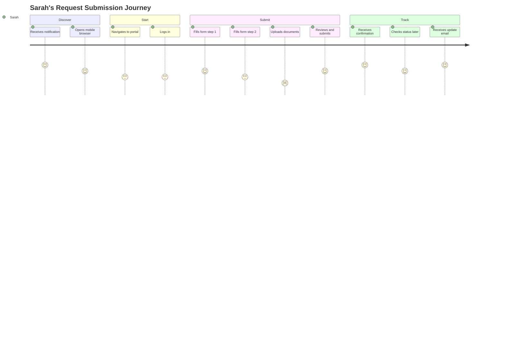
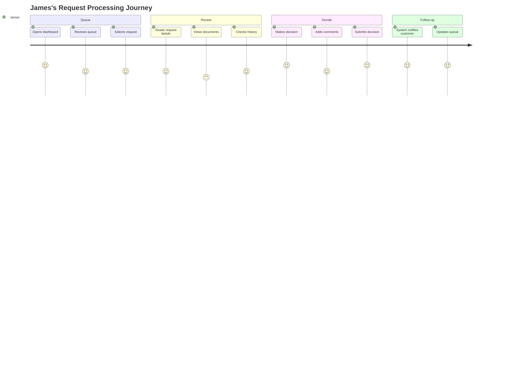
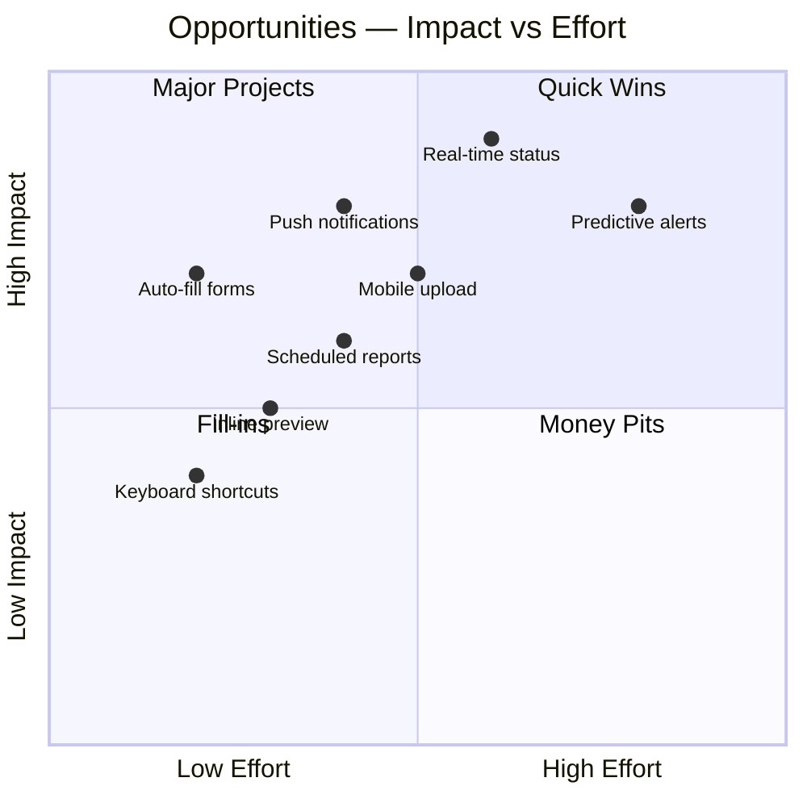

# Journey Map

> **Project:** [Project Name]
> **Version:** [X.Y] | **Status:** [Draft | Under Review | Approved]
> **Last Updated:** [YYYY-MM-DD]

---

## 1. Purpose

> Journey maps visualize the end-to-end experience of a persona completing a key task — showing touchpoints, emotions, pain points, and opportunities.

## 2. Journey: Sarah Submits a Request

### Journey Overview

| Field | Detail |
|-------|--------|
| [Persona] | [Sarah — Customer] |
| [Scenario] | [Submit a new request from mobile] |
| [Duration] | [5-15 minutes] |
| [Channels] | [Mobile web, email] |

### Journey Stages



### Detailed Journey

| Stage | Touchpoint | Action | Emotion | Pain Point | Opportunity |
|-------|-----------|--------|---------|-----------|------------|
| **Discover** | [Email/SMS] | [Receives notification about eligibility] | 😊 Happy | — | [Clear CTA in notification] |
| **Start** | [Mobile browser] | [Navigates to portal, logs in] | 😐 Neutral | [Slow login on mobile] | [Remember me, biometric auth] |
| **Submit — Step 1** | [Form page 1] | [Fills personal info] | 😊 Happy | — | [Auto-fill from profile] |
| **Submit — Step 2** | [Form page 2] | [Fills request details] | 😐 Neutral | [Some fields unclear] | [Inline help, tooltips] |
| **Submit — Upload** | [Upload widget] | [Tries to upload from phone] | 😤 Frustrated | [Can't access files easily] | [Camera capture, cloud storage] |
| **Submit — Review** | [Review page] | [Reviews and submits] | 😊 Happy | — | [Edit any section before submit] |
| **Track — Confirm** | [Confirmation page] | [Receives reference number] | 😊 Happy | — | [Save to phone, share] |
| **Track — Check** | [Status page] | [Checks status later] | 😤 Frustrated | [No real-time updates] | [Live status, push notifications] |
| **Track — Update** | [Email] | [Receives status update] | 😊 Happy | — | [One-click to view details] |

### Emotion Curve

```
😊  ─── Discover ──────── Start ──── Submit ──── Track ────
     \                    /    \        |    \        /
😐    \                  /      \       |     \      /
       \                /        \      |      \    /
😤      ───────────────          Upload  ─────── Status Check
```

## 3. Journey: James Processes a Request

### Journey Overview

| Field | Detail |
|-------|--------|
| [Persona] | [James — Operations Staff] |
| [Scenario] | [Process a request from queue] |
| [Duration] | [3-10 minutes] |
| [Channels] | [Desktop web] |

### Journey Stages



### Detailed Journey

| Stage | Touchpoint | Action | Emotion | Pain Point | Opportunity |
|-------|-----------|--------|---------|-----------|------------|
| **Queue** | [Dashboard] | [Opens dashboard, reviews queue] | 😊 Happy | — | [Priority-sorted, color-coded] |
| **Queue** | [Queue list] | [Selects highest priority request] | 😊 Happy | — | [One-click to open] |
| **Review** | [Request detail] | [Reads request details] | 😐 Neutral | [Too many clicks to see context] | [Side-by-side view] |
| **Review** | [Document viewer] | [Views uploaded documents] | 😤 Frustrated | [Documents open in new tab] | [Inline document preview] |
| **Review** | [History tab] | [Checks request history] | 😐 Neutral | [History is buried] | [Always-visible timeline] |
| **Decide** | [Action buttons] | [Clicks approve/reject] | 😊 Happy | — | [Keyboard shortcut: A/R] |
| **Decide** | [Comment box] | [Adds comments] | 😐 Neutral | [Comment box is small] | [Expandable, templates] |
| **Follow-up** | [System] | [Customer notified automatically] | 😊 Happy | — | [Confirmation visible to staff] |

## 4. Journey: Linda Monitors Performance

| Stage | Touchpoint | Action | Emotion | Pain Point | Opportunity |
|-------|-----------|--------|---------|-----------|------------|
| **Morning** | [Dashboard] | [Checks overnight metrics] | 😐 Neutral | [Must wait for report] | [Real-time dashboard] |
| **Midday** | [Alert] | [Receives SLA warning] | 😤 Frustrated | [Alerts come too late] | [Predictive alerts] |
| **Afternoon** | [Reports] | [Generates weekly report] | 😤 Frustrated | [Manual process] | [Scheduled auto-reports] |
| **Friday** | [Export] | [Exports for leadership] | 😐 Neutral | [Formatting required] | [Pre-formatted exports] |

## 5. Pain Points Summary

| # | Pain Point | Persona | Stage | Severity | Solution |
|---|-----------|---------|-------|---------|---------|
| 1 | [Mobile upload difficult] | [Sarah] | [Submit] | 🔴 | [Camera capture, cloud storage] |
| 2 | [No real-time status] | [Sarah] | [Track] | 🔴 | [Live status page, push notifications] |
| 3 | [Documents open in new tab] | [James] | [Review] | 🟡 | [Inline preview] |
| 4 | [Manual report generation] | [Linda] | [Reports] | 🟡 | [Scheduled reports] |
| 5 | [Late SLA alerts] | [Linda] | [Monitoring] | 🟡 | [Predictive alerts] |

## 6. Opportunities Map



---

## Related Documents

| Document | Relationship |
|----------|-------------|
| [[User-Personas]] | Personas whose journeys are mapped |
| [[User-Flows]] | Detailed task flows |
| [[User-Research-Report]] | Research informing the journey |

---

> **Template Standard:** Based on ISO 9241-210
> **Usage:** Journey maps reveal the *emotional* experience — not just the functional steps. Use them to identify moments of frustration and delight, then design for both.
