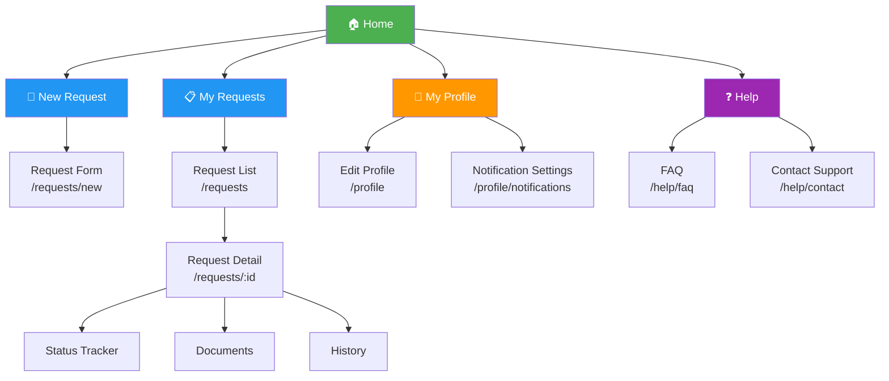
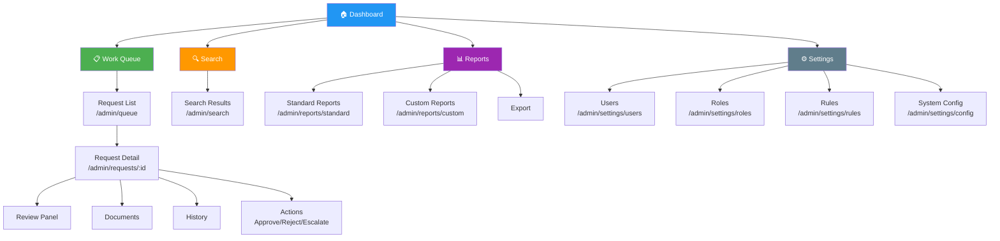

# Sitemap

> **Project:** [Project Name]
> **Version:** [X.Y] | **Status:** [Draft | Under Review | Approved]
> **Last Updated:** [YYYY-MM-DD]

---

## 1. Purpose

> The sitemap provides a visual overview of all pages and their hierarchical relationships.

## 2. Customer Portal Sitemap

## 3. Admin Portal Sitemap

## 4. Page Count Summary

| Section | Pages | Depth |
|---------|-------|-------|
| [Customer Portal] | [8] | [3 levels] |
| [Admin Portal] | [14] | [4 levels] |
| [Shared] | [4] | [2 levels] |
| **Total** | **[26]** | **[4 levels max]** |

## 5. Page Inventory

| # | Page | URL | Template | Auth | Priority |
|---|------|-----|---------|------|---------|
| 1 | [Home] | [/] | [Landing] | [Public] | 🔴 |
| 2 | [New Request] | [/requests/new] | [Multi-step form] | [Customer] | 🔴 |
| 3 | [My Requests] | [/requests] | [List] | [Customer] | 🔴 |
| 4 | [Request Detail] | [/requests/:id] | [Detail] | [Customer] | 🔴 |
| 5 | [My Profile] | [/profile] | [Form] | [Customer] | 🟡 |
| 6 | [Help / FAQ] | [/help] | [Content] | [Public] | 🟡 |
| 7 | [Contact Support] | [/help/contact] | [Form] | [Public] | 🟡 |
| 8 | [Admin Dashboard] | [/admin] | [Dashboard] | [Admin] | 🔴 |
| 9 | [Work Queue] | [/admin/queue] | [List] | [Staff] | 🔴 |
| 10 | [Admin Request Detail] | [/admin/requests/:id] | [Detail + Actions] | [Staff] | 🔴 |
| 11 | [Search] | [/admin/search] | [Search results] | [Staff] | 🔴 |
| 12 | [Standard Reports] | [/admin/reports/standard] | [Report] | [Manager] | 🟡 |
| 13 | [Custom Reports] | [/admin/reports/custom] | [Report builder] | [Manager] | 🟢 |
| 14 | [User Management] | [/admin/settings/users] | [CRUD list] | [Admin] | 🔴 |
| 15 | [Role Management] | [/admin/settings/roles] | [CRUD list] | [Admin] | 🟡 |
| 16 | [Rule Management] | [/admin/settings/rules] | [CRUD list] | [Admin] | 🟡 |

---

## Related Documents

| Document | Relationship |
|----------|-------------|
| [[Information-Architecture]] | IA structure this sitemap visualizes |
| [[User-Flows]] | Flows through these pages |
| [[Wireframes-Low-fi]] | Page layouts |

---

> **Template Standard:** Based on ISO 9241-210
> **Usage:** The sitemap is a *communication tool* — use it to align the team on scope and structure. Every page in the sitemap needs a wireframe.
