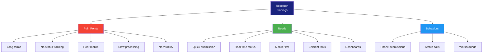

# User Research Report

> **Project:** [Project Name]
> **Version:** [X.Y] | **Status:** [Draft | Under Review | Approved]
> **Last Updated:** [YYYY-MM-DD]

---

## 1. Research Summary

| Field | Detail |
|-------|--------|
| [Research Period] | [YYYY-MM-DD to YYYY-MM-DD] |
| [Method] | [User interviews, contextual inquiry, survey] |
| [Participants] | [12 interviews + 45 survey responses] |
| [Key Findings] | [5 major themes] |
| [Recommendations] | [8 design recommendations] |

## 2. Research Objectives

| # | Objective | Method | Status |
|---|----------|--------|--------|
| 1 | [Understand current request submission workflow] | [Interviews] | ✅ |
| 2 | [Identify pain points in current process] | [Interviews + Survey] | ✅ |
| 3 | [Understand user expectations for new system] | [Interviews] | ✅ |
| 4 | [Validate proposed feature priorities] | [Survey] | ✅ |

## 3. Participant Demographics

| Segment | Count | Age Range | Experience | Role |
|---------|-------|----------|-----------|------|
| [Customers] | [6] | [25-55] | [1-10 years] | [Request submitters] |
| [Operations Staff] | [4] | [30-50] | [3-15 years] | [Request processors] |
| [Managers] | [2] | [40-55] | [10-20 years] | [Team leads] |

## 4. Key Findings

### Finding 1: Request Submission Takes Too Long

| Aspect | Detail |
|--------|--------|
| **Frequency** | [10/12 participants mentioned] |
| **Severity** | 🔴 High |
| **Evidence** | ["I spend 15-20 minutes on each submission. Half the fields don't apply to my situation." — P-003] |
| **Root Cause** | [Long forms with conditional fields, no auto-fill, no save draft] |
| **Impact** | [Users delay submissions, some abandon entirely] |

### Finding 2: Status Tracking Is Opaque

| Aspect | Detail |
|--------|--------|
| **Frequency** | [11/12 participants mentioned] |
| **Severity** | 🔴 High |
| **Evidence** | ["I have no idea where my request is. I end up calling support every time." — P-007] |
| **Root Cause** | [No self-service status tracking, no proactive notifications] |
| **Impact** | [High support call volume, user frustration] |

### Finding 3: Mobile Experience Is Critical

| Aspect | Detail |
|--------|--------|
| **Frequency** | [8/12 participants mentioned] |
| **Severity** | 🔴 High |
| **Evidence** | ["I submit most requests from my phone during lunch. The current site is unusable on mobile." — P-002] |
| **Root Cause** | [Desktop-only design, no responsive layout] |
| **Impact** | [Users wait until they have desktop access, delaying submissions] |

### Finding 4: Staff Need Faster Processing Tools

| Aspect | Detail |
|--------|--------|
| **Frequency** | [4/4 staff participants mentioned] |
| **Severity** | 🟡 Medium |
| **Evidence** | ["I process 15-20 requests a day. Every extra click costs me time." — P-009] |
| **Root Cause** | [No keyboard shortcuts, no bulk actions, poor information layout] |
| **Impact** | [Lower processing throughput, SLA risk] |

### Finding 5: Managers Lack Real-Time Visibility

| Aspect | Detail |
|--------|--------|
| **Frequency** | [2/2 manager participants mentioned] |
| **Severity** | 🟡 Medium |
| **Evidence** | ["I find out about problems when they become emergencies. I need real-time dashboards." — P-011] |
| **Root Cause** | [No real-time dashboard, manual reporting] |
| **Impact** | [Reactive management, missed bottlenecks] |

## 5. Affinity Map

## 6. Survey Results

### Feature Priority (45 responses)

| Feature | Must Have | Nice to Have | Not Needed | Priority |
|---------|----------|-------------|-----------|----------|
| [Mobile-friendly forms] | [85%] | [12%] | [3%] | 🔴 Must |
| [Real-time status tracking] | [92%] | [6%] | [2%] | 🔴 Must |
| [Push notifications] | [78%] | [18%] | [4%] | 🔴 Must |
| [Document upload from phone] | [72%] | [22%] | [6%] | 🔴 Must |
| [Save draft and resume] | [68%] | [25%] | [7%] | 🔴 Must |
| [Bulk processing] | [45%] | [35%] | [20%] | 🟡 Nice |
| [Dashboard reports] | [55%] | [30%] | [15%] | 🟡 Nice |

### Satisfaction with Current System (1-5 scale)

| Aspect                 | Average | Distribution |
| ---------------------- | ------- | ------------ |
| [Ease of use]          | [2.1]   | [████████░░] |
| [Speed]                | [2.3]   | [████████░░] |
| [Mobile experience]    | [1.5]   | [██████░░░░] |
| [Status visibility]    | [1.8]   | [███████░░░] |
| [Overall satisfaction] | [2.0]   | [████████░░] |

## 7. Design Recommendations

| # | Recommendation | Based On | Priority | Impact |
|---|---------------|---------|----------|--------|
| 1 | [Design mobile-first responsive forms] | [Finding 3, Survey] | 🔴 | [High] |
| 2 | [Implement progressive disclosure in forms] | [Finding 1] | 🔴 | [High] |
| 3 | [Add real-time status tracking page] | [Finding 2, Survey] | 🔴 | [High] |
| 4 | [Implement push notifications] | [Finding 2, Survey] | 🔴 | [High] |
| 5 | [Add save draft functionality] | [Finding 1, Survey] | 🔴 | [Medium] |
| 6 | [Design keyboard shortcuts for staff] | [Finding 4] | 🟡 | [Medium] |
| 7 | [Create real-time management dashboard] | [Finding 5] | 🟡 | [Medium] |
| 8 | [Support document upload from mobile] | [Survey] | 🔴 | [Medium] |

## 8. Next Steps

| # | Action | Owner | Timeline |
|---|--------|-------|---------|
| 1 | [Create personas based on findings] | [UX] | [Week 1] |
| 2 | [Map user journeys] | [UX] | [Week 1-2] |
| 3 | [Design wireframes addressing findings] | [UX] | [Week 2-3] |
| 4 | [Validate designs with usability testing] | [UX] | [Week 4] |

---

## Related Documents

| Document | Relationship |
|----------|-------------|
| [[User-Interview-Script]] | Interview methodology |
| [[User-Personas]] | Personas from research |
| [[Journey-Map]] | Journey from research |

---

> **Template Standard:** Based on ISO 9241-210
> **Usage:** This report is the *evidence base* for design decisions. Reference specific findings when justifying design choices. "We designed it this way because 92% of users said status tracking is a must-have."
