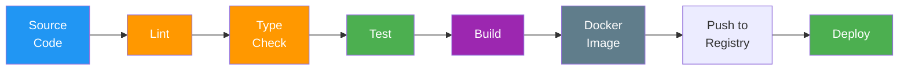

# Build Scripts

> **Project:** [Project Name]
> **Version:** [X.Y] | **Status:** [Active]
> **Last Updated:** [YYYY-MM-DD]

---

## 1. Purpose

> Documents the build pipeline — scripts, stages, and automation that transform source code into deployable artifacts.

## 2. Build Pipeline



## 3. Build Scripts

| Script | Command | Purpose |
|--------|---------|---------|
| [dev] | [npm run dev] | [Start development server] |
| [build] | [npm run build] | [Build for production] |
| [test] | [npm test] | [Run all tests] |
| [test:unit] | [npm run test:unit] | [Run unit tests] |
| [test:integration] | [npm run test:integration] | [Run integration tests] |
| [test:e2e] | [npm run test:e2e] | [Run E2E tests] |
| [lint] | [npm run lint] | [Run ESLint] |
| [format] | [npm run format] | [Run Prettier] |
| [type-check] | [npm run type-check] | [Run TypeScript check] |
| [docker:build] | [npm run docker:build] | [Build Docker image] |
| [docker:push] | [npm run docker:push] | [Push to registry] |
| [deploy] | [npm run deploy] | [Deploy to environment] |

## 4. CI/CD Pipeline (GitHub Actions)

```yaml
name: CI/CD Pipeline

on:
  push:
    branches: [main, develop]
  pull_request:
    branches: [main]

jobs:
  lint:
    runs-on: ubuntu-latest
    steps:
      - uses: actions/checkout@v4
      - uses: actions/setup-node@v4
      - run: npm ci
      - run: npm run lint
      - run: npm run type-check

  test:
    needs: lint
    runs-on: ubuntu-latest
    steps:
      - uses: actions/checkout@v4
      - uses: actions/setup-node@v4
      - run: npm ci
      - run: npm test -- --coverage
      - uses: codecov/codecov-action@v3

  build:
    needs: test
    runs-on: ubuntu-latest
    steps:
      - uses: actions/checkout@v4
      - run: docker build -t app:${{ github.sha }} .
      - run: docker push registry/app:${{ github.sha }}

  deploy:
    needs: build
    if: github.ref == 'refs/heads/main'
    runs-on: ubuntu-latest
    steps:
      - run: kubectl set image deployment/app app=registry/app:${{ github.sha }}
```

## 5. Build Artifacts

| Artifact | Format | Location | Retention |
|---------|--------|---------|----------|
| [Docker Image] | [Docker] | [Container Registry] | [30 days] |
| [Source Map] | [.map] | [S3] | [30 days] |
| [Test Report] | [HTML/JUnit] | [CI Artifacts] | [7 days] |
| [Coverage Report] | [HTML/LCOV] | [CI Artifacts] | [7 days] |

---

## Related Documents

| Document | Relationship |
|----------|-------------|
| [[Static-Analysis-Reports]] | Analysis in pipeline |
| [[README-Developer-Guide]] | Build instructions |
| [[Commit-Messages-Changelog]] | Commit standards |

---

> **Template Standard:** Based on SWEBOK v4
> **Usage:** The build pipeline is *the quality gate*. If it's not in the pipeline, it doesn't happen. Automate everything.
