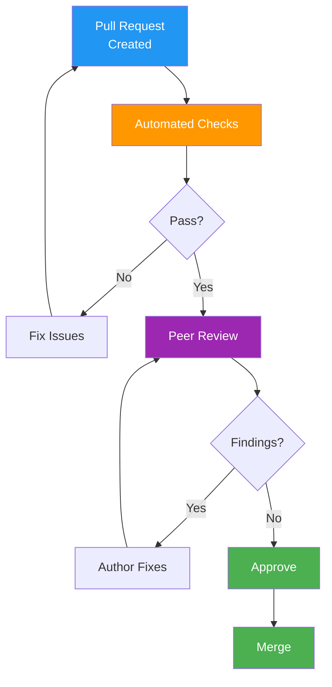

# Code Review Records

> **Project:** [Project Name]
> **Version:** [X.Y] | **Status:** [Active]
> **Last Updated:** [YYYY-MM-DD]

---

## 1. Purpose

> Records of code reviews — findings, patterns, and metrics that improve code quality over time.

## 2. Code Review Process

## 3. Review Standards

| Aspect | Standard |
|--------|---------|
| [PR Size] | [< 400 lines changed] |
| [Reviewers] | [Minimum 1 approval] |
| [Response Time] | [< 24 hours] |
| [Tests Required] | [Yes — for all changes] |
| [Documentation] | [Required for public APIs] |

## 4. Review Checklist

| # | Check | Category |
|---|-------|---------|
| 1 | [Code follows [[Coding-Standards]]] | Style |
| 2 | [No hardcoded secrets or credentials] | Security |
| 3 | [Error handling is comprehensive] | Reliability |
| 4 | [Tests cover happy path + edge cases] | Testing |
| 5 | [No unnecessary complexity] | Maintainability |
| 6 | [Performance implications considered] | Performance |
| 7 | [Security implications considered] | Security |
| 8 | [Documentation updated if needed] | Documentation |

## 5. Review Metrics

| Metric | Target | Current | Status |
|--------|--------|---------|--------|
| [PRs reviewed per week] | [> 10] | [X] | 🟢🟡🔴 |
| [Avg review time] | [< 24h] | [Xh] | 🟢🟡🔴 |
| [Findings per PR] | [< 5] | [X] | 🟢🟡🔴 |
| [Critical findings] | [0] | [X] | 🟢🟡🔴 |
| [Review coverage] | [100%] | [X%] | 🟢🟡🔴 |

## 6. Common Findings

| Finding | Frequency | Prevention |
|---------|----------|-----------|
| [Missing error handling] | [High] | [Checklist item #3] |
| [No tests for edge cases] | [Medium] | [Checklist item #4] |
| [Hardcoded values] | [Medium] | [Extract to config] |
| [Inconsistent naming] | [Low] | [[[Coding-Standards]]] |

---

## Related Documents

| Document | Relationship |
|----------|-------------|
| [[Coding-Standards]] | Standards being enforced |
| [[Design-Review-Records]] | Design-level reviews |
| [[README-Developer-Guide]] | Contribution guidelines |

---

> **Template Standard:** Based on SWEBOK v4, ISO/IEC 20246
> **Usage:** Code review is *quality gate #1*. Every PR gets reviewed. Track metrics to improve the process.
