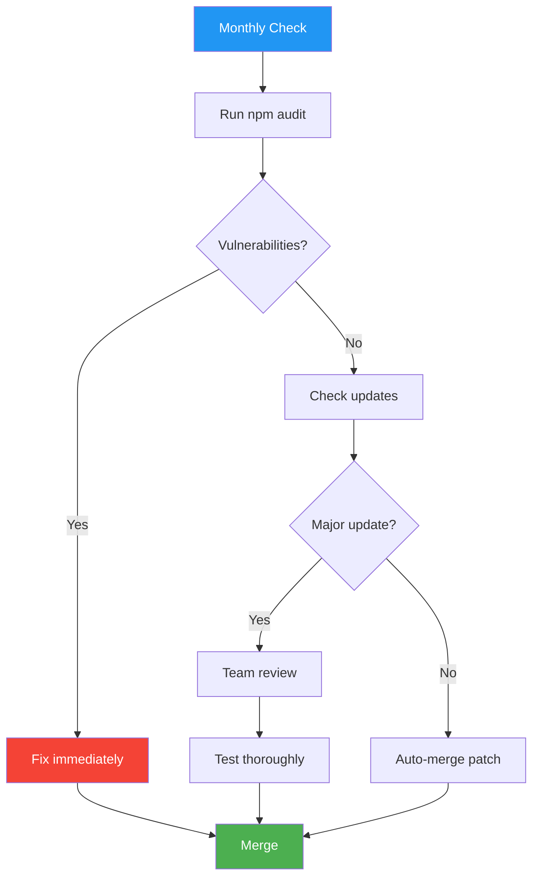

# Dependency Manifest

> **Project:** [Project Name]
> **Version:** [X.Y] | **Status:** [Active]
> **Last Updated:** [YYYY-MM-DD]

---

## 1. Purpose

> Documents all project dependencies — direct and transitive — with versions, licenses, and security status.

## 2. Dependency Overview

| Metric | Count |
|--------|-------|
| [Direct Dependencies] | [X] |
| [Dev Dependencies] | [X] |
| [Total (with transitive)] | [X] |
| [Known Vulnerabilities] | [X] |
| [License Issues] | [X] |

## 3. Production Dependencies

| Package | Version | License | Purpose | Security |
|---------|---------|---------|---------|---------|
| [express] | [^4.18.2] | [MIT] | [Web framework] | ✅ Clean |
| [pg] | [^8.11.3] | [MIT] | [PostgreSQL client] | ✅ Clean |
| [ioredis] | [^5.3.2] | [MIT] | [Redis client] | ✅ Clean |
| [amqplib] | [^0.10.3] | [MIT] | [RabbitMQ client] | ✅ Clean |
| [jsonwebtoken] | [^9.0.2] | [MIT] | [JWT handling] | ✅ Clean |
| [zod] | [^3.22.4] | [MIT] | [Schema validation] | ✅ Clean |
| [winston] | [^3.11.0] | [MIT] | [Logging] | ✅ Clean |
| [axios] | [^1.6.2] | [MIT] | [HTTP client] | ✅ Clean |

## 4. Dev Dependencies

| Package | Version | License | Purpose |
|---------|---------|---------|---------|
| [typescript] | [^5.3.2] | [Apache-2.0] | [Type checking] |
| [jest] | [^29.7.0] | [MIT] | [Testing framework] |
| [eslint] | [^8.55.0] | [MIT] | [Linting] |
| [prettier] | [^3.1.0] | [MIT] | [Formatting] |
| [husky] | [^8.0.3] | [MIT] | [Git hooks] |
| [nodemon] | [^3.0.2] | [MIT] | [Dev server] |

## 5. Dependency Policy

| Rule | Enforcement |
|------|-----------|
| [No `any` license without approval] | [License checker in CI] |
| [No known vulnerabilities] | [`npm audit` in CI] |
| [Lock file committed] | [package-lock.json in repo] |
| [Major updates require review] | [PR template] |
| [Monthly dependency review] | [Scheduled audit] |

## 6. Dependency Update Process

---

## Related Documents

| Document | Relationship |
|----------|-------------|
| [[SBOM]] | Software bill of materials |
| [[System-Bill-of-Materials]] | Full system BOM |
| [[Static-Analysis-Reports]] | Security scanning |

---

> **Template Standard:** Based on SWEBOK v4
> **Usage:** Know what you depend on. Run `npm audit` regularly. Lock your versions. Review major updates before merging.
