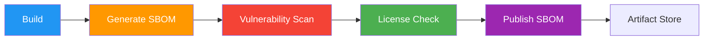

# SBOM (Software Bill of Materials)

> **Project:** [Project Name]
> **Version:** [X.Y] | **Status:** [Active]
> **Last Updated:** [YYYY-MM-DD]

---

## 1. Purpose

> The SBOM provides transparency into the software supply chain — every component, version, and license that makes up the product.

## 2. SBOM Standards

| Standard | Purpose | Format |
|---------|---------|--------|
| [SPDX] | [License compliance] | [JSON, RDF, XML] |
| [CycloneDX] | [Security focus] | [JSON, XML] |
| [SWID Tags] | [Asset management] | [XML] |

## 3. SBOM Generation

```bash
# Generate SBOM using Syft
syft dir:. -o spdx-json > sbom.spdx.json
syft dir:. -o cyclonedx-json > sbom.cdx.json

# Scan for vulnerabilities using Grype
grype sbom:sbom.spdx.json -o table

# Generate SBOM using npm
npm sbom --output-format spdx > npm-sbom.spdx.json
```

## 4. SBOM Metadata

| Field | Value |
|-------|-------|
| [Supplier] | [Organization Name] |
| [Component Name] | [Project Name] |
| [Version] | [X.Y.Z] |
| [Unique Identifier] | [CPE or Package URL] |
| [Timestamp] | [YYYY-MM-DDTHH:MM:SSZ] |
| [SBOM Author] | [Technical Lead] |
| [SBOM Tool] | [Syft v0.XX] |

## 5. Component Summary

| Category | Count | Licenses |
|---------|-------|---------|
| [Direct Dependencies] | [X] | [MIT, Apache-2.0] |
| [Transitive Dependencies] | [X] | [MIT, ISC, BSD] |
| [Dev Dependencies] | [X] | [MIT, Apache-2.0] |
| **Total** | **[X]** | |

## 6. License Compliance

| License | Count | Status | Policy |
|---------|-------|--------|--------|
| [MIT] | [XX] | ✅ | [Approved] |
| [Apache-2.0] | [XX] | ✅ | [Approved] |
| [ISC] | [XX] | ✅ | [Approved] |
| [BSD-2-Clause] | [XX] | ✅ | [Approved] |
| [BSD-3-Clause] | [XX] | ✅ | [Approved] |
| [GPL] | [0] | — | [Not allowed] |

## 7. SBOM Pipeline



---

## Related Documents

| Document | Relationship |
|----------|-------------|
| [[Dependency-Manifest]] | Dependency details |
| [[System-Bill-of-Materials]] | Full system BOM |
| [[Static-Analysis-Reports]] | Security scanning |

---

> **Template Standard:** Based on SWEBOK v4, NTIA SBOM Minimum Elements
> **Usage:** Generate SBOM on every build. Scan for vulnerabilities. Block deployment if critical vulnerabilities found.
