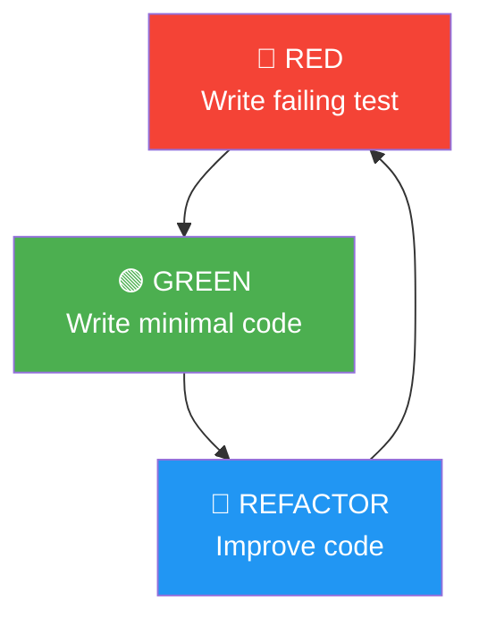

# TDD Test Cases

> **Project:** [Project Name]
> **Version:** [X.Y] | **Status:** [Active]
> **Last Updated:** [YYYY-MM-DD]

---

## 1. Purpose

> TDD test cases follow the Red-Green-Refactor cycle — write the test first, make it pass, then refactor.

## 2. TDD Cycle



## 3. TDD Rules

| Rule | Description |
|------|-----------|
| [1] | [Write a failing test first] |
| [2] | [Write just enough code to pass] |
| [3] | [Refactor to improve] |
| [4] | [Never write production code without a failing test] |
| [5] | [One test at a time] |

## 4. TDD Test Cases

### TC-TDD-001: Create Request

**RED — Write Failing Test:**
```typescript
describe('RequestService.create', () => {
  it('should create a request with valid data', async () => {
    const dto = { type: 'STANDARD', amount: 5000 };
    const request = await requestService.create(dto);
    expect(request.id).toBeDefined();
    expect(request.status).toBe('DRAFT');
  });
});
```

**GREEN — Minimal Implementation:**
```typescript
async function create(dto: CreateRequestDTO): Promise<Request> {
  return { id: generateId(), ...dto, status: 'DRAFT' };
}
```

**REFACTOR — Improve:**
```typescript
async function create(dto: CreateRequestDTO): Promise<Request> {
  const validated = validateDTO(dto);
  const request = new Request(validated);
  await this.repository.save(request);
  return request;
}
```

### TC-TDD-002: Validate Request Amount

**RED:**
```typescript
it('should reject amount of 0', async () => {
  const dto = { type: 'STANDARD', amount: 0 };
  await expect(requestService.create(dto)).rejects.toThrow('Amount must be positive');
});

it('should reject negative amount', async () => {
  const dto = { type: 'STANDARD', amount: -100 };
  await expect(requestService.create(dto)).rejects.toThrow('Amount must be positive');
});
```

**GREEN:**
```typescript
if (dto.amount <= 0) throw new Error('Amount must be positive');
```

### TC-TDD-003: Auto-Approve Eligible Requests

**RED:**
```typescript
it('should auto-approve standard request under $10K', async () => {
  const request = await processingService.process({
    type: 'STANDARD', amount: 5000, customerId: 'vip-customer'
  });
  expect(request.status).toBe('APPROVED');
});

it('should not auto-approve request over $10K', async () => {
  const request = await processingService.process({
    type: 'STANDARD', amount: 15000, customerId: 'regular-customer'
  });
  expect(request.status).toBe('UNDER_REVIEW');
});
```

**GREEN:**
```typescript
if (request.amount <= 10000 && request.type === 'STANDARD') {
  request.status = 'APPROVED';
} else {
  request.status = 'UNDER_REVIEW';
}
```

## 5. TDD Metrics

| Metric | Target | Current | Status |
|--------|--------|---------|--------|
| [Tests written before code] | [100%] | [X%] | 🟢🟡🔴 |
| [Test coverage] | [≥ 80%] | [X%] | 🟢🟡🔴 |
| [Red-Green-Refactor cycles per feature] | [3-5] | [X] | 🟢🟡🔴 |
| [Time in RED state] | [< 5 min] | [X min] | 🟢🟡🔴 |

## 6. TDD Benefits

| Benefit | Evidence |
|---------|---------|
| [Better design] | [Code is testable by default] |
| [Fewer bugs] | [Tests catch regressions] |
| [Confidence to refactor] | [Tests verify behavior] |
| [Living documentation] | [Tests describe behavior] |

---

## Related Documents

| Document | Relationship |
|----------|-------------|
| [[Mock-Stub-Driver-Specifications]] | Test doubles used |
| [[Test-Plan]] | Testing strategy |
| [[Test-Cases]] | Functional test cases |

---

> **Template Standard:** Based on SWEBOK v4, Kent Beck
> **Usage:** TDD is a *discipline* — write the test first, always. It feels slow at first but pays off with better design, fewer bugs, and confident refactoring.
