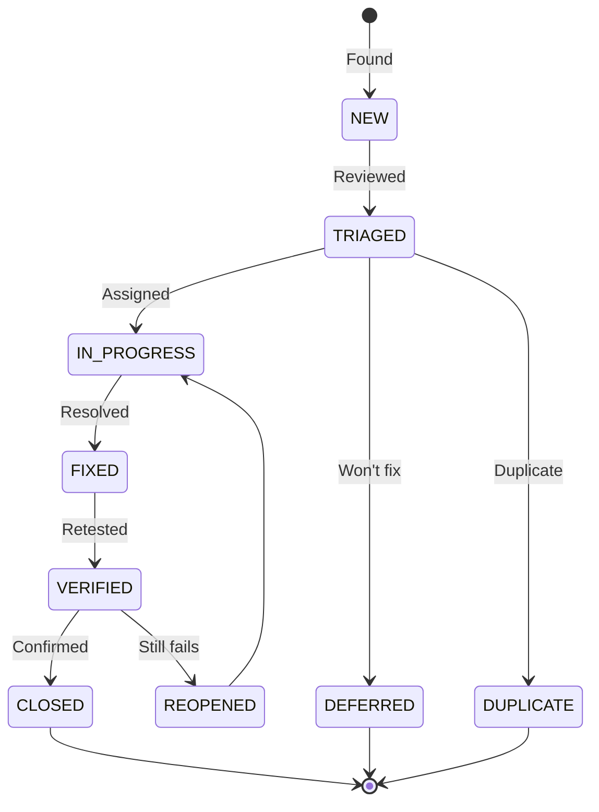

# Defect Report

> **Project:** [Project Name]
> **Version:** [X.Y] | **Status:** [Active]
> **Last Updated:** [YYYY-MM-DD]

---

## 1. Purpose

> Standardized defect reporting — capturing all information needed to reproduce, fix, and verify defects.

## 2. Defect Lifecycle

## 3. Defect Template

| Field | Value |
|-------|-------|
| **Defect ID** | [DEF-XXX] |
| **Title** | [Brief, descriptive title] |
| **Severity** | [🔴 Critical / 🟡 High / 🟢 Medium / ⚪ Low] |
| **Priority** | [🔴 P1 / 🟡 P2 / 🟢 P3 / ⚪ P4] |
| **Status** | [New / Triaged / In Progress / Fixed / Verified / Closed] |
| **Module** | [Request / Processing / Auth / Notification / Reporting] |
| **Reported By** | [Name] |
| **Assigned To** | [Name] |
| **Reported Date** | [YYYY-MM-DD] |
| **Target Fix** | [Sprint X] |
| **Test Case** | [TC-XXX] |
| **Requirement** | [FR-XXX] |

### Description

> [Clear description of the defect — what happened vs what was expected]

### Steps to Reproduce

| Step | Action | Expected Result | Actual Result |
|------|--------|----------------|--------------|
| 1 | [Step 1] | [Expected] | [Actual] |
| 2 | [Step 2] | [Expected] | [Actual] |
| 3 | [Step 3] | [Expected] | [Actual] |

### Environment

| Field | Value |
|-------|-------|
| [Browser] | [Chrome 120] |
| [OS] | [Windows 11] |
| [Environment] | [Staging] |
| [Version] | [v1.2.0] |

### Evidence

| Type | Description |
|------|-----------|
| [Screenshot] | [URL] |
| [Console Log] | [Error message] |
| [Network] | [Request/Response] |

## 4. Defect Register

| ID | Title | Severity | Module | Status | Assigned | Reported | Fixed |
|----|-------|---------|--------|--------|---------|---------|-------|
| DEF-001 | [Upload fails silently on mobile] | 🔴 Critical | [Request] | ✅ Closed | [Dev 1] | [Jul 12] | [Jul 13] |
| DEF-002 | [Token refresh race condition] | 🔴 Critical | [Auth] | ✅ Closed | [Dev 2] | [Jul 10] | [Jul 11] |
| DEF-003 | [Report filter not applied] | 🟡 High | [Reporting] | 🔄 In Progress | [Dev 3] | [Jul 14] | — |
| DEF-004 | [Tooltip positioning off] | 🟢 Medium | [UI] | ⬜ New | — | [Jul 15] | — |
| DEF-005 | [Date format inconsistency] | ⚪ Low | [Request] | ⬜ New | — | [Jul 15] | — |

## 5. Defect Metrics

| Metric | Value | Target | Status |
|--------|-------|--------|--------|
| [Total defects found] | [X] | — | — |
| [Critical defects] | [X] | [0 at release] | 🟢🟡🔴 |
| [Defects fixed] | [X] | — | — |
| [Defects remaining] | [X] | [< 5] | 🟢🟡🔴 |
| [Avg fix time — Critical] | [X hours] | [< 24h] | 🟢🟡🔴 |
| [Defect density] | [X/feature] | [< 2] | 🟢🟡🔴 |
| [Defect reopen rate] | [X%] | [< 10%] | 🟢🟡🔴 |

## 6. Severity Definitions

| Severity | Definition | Response | Resolution |
|---------|-----------|---------|-----------|
| 🔴 **Critical** | [System crash, data loss, security breach] | [1 hour] | [4 hours] |
| 🟡 **High** | [Major feature broken, no workaround] | [4 hours] | [1 day] |
| 🟢 **Medium** | [Feature broken, workaround exists] | [1 day] | [3 days] |
| ⚪ **Low** | [Minor issue, cosmetic] | [3 days] | [Next sprint] |

---

## Related Documents

| Document | Relationship |
|----------|-------------|
| [[Test-Cases]] | Tests that found defects |
| [[Test-Report]] | Report summarizing defects |
| [[Traceability-Matrix-Req-Tests]] | Requirement traceability |

---

> **Template Standard:** Based on SWEBOK v4, ISO/IEC/IEEE 29119
> **Usage:** A good defect report is *reproducible*. If the developer can't reproduce it, they can't fix it. Steps, environment, evidence.
