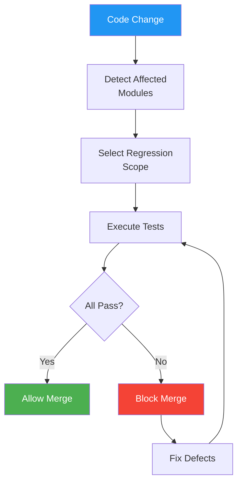

# Regression Test Suite

> **Project:** [Project Name]
> **Version:** [X.Y] | **Status:** [Active]
> **Last Updated:** [YYYY-MM-DD]

---

## 1. Purpose

> Regression testing verifies that new changes don't break existing functionality.

## 2. Regression Strategy

| Scope | When | Tests | Duration |
|-------|------|-------|---------|
| [Smoke] | [Every deployment] | [10] | [< 5 min] |
| [Targeted] | [Affected modules] | [Variable] | [< 30 min] |
| [Full Regression] | [Pre-release] | [73] | [< 2 hours] |

## 3. Regression Suite Composition

| Category | Tests | Automation | Priority |
|---------|-------|-----------|---------|
| [Critical Paths] | [10] | [100%] | 🔴 Always run |
| [Core Features] | [25] | [100%] | 🔴 Always run |
| [Edge Cases] | [20] | [80%] | 🟡 Pre-release |
| [UI/UX] | [18] | [60%] | 🟡 Pre-release |
| **Total** | **[73]** | **[80%]** | |

## 4. Regression Triggers

| Trigger | Suite | Automation |
|---------|-------|-----------|
| [PR to main] | [Critical Path] | [GitHub Actions] |
| [Merge to develop] | [Affected modules] | [GitHub Actions] |
| [Nightly] | [Full Regression] | [Scheduled] |
| [Pre-release] | [Full Regression] | [Manual trigger] |
| [Hotfix] | [Smoke + Critical Path] | [GitHub Actions] |

## 5. Regression Execution

## 6. Regression Metrics

| Metric | Target | Current | Status |
|--------|--------|---------|--------|
| [Regression pass rate] | [≥ 95%] | [X%] | 🟢🟡🔴 |
| [Regression execution time] | [< 2 hours] | [X min] | 🟢🟡🔴 |
| [Regression coverage] | [100% critical paths] | [X%] | 🟢🟡🔴 |
| [Defects caught by regression] | [> 50%] | [X%] | 🟢🟡🔴 |

## 7. Flaky Test Management

| Test | Issue | Frequency | Action |
|------|-------|----------|--------|
| [TC-XXX] | [Timing issue] | [10%] | [Quarantine + fix] |
| [TC-YYY] | [External dependency] | [5%] | [Mock dependency] |

---

## Related Documents

| Document | Relationship |
|----------|-------------|
| [[Test-Suite]] | Suite organization |
| [[Test-Scripts-Automated]] | Automation scripts |
| [[Build-Scripts]] | CI/CD integration |

---

> **Template Standard:** Based on SWEBOK v4
> **Usage:** Regression testing is *insurance*. Run it often. Fix flaky tests immediately — they hide real failures.
