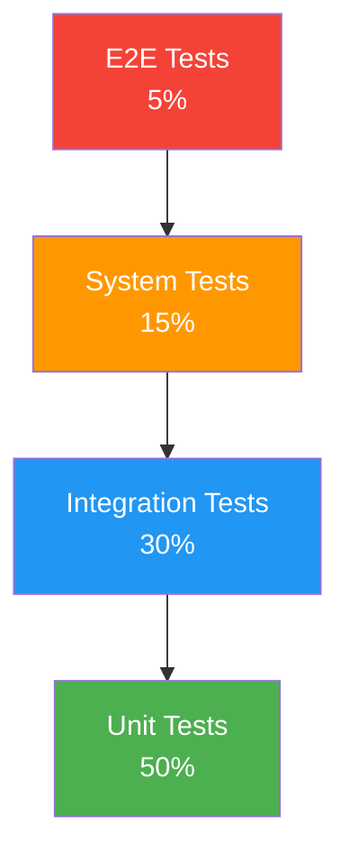

# Test Strategy

> **Project:** [Project Name]
> **Version:** [X.Y] | **Status:** [Draft | Under Review | Approved | Baselined]
> **Last Updated:** [YYYY-MM-DD]

---

## 1. Purpose

> The test strategy defines *how* testing will be conducted — levels, types, automation approach, and quality standards.

## 2. Testing Levels

| Level | Scope | Automation | Speed | Cost |
|-------|-------|-----------|-------|------|
| [Unit] | [Individual functions/classes] | [100%] | [Fast — seconds] | [Low] |
| [Integration] | [Component interactions] | [80%] | [Medium — minutes] | [Medium] |
| [System] | [Full application] | [60%] | [Slow — hours] | [High] |
| [E2E] | [User journeys] | [50%] | [Slowest — hours] | [Highest] |
| [UAT] | [Business scenarios] | [0%] | [Manual] | [Medium] |

## 3. Test Types

| Type | Purpose | When | Tools |
|------|---------|------|-------|
| [Functional] | [Verify features work] | [Every sprint] | [Jest, Playwright] |
| [Integration] | [Verify component interaction] | [Every sprint] | [Jest, Supertest] |
| [Performance] | [Verify response times] | [Per release] | [k6, Artillery] |
| [Security] | [Verify security controls] | [Per release] | [OWASP ZAP, Snyk] |
| [Accessibility] | [Verify WCAG compliance] | [Per release] | [axe, Lighthouse] |
| [Usability] | [Verify user experience] | [Per release] | [Manual, UserTesting] |
| [Regression] | [Verify no regressions] | [Every PR] | [Full suite] |
| [Smoke] | [Verify critical paths] | [Every deployment] | [Playwright] |

## 4. Automation Strategy

| Layer | Framework | Coverage Target | CI/CD |
|-------|----------|----------------|-------|
| [Unit] | [Jest] | [≥ 80%] | [Every commit] |
| [Integration] | [Jest + Supertest] | [All API endpoints] | [Every PR] |
| [E2E] | [Playwright] | [Critical user journeys] | [Nightly] |
| [Visual] | [Playwright screenshots] | [Key pages] | [Nightly] |

## 5. Test Data Strategy

| Type | Source | Management |
|------|--------|-----------|
| [Unit] | [Factory functions] | [Generated in test] |
| [Integration] | [Test fixtures] | [Seeded before test] |
| [System] | [Anonymized production] | [Refreshed weekly] |
| [UAT] | [Anonymized production] | [Refreshed before UAT] |

## 6. Quality Standards

| Metric | Target | Measurement |
|--------|--------|-----------|
| [Code Coverage] | [≥ 80%] | [Jest coverage report] |
| [Test Pass Rate] | [≥ 95%] | [Test execution results] |
| [Defect Density] | [< 2/feature] | [Defect tracking] |
| [Critical Defects] | [0 at release] | [Defect tracking] |
| [Automation Rate] | [≥ 60%] | [Automated / Total tests] |

## 7. Shift-Left Practices

| Practice | When | Benefit |
|---------|------|---------|
| [TDD] | [During coding] | [Better design, fewer bugs] |
| [Code Review] | [Before merge] | [Catch issues early] |
| [Static Analysis] | [Every commit] | [Automated quality] |
| [Contract Testing] | [During integration] | [API compatibility] |
| [Smoke Tests] | [After deployment] | [Fast feedback] |

---

## Related Documents

| Document | Relationship |
|----------|-------------|
| [[Test-Plan]] | Plan using this strategy |
| [[Test-Cases]] | Test case specifications |
| [[TDD-Test-Cases]] | TDD approach |

---

> **Template Standard:** Based on SWEBOK v4, ISO/IEC/IEEE 29119
> **Usage:** The strategy answers *how* we test. The plan answers *when* and *who*. Keep them separate — strategies change less frequently than plans.
