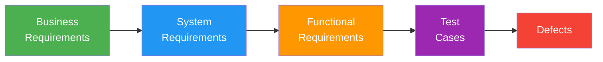

# Traceability Matrix (Req ↔ Tests)

> **Project:** [Project Name]
> **Version:** [X.Y] | **Status:** [Active]
> **Last Updated:** [YYYY-MM-DD]

---

## 1. Purpose

> Bidirectional traceability between requirements and test cases — ensuring every requirement is tested and every test traces to a requirement.

## 2. Traceability Model

## 3. Traceability Matrix

| Req ID | Requirement | Priority | Test Cases | Coverage | Status |
|--------|-------------|---------|-----------|---------|--------|
| [FR-001] | [Customer can submit request] | 🔴 | [TC-001, TC-002, TC-003] | [100%] | ✅ |
| [FR-002] | [Customer can track status] | 🔴 | [TC-004, TC-005] | [100%] | ✅ |
| [FR-003] | [Customer can upload documents] | 🔴 | [TC-006, TC-007, TC-008] | [100%] | ✅ |
| [FR-101] | [System validates inputs] | 🔴 | [TC-010, TC-011, TC-012] | [100%] | ✅ |
| [FR-102] | [System classifies requests] | 🔴 | [TC-013, TC-014] | [100%] | ✅ |
| [FR-103] | [System auto-approves eligible] | 🔴 | [TC-015, TC-016, TC-017] | [100%] | ✅ |
| [FR-104] | [Staff can review requests] | 🔴 | [TC-020, TC-021, TC-022] | [100%] | ✅ |
| [FR-105] | [Staff can approve requests] | 🔴 | [TC-023, TC-024] | [100%] | ✅ |
| [FR-106] | [Staff can reject requests] | 🔴 | [TC-025, TC-026] | [100%] | ✅ |
| [FR-201] | [System sends email notifications] | 🔴 | [TC-030, TC-031] | [100%] | ✅ |
| [FR-301] | [Dashboard displays real-time KPIs] | 🟡 | [TC-040, TC-041] | [100%] | ✅ |
| [FR-302] | [System generates reports] | 🟡 | [TC-042, TC-043] | [100%] | ✅ |

## 4. Coverage Summary

| Module | Requirements | Tested | Untested | Coverage |
|--------|-------------|--------|---------|---------|
| [Request Management] | [10] | [10] | [0] | [100%] |
| [Processing] | [8] | [8] | [0] | [100%] |
| [Notifications] | [4] | [4] | [0] | [100%] |
| [Reporting] | [5] | [5] | [0] | [100%] |
| [Authentication] | [6] | [6] | [0] | [100%] |
| **Total** | **[33]** | **[33]** | **[0]** | **[100%]** |

## 5. Reverse Traceability

| Test Case | Requirement | Module | Automated | Status |
|-----------|-----------|--------|----------|--------|
| [TC-001] | [FR-001] | [Request] | ✅ | ✅ Pass |
| [TC-002] | [FR-001] | [Request] | ✅ | ✅ Pass |
| [TC-003] | [FR-001] | [Request] | ✅ | ✅ Pass |
| [TC-010] | [FR-101] | [Processing] | ✅ | ✅ Pass |
| [TC-015] | [FR-103] | [Processing] | ✅ | ✅ Pass |

## 6. Gap Analysis

| Gap Type | Count | Details |
|---------|-------|--------|
| [Untested requirements] | [0] | [None] |
| [Orphaned tests] | [0] | [None] |
| [Requirements without test cases] | [0] | [None] |

---

## Related Documents

| Document | Relationship |
|----------|-------------|
| [[Test-Cases]] | Test cases in this matrix |
| [[Requirements-Traceability-Matrix]] | Requirements-side traceability |
| [[Software-Requirements-Specification]] | Requirements being traced |

---

> **Template Standard:** Based on SWEBOK v4, ISO/IEC/IEEE 29119
> **Usage:** If a requirement has no test, it's not verified. If a test has no requirement, it's orphaned. Keep this matrix 100%.
