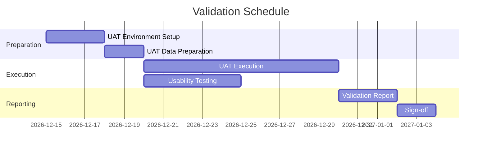

# Validation Plan

> **Project:** [Project Name]
> **Version:** [X.Y] | **Status:** [Draft | Under Review | Approved]
> **Last Updated:** [YYYY-MM-DD]

---

## 1. Purpose

> Validation confirms the product is the *right* product — that it meets user needs and business objectives. This plan defines how validation will be conducted.

## 2. Validation vs Verification

| Aspect | Verification | Validation |
|--------|-------------|-----------|
| **Question** | [Are we building the product right?] | [Are we building the right product?] |
| **Focus** | [Specifications] | [User needs] |
| **Method** | [Reviews, testing] | [User testing, acceptance] |
| **When** | [During development] | [After development] |
| **Standard** | [[Verification-Plan]] | [[Validation-Plan]] (this document) |

## 3. Validation Methods

| Method | When | Participants | Purpose |
|--------|------|-------------|---------|
| [UAT] | [After system testing] | [Business users] | [Verify business requirements] |
| [Usability Testing] | [During design] | [End users] | [Verify usability] |
| [Prototype Review] | [During design] | [Stakeholders] | [Verify design direction] |
| [Walkthrough] | [After implementation] | [Development team] | [Verify implementation] |
| [Operational Testing] | [Before go-live] | [Operations team] | [Verify operability] |

## 4. Validation Criteria

| Criteria | Measurement | Target | Method |
|---------|-----------|--------|--------|
| [Business requirements met] | [UAT scenarios] | [100% pass] | [UAT] |
| [User satisfaction] | [SUS score] | [≥ 68] | [Usability test] |
| [Task completion rate] | [User testing] | [≥ 90%] | [Usability test] |
| [Performance acceptable] | [User perception] | [≥ 4/5] | [User survey] |
| [Operational readiness] | [Operations checklist] | [100%] | [Operational test] |

## 5. UAT Plan

| Field | Detail |
|-------|--------|
| [UAT Period] | [YYYY-MM-DD to YYYY-MM-DD] |
| [Environment] | [uat.project.com] |
| [Participants] | [8 users: 4 customers, 2 staff, 2 managers] |
| [Scenarios] | [5 business scenarios] |
| [Success Criteria] | [All scenarios pass, SUS ≥ 68] |

### UAT Scenarios

| # | Scenario | Persona | Acceptance Criteria |
|---|---------|---------|-------------------|
| 1 | [Submit request end-to-end] | [Customer] | [Complete in < 10 min] |
| 2 | [Process request] | [Staff] | [Complete in < 5 min] |
| 3 | [View dashboard] | [Manager] | [KPIs visible in < 5s] |
| 4 | [Generate report] | [Manager] | [Report generated in < 30s] |
| 5 | [Mobile request submission] | [Customer] | [Complete on mobile] |

## 6. Validation Schedule

## 7. Validation Exit Criteria

| # | Criteria | Target | Status |
|---|---------|--------|--------|
| 1 | [All UAT scenarios pass] | [100%] | ⬜ |
| 2 | [No critical defects open] | [0] | ⬜ |
| 3 | [SUS score ≥ 68] | [≥ 68] | ⬜ |
| 4 | [Stakeholder sign-off] | [All sign] | ⬜ |
| 5 | [Operations ready] | [100% checklist] | ⬜ |

---

## Related Documents

| Document | Relationship |
|----------|-------------|
| [[Verification-Plan]] | Verification counterpart |
| [[Validation-Reports]] | Validation results |
| [[UAT-Sign-off]] | Formal acceptance |

---

> **Template Standard:** Based on SEBoK v2, ISO/IEC/IEEE 15288
> **Usage:** Validation is *user-focused*. Verification checks specs; validation checks needs. A system can pass all tests but still not meet user needs.
