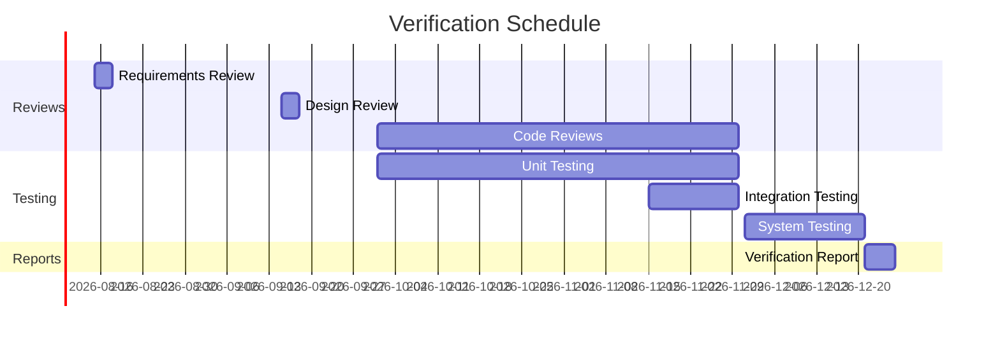

# Verification Plan

> **Project:** [Project Name]
> **Version:** [X.Y] | **Status:** [Draft | Under Review | Approved]
> **Last Updated:** [YYYY-MM-DD]

---

## 1. Purpose

> Verification confirms the product is built *correctly* — that it meets its specifications. This plan defines how verification will be conducted across all lifecycle phases.

## 2. Verification vs Validation

| Aspect | Verification | Validation |
|--------|-------------|-----------|
| **Question** | [Are we building the product right?] | [Are we building the right product?] |
| **Method** | [Reviews, inspections, testing] | [User testing, acceptance] |
| **When** | [During development] | [After development] |
| **Standard** | [[Verification-Plan]] (this document) | [[Validation-Plan]] |

## 3. Verification Methods

| Method | Phase | What's Verified | Who |
|--------|-------|----------------|-----|
| [Requirements Review] | [Requirements] | [Completeness, consistency] | [BA, Architect] |
| [Design Review] | [Design] | [Design meets requirements] | [Architect, TL] |
| [Code Review] | [Construction] | [Code meets standards] | [Developers] |
| [Unit Testing] | [Construction] | [Functions work correctly] | [Developers] |
| [Integration Testing] | [Testing] | [Components interact correctly] | [QA] |
| [System Testing] | [Testing] | [System meets specifications] | [QA] |
| [Inspection] | [Any] | [Formal defect detection] | [Trained inspectors] |

## 4. Verification Criteria

| Level | Criteria | Measurement |
|-------|---------|------------|
| [Requirements] | [All requirements traceable] | [[Traceability-Matrix-Req-Tests]] |
| [Design] | [All requirements addressed in design] | [[Design-Review-Records]] |
| [Code] | [Code meets [[Coding-Standards]]] | [[Code-Review-Records]] |
| [Testing] | [All test cases pass] | [[Test-Report]] |

## 5. Verification Schedule

## 6. Verification Matrix

| Requirement | Design | Code | Unit Test | Integration | System | Status |
|-------------|--------|------|----------|------------|--------|--------|
| [FR-001] | ✅ | ✅ | ✅ | ✅ | ✅ | ✅ |
| [FR-002] | ✅ | ✅ | ✅ | ✅ | ✅ | ✅ |
| [FR-101] | ✅ | ✅ | ✅ | ✅ | ✅ | ✅ |
| [NFR-001] | ✅ | ✅ | — | — | ✅ | ✅ |
| [NFR-002] | ✅ | ✅ | — | — | ✅ | ✅ |

---

## Related Documents

| Document | Relationship |
|----------|-------------|
| [[Validation-Plan]] | Validation counterpart |
| [[Verification-Reports]] | Verification results |
| [[Test-Plan]] | Testing details |

---

> **Template Standard:** Based on SEBoK v2, ISO/IEC/IEEE 15288
> **Usage:** Verification is *process-oriented* — did we follow our standards? Validation is *product-oriented* — does it work for users? You need both.
