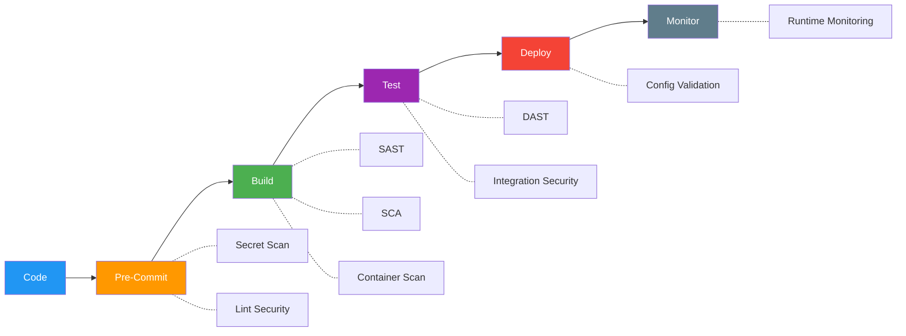

# DevSecOps Pipeline Configuration

> **Project:** [Project Name]
> **Version:** [X.Y] | **Status:** [Draft | Under Review | Approved]
> **Last Updated:** [YYYY-MM-DD]

---

## 1. Purpose

> Defines security tooling integrated into CI/CD — automating security checks at every stage of the pipeline.

## 2. Pipeline Security Gates



## 3. Security Tools

| Stage | Tool | Purpose | Gate | Action on Fail |
|-------|------|---------|------|---------------|
| [Pre-commit] | [detect-secrets] | [Secret scanning] | [Block commit] | [Fix before commit] |
| [Pre-commit] | [ESLint Security] | [Security linting] | [Block commit] | [Fix before commit] |
| [Build] | [Semgrep] | [SAST scanning] | [Block build] | [Fix critical/high] |
| [Build] | [npm audit] | [Dependency scanning] | [Block build] | [Fix critical/high] |
| [Build] | [Trivy] | [Container scanning] | [Block build] | [Fix critical/high] |
| [Test] | [OWASP ZAP] | [DAST scanning] | [Warn] | [Review findings] |
| [Deploy] | [Checkov] | [IaC security] | [Block deploy] | [Fix misconfigurations] |
| [Monitor] | [Falco] | [Runtime security] | [Alert] | [Investigate] |

## 4. Pipeline Configuration

```yaml
# .github/workflows/devsecops.yml
name: DevSecOps Pipeline

on:
  push:
    branches: [main, develop]
  pull_request:
    branches: [main]

jobs:
  pre-commit:
    runs-on: ubuntu-latest
    steps:
      - uses: actions/checkout@v4
      - name: Secret Scan
        run: detect-secrets scan --all-files
      - name: Security Lint
        run: npm run lint:security

  sast:
    needs: pre-commit
    runs-on: ubuntu-latest
    steps:
      - uses: actions/checkout@v4
      - name: SAST Scan
        run: semgrep --config=owasp-top-ten --error --quiet
      - name: Dependency Scan
        run: npm audit --audit-level=high

  container-scan:
    needs: sast
    runs-on: ubuntu-latest
    steps:
      - name: Build Image
        run: docker build -t app:${{ github.sha }} .
      - name: Container Scan
        run: trivy image app:${{ github.sha }} --severity HIGH,CRITICAL --exit-code 1

  dast:
    needs: container-scan
    runs-on: ubuntu-latest
    steps:
      - name: Deploy to Staging
        run: kubectl apply -f staging.yaml
      - name: DAST Scan
        run: zap-baseline.py -t https://staging.project.com -r report.html
      - name: Upload Report
        uses: actions/upload-artifact@v3
        with:
          name: dast-report
          path: report.html
```

## 5. Security Gate Summary

| Gate | Tool | Threshold | Blocking | Bypass |
|------|------|----------|---------|--------|
| [Secret Scan] | [detect-secrets] | [0 secrets] | ✅ Yes | [None] |
| [SAST] | [Semgrep] | [0 critical, 0 high] | ✅ Yes | [Security team approval] |
| [SCA] | [npm audit] | [0 critical, 0 high] | ✅ Yes | [Security team approval] |
| [Container] | [Trivy] | [0 critical, 0 high] | ✅ Yes | [Security team approval] |
| [DAST] | [OWASP ZAP] | [0 critical] | ⚠️ Warn | [Review findings] |
| [IaC] | [Checkov] | [0 critical misconfig] | ✅ Yes | [None] |

## 6. Metrics

| Metric | Target | Current | Status |
|--------|--------|---------|--------|
| [Pipeline security pass rate] | [≥ 95%] | [X%] | 🟢🟡🔴 |
| [Mean time to fix (critical)] | [< 48h] | [X hours] | 🟢🟡🔴 |
| [Security findings per build] | [< 3] | [X] | 🟢🟡🔴 |
| [False positive rate] | [< 10%] | [X%] | 🟢🟡🔴 |

---

## Related Documents

| Document | Relationship |
|----------|-------------|
| [[SSDLC-Process-Documentation]] | Secure lifecycle |
| [[SAST-Report]] | Static analysis results |
| [[Build-Scripts]] | Build configuration |

---

> **Template Standard:** Based on CyBOK v1, SWEBOK v4
> **Usage:** Security is *automated* in the pipeline. If it's not in CI/CD, it doesn't happen. Fail fast, fix fast.
