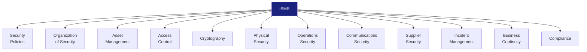

# ISMS Documentation (Information Security Management System)

> **Project:** [Project Name]
> **Version:** [X.Y] | **Status:** [Draft | Under Review | Approved]
> **Last Updated:** [YYYY-MM-DD]

---

## 1. Purpose

> Defines the Information Security Management System — policies, procedures, and controls for protecting information assets.

## 2. ISMS Scope

| Field | Detail |
|-------|--------|
| [Scope Statement] | [All information systems, data, and processes within the project] |
| [Boundaries] | [Production, staging, development environments] |
| [Exclusions] | [Third-party SaaS vendor infrastructure (managed by vendor)] |
| [Assets in Scope] | [Application code, customer data, credentials, infrastructure] |

## 3. ISMS Structure

## 4. Security Controls Summary

| Control Domain | Controls Implemented | Status |
|---------------|---------------------|--------|
| [A.5 — Information Security Policies] | [2] | ✅ |
| [A.6 — Organization of Security] | [7] | ✅ |
| [A.7 — Human Resource Security] | [6] | ✅ |
| [A.8 — Asset Management] | [10] | ✅ |
| [A.9 — Access Control] | [14] | ✅ |
| [A.10 — Cryptography] | [2] | ✅ |
| [A.11 — Physical Security] | [15] | N/A (cloud) |
| [A.12 — Operations Security] | [14] | ✅ |
| [A.13 — Communications Security] | [7] | ✅ |
| [A.14 — System Development] | [13] | ✅ |
| [A.15 — Supplier Relationships] | [5] | ✅ |
| [A.16 — Incident Management] | [7] | ✅ |
| [A.17 — Business Continuity] | [4] | ✅ |
| [A.18 — Compliance] | [8] | ✅ |

## 5. ISMS Documents

| # | Document | ISO 27001 Clause | Status | Link |
|---|---------|-----------------|--------|------|
| 1 | [Security Policy] | [A.5.1] | ✅ | [[Security-Policy]] |
| 2 | [Risk Assessment Report] | [A.8.1] | ✅ | [[Risk-Assessment-Report-Security]] |
| 3 | [Risk Treatment Plan] | [A.8.1] | ✅ | [[Risk-Treatment-Plan]] |
| 4 | [Access Control Policy] | [A.9.1] | ✅ | [[Access-Control-Policy]] |
| 5 | [Secure Coding Guidelines] | [A.14.2] | ✅ | [[Secure-Coding-Guidelines]] |
| 6 | [Incident Response Plan] | [A.16.1] | ✅ | [[Incident-Management-Process]] |
| 7 | [Business Continuity Plan] | [A.17.1] | ✅ | [[Disaster-Recovery-Plan]] |

## 6. Management Review

| Review Date | Participants | Findings | Actions |
|------------|-------------|---------|---------|
| [YYYY-MM-DD] | [CISO, PM, Tech Lead] | [X findings] | [X actions] |

## 7. Continuous Improvement

| Cycle | Focus Area | Actions | Status |
|-------|-----------|---------|--------|
| [Cycle 1] | [Access control] | [Implement MFA] | ✅ |
| [Cycle 2] | [Monitoring] | [Enhance logging] | 🔄 |
| [Cycle 3] | [Incident response] | [Tabletop exercise] | ⬜ |

---

## Related Documents

| Document | Relationship |
|----------|-------------|
| [[Security-Policy]] | Top-level policy |
| [[Risk-Assessment-Report-Security]] | Risk identification |
| [[Access-Control-Policy]] | Access controls |

---

> **Template Standard:** Based on CyBOK v1, ISO/IEC 27001
> **Usage:** The ISMS is the *security backbone*. It's a living system — review annually, update when threats change.
