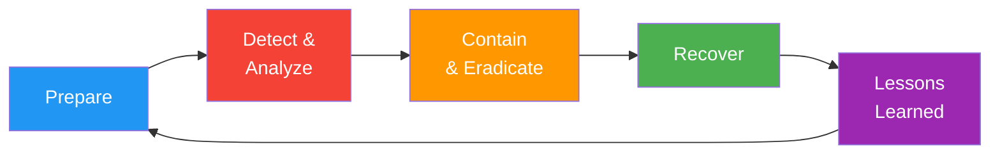

# Incident Response Plan

> **Project:** [Project Name]
> **Version:** [X.Y] | **Status:** [Draft | Under Review | Approved]
> **Last Updated:** [YYYY-MM-DD]

---

## 1. Purpose

> Defines procedures for detecting, containing, eradicating, and recovering from security incidents.

## 2. Incident Response Lifecycle

## 3. Incident Severity

| Severity | Definition | Response Time | Examples |
|---------|-----------|-------------|---------|
| 🔴 **SEV-1** | [Active breach, data exfiltration] | [15 minutes] | [Ransomware, data theft, system compromise] |
| 🟠 **SEV-2** | [Confirmed vulnerability exploited] | [1 hour] | [Unauthorized access, malware detected] |
| 🟡 **SEV-3** | [Suspicious activity, investigation needed] | [4 hours] | [Anomalous login, unusual traffic] |
| 🟢 **SEV-4** | [Policy violation, minor issue] | [24 hours] | [Password sharing, unauthorized software] |

## 4. Incident Response Team

| Role | Name | Phone | Email | Responsibility |
|------|------|-------|-------|---------------|
| [Incident Commander] | [Name] | [Phone] | [Email] | [Overall coordination] |
| [Security Lead] | [Name] | [Phone] | [Email] | [Technical investigation] |
| [Communications Lead] | [Name] | [Phone] | [Email] | [Stakeholder communication] |
| [Legal Counsel] | [Name] | [Phone] | [Email] | [Legal/regulatory advice] |
| [IT Operations] | [Name] | [Phone] | [Email] | [System recovery] |

## 5. Incident Response Procedures

### 5.1 Detection & Analysis

| Step | Action | Owner | Duration |
|------|--------|-------|---------|
| 1 | [Alert received (SIEM, user report, monitoring)] | [On-call] | [Immediate] |
| 2 | [Acknowledge and triage] | [Security Lead] | [< 15 min] |
| 3 | [Classify severity] | [Security Lead] | [< 30 min] |
| 4 | [Notify incident response team] | [Incident Commander] | [< 1 hour] |
| 5 | [Document initial findings] | [Security Lead] | [Ongoing] |

### 5.2 Containment

| Step | Action | Owner | Duration |
|------|--------|-------|---------|
| 1 | [Isolate affected systems] | [IT Operations] | [< 1 hour] |
| 2 | [Preserve evidence] | [Security Lead] | [Ongoing] |
| 3 | [Block malicious IPs/accounts] | [Security Lead] | [< 2 hours] |
| 4 | [Implement temporary controls] | [IT Operations] | [< 4 hours] |

### 5.3 Eradication

| Step | Action | Owner | Duration |
|------|--------|-------|---------|
| 1 | [Identify root cause] | [Security Lead] | [Ongoing] |
| 2 | [Remove malware/unauthorized access] | [Security Lead] | [Varies] |
| 3 | [Patch vulnerabilities] | [IT Operations] | [Varies] |
| 4 | [Reset compromised credentials] | [IT Operations] | [< 2 hours] |

### 5.4 Recovery

| Step | Action | Owner | Duration |
|------|--------|-------|---------|
| 1 | [Restore from clean backup] | [IT Operations] | [Varies] |
| 2 | [Verify system integrity] | [Security Lead] | [< 4 hours] |
| 3 | [Monitor for re-infection] | [Security Lead] | [72 hours] |
| 4 | [Return to normal operations] | [Incident Commander] | [After verification] |

### 5.5 Lessons Learned

| Step | Action | Owner | Duration |
|------|--------|-------|---------|
| 1 | [Conduct post-mortem (within 72h)] | [Incident Commander] | [1 hour] |
| 2 | [Document findings and recommendations] | [Security Lead] | [1 day] |
| 3 | [Update security controls] | [Security Lead] | [Varies] |
| 4 | [Update incident response plan] | [Security Officer] | [1 week] |

## 6. Communication Templates

### Internal Notification (SEV-1)

> **Subject:** [SECURITY INCIDENT — SEV-1] Brief Description
>
> **Impact:** [What happened, what's affected]
> **Status:** [Investigating / Contained / Resolved]
> **Actions Taken:** [What we've done]
> **Next Steps:** [What's happening next]
> **ETA:** [Estimated resolution time]

### External Notification (if required)

> [Template for customer/regulator notification — reviewed by Legal]

## 7. Evidence Preservation

| Evidence Type | Collection Method | Storage | Retention |
|--------------|------------------|--------|----------|
| [System logs] | [Export from SIEM] | [Secure storage] | [1 year] |
| [Network traffic] | [Packet capture] | [Secure storage] | [90 days] |
| [Memory dumps] | [Forensic tools] | [Secure storage] | [90 days] |
| [Disk images] | [Forensic imaging] | [Secure storage] | [1 year] |

## 8. Regulatory Notification

| Regulation | Notification Requirement | Timeline | Contact |
|-----------|------------------------|---------|--------|
| [GDPR] | [72 hours to supervisory authority] | [72 hours] | [DPO] |
| [PCI DSS] | [Immediately to acquiring bank] | [Immediate] | [Security Officer] |
| [HIPAA] | [60 days to HHS] | [60 days] | [Compliance Officer] |

---

## Related Documents

| Document | Relationship |
|----------|-------------|
| [[Incident-Management-Process]] | Operational incident handling |
| [[Business-Continuity-Plan-BCP]] | Business continuity |
| [[Digital-Forensics-Report]] | Forensic analysis |

---

> **Template Standard:** Based on CyBOK v1, ISO/IEC 27035, NIST SP 800-61
> **Usage:** Practice this plan with tabletop exercises. A plan you've never tested is not a plan.
