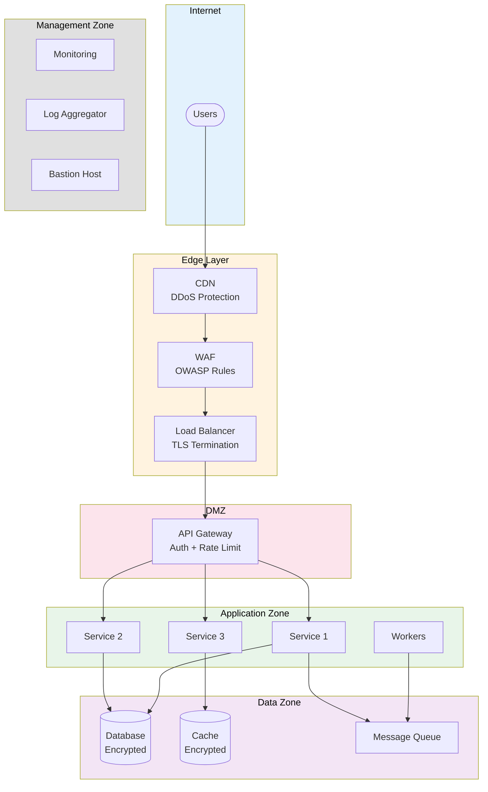

# Network Security Architecture

> **Project:** [Project Name]
> **Version:** [X.Y] | **Status:** [Draft | Under Review | Approved]
> **Last Updated:** [YYYY-MM-DD]

---

## 1. Purpose

> Defines network segmentation, firewall rules, encryption in transit, and monitoring for network security.

## 2. Network Architecture

## 3. Network Segmentation

| Zone | Subnet | Purpose | Access |
|------|--------|---------|--------|
| [Edge] | [Public] | [CDN, WAF, LB] | [Internet-facing] |
| [DMZ] | [10.0.1.0/24] | [API Gateway] | [Edge only] |
| [Application] | [10.0.2.0/24] | [Services, Workers] | [DMZ only] |
| [Data] | [10.0.3.0/24] | [Database, Cache, Queue] | [Application only] |
| [Management] | [10.0.4.0/24] | [Monitoring, Bastion] | [VPN only] |

## 4. Firewall Rules

| Source | Destination | Port | Protocol | Action | Purpose |
|--------|-----------|------|---------|--------|---------|
| [Internet] | [CDN] | [443] | [HTTPS] | ✅ Allow | [User access] |
| [CDN] | [WAF] | [443] | [HTTPS] | ✅ Allow | [Content delivery] |
| [WAF] | [LB] | [443] | [HTTPS] | ✅ Allow | [Filtered traffic] |
| [LB] | [API Gateway] | [3000] | [HTTP] | ✅ Allow | [Internal routing] |
| [API Gateway] | [Services] | [3000] | [HTTP] | ✅ Allow | [Service calls] |
| [Services] | [Database] | [5432] | [TCP] | ✅ Allow | [Data access] |
| [Services] | [Cache] | [6379] | [TCP] | ✅ Allow] | [Cache access] |
| [Services] | [Queue] | [5672] | [AMQP] | ✅ Allow | [Messaging] |
| [Internet] | [Services] | [*] | [*] | ❌ Deny | [No direct access] |
| [Internet] | [Database] | [*] | [*] | ❌ Deny | [No direct access] |

## 5. Encryption in Transit

| Connection | Protocol | Certificate | Configuration |
|-----------|---------|-------------|-------------|
| [User → CDN] | [TLS 1.3] | [Cloud-managed] | [HSTS, OCSP stapling] |
| [CDN → LB] | [TLS 1.3] | [Cloud-managed] | [Full strict] |
| [LB → Services] | [TLS 1.3] | [Internal cert] | [Mutual TLS optional] |
| [Services → DB] | [TLS 1.2+] | [Cloud-managed] | [Required] |
| [Services → Cache] | [TLS 1.2+] | [Cloud-managed] | [Required] |

## 6. DDoS Protection

| Layer | Protection | Implementation |
|-------|-----------|---------------|
| [Layer 3/4] | [Volumetric protection] | [Cloud provider DDoS shield] |
| [Layer 7] | [Application protection] | [WAF rules, rate limiting] |
| [API] | [Rate limiting] | [100 req/min per user] |

## 7. Network Monitoring

| Monitoring | Tool | Alerts |
|-----------|------|--------|
| [Traffic analysis] | [VPC Flow Logs] | [Anomalous traffic patterns] |
| [Intrusion detection] | [WAF + IDS] | [Attack signatures] |
| [DNS monitoring] | [DNS logging] | [DNS anomalies] |
| [Certificate monitoring] | [Certificate manager] | [Expiry alerts] |

---

## Related Documents

| Document | Relationship |
|----------|-------------|
| [[Security-Architecture]] | Overall security architecture |
| [[Access-Control-Policy]] | Access controls |
| [[Physical-Architecture]] | Infrastructure architecture |

---

> **Template Standard:** Based on CyBOK v1
> **Usage:** Network security is *defense in depth*. Every layer has controls. No single point of failure.
