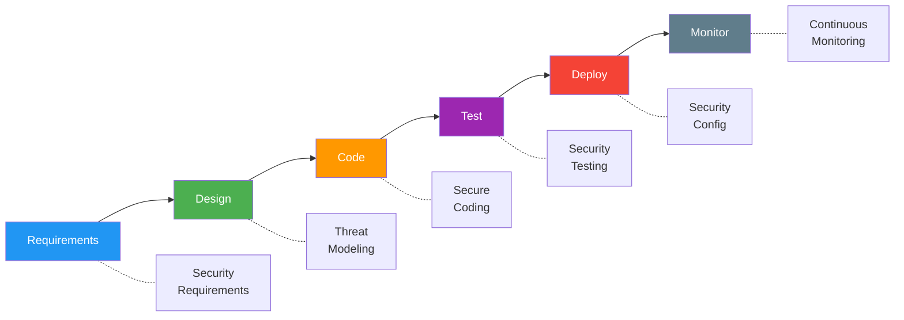

# SSDLC Process Documentation (Secure Software Development Lifecycle)

> **Project:** [Project Name]
> **Version:** [X.Y] | **Status:** [Draft | Under Review | Approved]
> **Last Updated:** [YYYY-MM-DD]

---

## 1. Purpose

> Defines how security is integrated into every phase of the software development lifecycle — not bolted on at the end.

## 2. SSDLC Overview

## 3. Security Activities by Phase

| Phase | Security Activity | Output | Owner | Enforcement |
|-------|------------------|--------|-------|-----------|
| [Requirements] | [Define security requirements] | [[Security-Requirements-Specification]] | [Security + BA] | [Review gate] |
| [Design] | [Threat modeling] | [[Threat-Model]] | [Security + Architect] | [Review gate] |
| [Design] | [Secure design review] | [[Secure-Design-Review-Report]] | [Security] | [Review gate] |
| [Code] | [Follow secure coding guidelines] | [[Secure-Coding-Guidelines]] | [Developers] | [Code review] |
| [Code] | [Secret scanning] | [Pre-commit hook results] | [Developers] | [Pre-commit hook] |
| [Test] | [SAST scanning] | [[SAST-Report]] | [CI/CD] | [Build gate] |
| [Test] | [SCA scanning] | [[SCA-Report]] | [CI/CD] | [Build gate] |
| [Test] | [DAST scanning] | [[DAST-Report]] | [Security] | [Pre-release gate] |
| [Test] | [Penetration testing] | [[Penetration-Test-Report]] | [External] | [Pre-release gate] |
| [Deploy] | [Security configuration review] | [Deployment checklist] | [DevOps] | [Deploy gate] |
| [Monitor] | [Continuous monitoring] | [[Monitoring-Dashboard-Spec]] | [DevOps] | [Continuous] |

## 4. Security Gates

| Gate | Phase | Criteria | Blocking? |
|------|-------|---------|----------|
| [Security Requirements Review] | [Requirements] | [All security requirements defined] | ✅ Yes |
| [Threat Model Review] | [Design] | [Threat model complete, risks identified] | ✅ Yes |
| [SAST Gate] | [Build] | [No critical/high SAST findings] | ✅ Yes |
| [SCA Gate] | [Build] | [No critical/high dependency vulnerabilities] | ✅ Yes |
| [DAST Gate] | [Pre-release] | [No critical DAST findings] | ✅ Yes |
| [Pen Test Gate] | [Pre-release] | [No critical pen test findings] | ✅ Yes |

## 5. Security Training

| Training | Audience | Frequency | Content |
|---------|---------|----------|---------|
| [Secure Coding Basics] | [All developers] | [Onboarding] | [OWASP Top 10, common vulnerabilities] |
| [Threat Modeling] | [Architects + Senior Devs] | [Annual] | [STRIDE, attack trees] |
| [Security Awareness] | [All team] | [Annual] | [Phishing, social engineering, data handling] |
| [Incident Response] | [DevOps + Security] | [Annual] | [Detection, containment, recovery] |

## 6. Security Metrics

| Metric | Definition | Target | Current |
|--------|-----------|--------|---------|
| [SAST findings per release] | [Critical + High] | [0] | [X] |
| [SCA vulnerabilities] | [Critical + High] | [0] | [X] |
| [Time to fix critical] | [Days from discovery to fix] | [< 48h] | [X hours] |
| [Security training completion] | [% of team trained] | [100%] | [X%] |
| [Pen test pass rate] | [% findings remediated] | [100% critical] | [X%] |

---

## Related Documents

| Document | Relationship |
|----------|-------------|
| [[Secure-Coding-Guidelines]] | Coding standards |
| [[Threat-Model]] | Design-phase security |
| [[Security-Requirements-Specification]] | Requirements-phase security |

---

> **Template Standard:** Based on CyBOK v1, ISO/IEC 27034
> **Usage:** Security is *shift-left* — catch issues early. Every phase has security gates. No gate = no progress.
