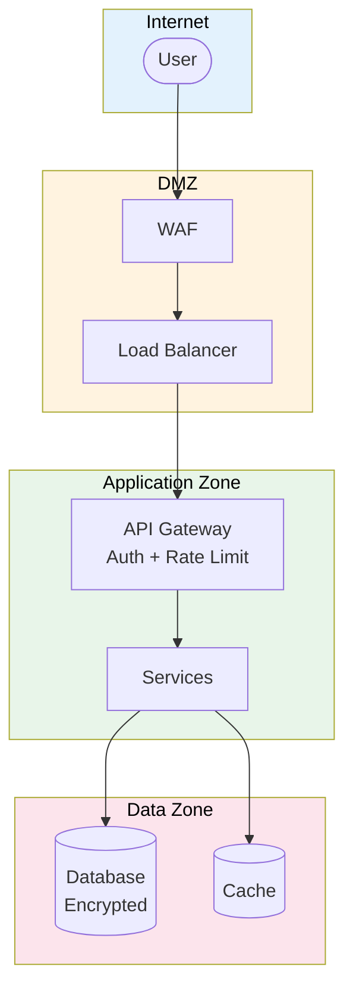

# Secure Design Review Report

> **Project:** [Project Name]
> **Version:** [X.Y] | **Status:** [Draft | Under Review | Approved]
> **Last Updated:** [YYYY-MM-DD]

---

## 1. Purpose

> Reviews the system architecture and design for security principles — identifying design-level vulnerabilities before implementation.

## 2. Review Summary

| Field | Detail |
|-------|--------|
| [Review Date] | [YYYY-MM-DD] |
| [Reviewer] | [Security Engineer] |
| [Scope] | [Full system architecture] |
| [Result] | ✅ Pass / ⚠️ Conditional / ❌ Fail |

## 3. Security Design Principles Assessment

| # | Principle | Status | Evidence |
|---|----------|--------|---------|
| 1 | [Least Privilege] | ✅ | [RBAC implemented, role-based access] |
| 2 | [Defense in Depth] | ✅ | [WAF + API Gateway + App validation + DB constraints] |
| 3 | [Fail Secure] | ✅ | [Default deny, explicit allow] |
| 4 | [Separation of Duties] | ✅ | [Distinct roles, no single-person critical paths] |
| 5 | [Economy of Mechanism] | ✅ | [Simple, well-defined interfaces] |
| 6 | [Complete Mediation] | ✅ | [Every access checked, no caching auth decisions] |
| 7 | [Open Design] | ✅ | [Security not dependent on secrecy of design] |
| 8 | [Psychological Acceptability] | ✅ | [Security doesn't impede usability] |

## 4. Design Review Findings

| # | Finding | Component | Severity | Recommendation | Status |
|---|--------|----------|---------|---------------|--------|
| 1 | [API Gateway validates all tokens] | [API] | ✅ Good | [Maintain] | ✅ |
| 2 | [Services communicate via internal network only] | [Network] | ✅ Good | [Maintain] | ✅ |
| 3 | [Database accessible only from app subnet] | [Network] | ✅ Good | [Maintain] | ✅ |
| 4 | [Secrets stored in vault, not environment] | [Config] | ✅ Good | [Maintain] | ✅ |
| 5 | [Audit logging on all data access] | [Logging] | ✅ Good | [Maintain] | ✅ |

## 5. Architecture Security Diagram

## 6. Recommendations

| # | Recommendation | Priority | Owner | Status |
|---|---------------|---------|-------|--------|
| 1 | [No critical findings — maintain current design] | — | — | ✅ |

---

## Related Documents

| Document | Relationship |
|----------|-------------|
| [[Threat-Model]] | Threats addressed by design |
| [[Security-Requirements-Specification]] | Requirements driving design |
| [[Software-Architecture-Document]] | Architecture being reviewed |

---

> **Template Standard:** Based on CyBOK v1
> **Usage:** Secure design review catches architectural flaws before they become code vulnerabilities. Review before implementation begins.
