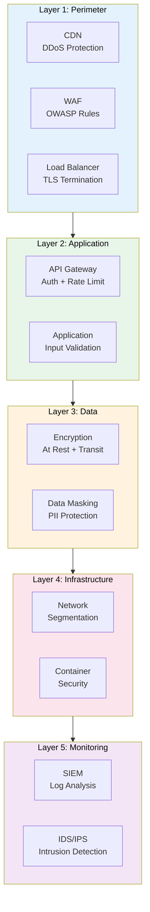

# Security Architecture

> **Project:** [Project Name]
> **Version:** [X.Y] | **Status:** [Draft | Under Review | Approved]
> **Last Updated:** [YYYY-MM-DD]

---

## 1. Purpose

> Comprehensive security architecture — defense in depth across all layers of the system.

## 2. Security Architecture Overview

## 3. Defense in Depth Layers

### Layer 1: Perimeter Security

| Control | Implementation | Purpose |
|---------|---------------|---------|
| [CDN] | [CloudFront / Azure CDN] | [DDoS protection, edge caching] |
| [WAF] | [AWS WAF / Azure WAF] | [OWASP Top 10 protection] |
| [Load Balancer] | [ALB / Azure LB] | [TLS termination, traffic distribution] |
| [DNS Security] | [DNSSEC, DNS filtering] | [DNS attack prevention] |

### Layer 2: Application Security

| Control | Implementation | Purpose |
|---------|---------------|---------|
| [API Gateway] | [Kong / AWS API GW] | [Authentication, rate limiting, routing] |
| [Input Validation] | [Zod schemas] | [Prevent injection attacks] |
| [Output Encoding] | [React auto-escape] | [Prevent XSS] |
| [CSRF Protection] | [SameSite cookies + tokens] | [Prevent CSRF] |
| [Security Headers] | [Helmet middleware] | [X-Frame-Options, CSP, HSTS] |

### Layer 3: Data Security

| Control | Implementation | Purpose |
|---------|---------------|---------|
| [Encryption at Rest] | [AES-256 via KMS] | [Protect stored data] |
| [Encryption in Transit] | [TLS 1.3] | [Protect data in motion] |
| [Data Masking] | [PII masking in logs] | [Prevent data exposure] |
| [Tokenization] | [Payment tokenization] | [Protect sensitive data] |
| [Data Classification] | [4-level classification] | [Appropriate controls] |

### Layer 4: Infrastructure Security

| Control | Implementation | Purpose |
|---------|---------------|---------|
| [Network Segmentation] | [VPC, subnets, security groups] | [Isolate components] |
| [Container Security] | [Image scanning, runtime protection] | [Secure containers] |
| [Secret Management] | [Vault / AWS Secrets Manager] | [Protect credentials] |
| [Patch Management] | [Automated patching] | [Fix vulnerabilities] |

### Layer 5: Monitoring & Detection

| Control | Implementation | Purpose |
|---------|---------------|---------|
| [SIEM] | [ELK / Splunk] | [Log analysis, correlation] |
| [IDS/IPS] | [WAF + network IDS] | [Intrusion detection] |
| [UEBA] | [User behavior analytics] | [Anomaly detection] |
| [Alerting] | [PagerDuty / Slack] | [Incident notification] |

## 4. Security Principles

| Principle | Implementation |
|----------|---------------|
| [Least Privilege] | [RBAC with minimal permissions] |
| [Defense in Depth] | [5 layers of security] |
| [Zero Trust] | [Verify every request] |
| [Fail Secure] | [Default deny] |
| [Security by Design] | [Security built in, not bolted on] |
| [Separation of Duties] | [No single-person critical paths] |

## 5. Security Zones

| Zone | Components | Trust Level | Access |
|------|-----------|-----------|--------|
| [Internet] | [Users, attackers] | [Untrusted] | [WAF filtered] |
| [DMZ] | [CDN, WAF, LB] | [Low trust] | [Filtered traffic only] |
| [Application] | [API, Services] | [Medium trust] | [Authenticated] |
| [Data] | [Database, Cache] | [High trust] | [Application only] |
| [Management] | [Monitoring, Bastion] | [High trust] | [VPN only] |

## 6. Security Testing

| Test | Frequency | Tool | Scope |
|------|----------|------|-------|
| [SAST] | [Every commit] | [Semgrep] | [All code] |
| [SCA] | [Every build] | [npm audit] | [All dependencies] |
| [DAST] | [Weekly] | [OWASP ZAP] | [All endpoints] |
| [Container Scan] | [Every build] | [Trivy] | [All images] |
| [Pen Test] | [Annually] | [External vendor] | [Full system] |

---

## Related Documents

| Document | Relationship |
|----------|-------------|
| [[Network-Security-Architecture]] | Network layer details |
| [[Access-Control-Policy]] | Access controls |
| [[Security-Policy]] | Security policies |
| [[ISMS-Documentation]] | ISMS framework |

---

> **Template Standard:** Based on CyBOK v1, SWEBOK v4
> **Usage:** Security architecture is *defense in depth* — no single layer is sufficient. Every layer has controls. If one fails, others protect.
