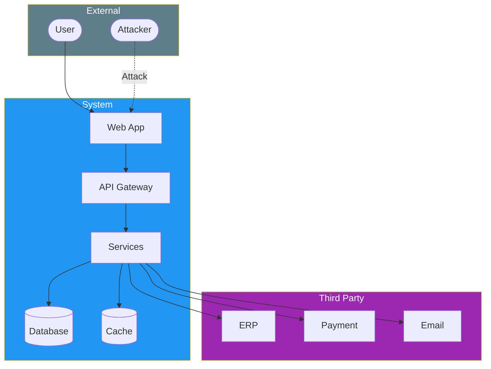
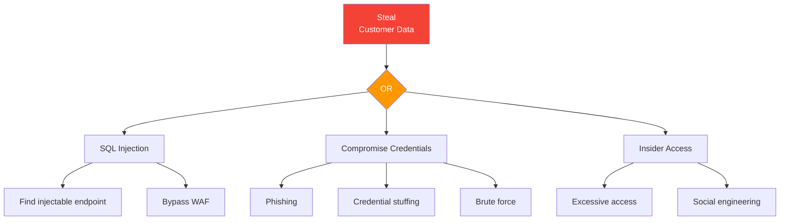

# Threat Model

> **Project:** [Project Name]
> **Version:** [X.Y] | **Status:** [Draft | Under Review | Approved]
> **Last Updated:** [YYYY-MM-DD]

---

## 1. Purpose

> Structured analysis of attack surfaces, threat actors, and attack vectors — identifying what can go wrong before it does.

## 2. Threat Modeling Approach

| Aspect | Approach |
|--------|---------|
| [Method] | [STRIDE + Attack Trees] |
| [Scope] | [All user-facing interfaces, APIs, data stores] |
| [Participants] | [Security Engineer, Tech Lead, Dev Team] |
| [Tools] | [Microsoft Threat Modeling Tool / OWASP Threat Dragon] |

## 3. System Overview

## 4. STRIDE Analysis

| Threat | Description | Component | Risk | Mitigation |
|--------|-----------|----------|------|-----------|
| **S**poofing | [Impersonate user] | [Auth] | 🔴 | [MFA, JWT validation] |
| **T**ampering | [Modify data in transit] | [API] | 🔴 | [TLS 1.3, integrity checks] |
| **R**epudiation | [Deny action] | [All] | 🟡 | [Audit logging, non-repudiation] |
| **I**nformation Disclosure | [Expose sensitive data] | [DB, API] | 🔴 | [Encryption, access controls] |
| **D**enial of Service | [Overwhelm system] | [API] | 🟡 | [Rate limiting, WAF] |
| **E**levation of Privilege | [Gain unauthorized access] | [Auth] | 🔴 | [RBAC, least privilege] |

## 5. Attack Surface Analysis

| Entry Point | Exposure | Threats | Controls |
|------------|---------|---------|---------|
| [Web Application] | [Public] | [XSS, CSRF, injection] | [WAF, CSP, input validation] |
| [REST API] | [Public] | [Injection, broken auth] | [Rate limiting, OAuth2, validation] |
| [Database] | [Internal] | [SQL injection, data theft] | [Parameterized queries, encryption] |
| [File Upload] | [Public] | [Malware, path traversal] | [Type validation, size limits, scanning] |
| [Email Service] | [External] | [Phishing, spoofing] | [SPF, DKIM, DMARC] |
| [Payment Gateway] | [External] | [Data interception] | [PCI DSS compliance, tokenization] |

## 6. Attack Trees

### Attack: Steal Customer Data

## 7. Threat Mitigations

| Threat | Mitigation | Implementation | Status |
|--------|----------|---------------|--------|
| [SQL Injection] | [Parameterized queries] | [ORM + prepared statements] | ✅ |
| [XSS] | [Output encoding + CSP] | [React auto-escape + CSP headers] | ✅ |
| [CSRF] | [CSRF tokens] | [SameSite cookies + tokens] | ✅ |
| [Credential Theft] | [MFA + monitoring] | [Auth service + alerting] | ✅ |
| [Data Exposure] | [Encryption + access control] | [KMS + RBAC] | ✅ |
| [DDoS] | [Rate limiting + WAF] | [API gateway + Cloud WAF] | ✅ |

## 8. Threat Model Review Schedule

| Frequency | Activity | Participants |
|----------|---------|-------------|
| [Per sprint] | [Review new features] | [Security + Dev] |
| [Quarterly] | [Full model review] | [Security + Architecture] |
| [After incident] | [Update based on findings] | [Security Team] |

---

## Related Documents

| Document | Relationship |
|----------|-------------|
| [[Risk-Assessment-Report-Security]] | Risk identification |
| [[Secure-Design-Review-Report]] | Design security review |
| [[Security-Requirements-Specification]] | Security requirements |

---

> **Template Standard:** Based on CyBOK v1, SWEBOK v4, Microsoft STRIDE
> **Usage:** Threat model *before* you build, not after you're breached. Every new feature gets threat-modeled.
