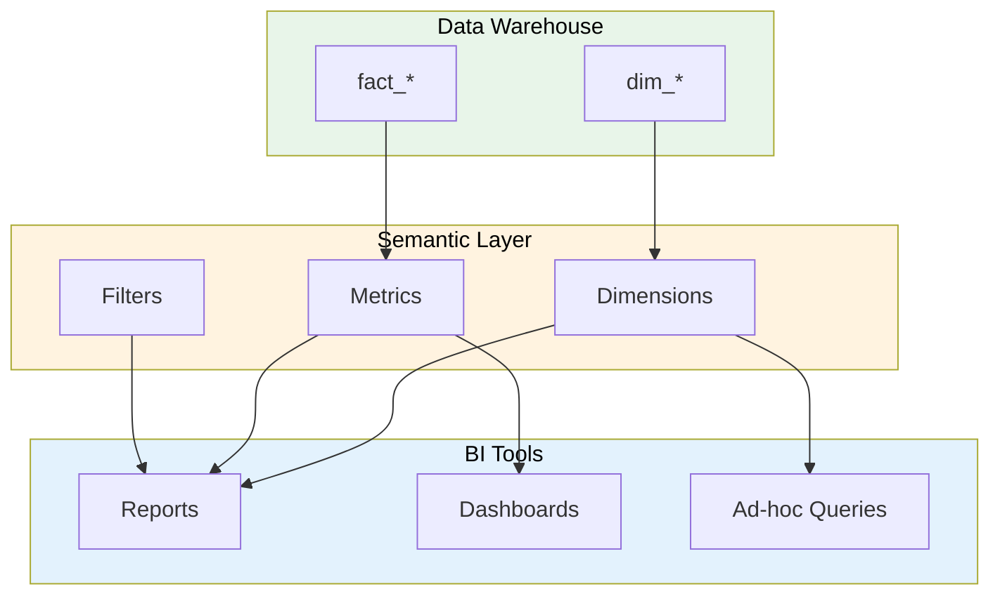

# BI Semantic Layer Definition

> **Project:** [Project Name]
> **Version:** [X.Y] | **Status:** [Draft | Under Review | Approved]
> **Last Updated:** [YYYY-MM-DD]

---

## 1. Purpose

> Defines the business-friendly data model for BI tools — translating technical data into business terms.

## 2. Semantic Layer Architecture

## 3. Metrics Definition

| Metric | Business Name | Calculation | Source | Format |
|--------|-------------|-----------|--------|--------|
| [request_count] | [Total Requests] | [COUNT(requests)] | [fact_requests] | [Integer] |
| [total_amount] | [Total Amount] | [SUM(amount)] | [fact_requests] | [Currency] |
| [avg_amount] | [Average Amount] | [AVG(amount)] | [fact_requests] | [Currency] |
| [processing_days] | [Avg Processing Days] | [AVG(processing_days)] | [fact_requests] | [Decimal] |
| [sla_breach_rate] | [SLA Breach Rate] | [SUM(sla_breach) / COUNT(*)] | [fact_requests] | [Percentage] |
| [approval_rate] | [Approval Rate] | [Approved / Total] | [fact_requests] | [Percentage] |
| [customer_count] | [Total Customers] | [COUNT(DISTINCT customer_id)] | [fact_requests] | [Integer] |
| [transaction_count] | [Total Transactions] | [COUNT(transactions)] | [fact_transactions] | [Integer] |

## 4. Dimensions Definition

| Dimension | Business Name | Source | Attributes |
|----------|-------------|--------|-----------|
| [Date] | [Date] | [dim_date] | [Year, Quarter, Month, Week, Day] |
| [Customer] | [Customer] | [dim_customer] | [Name, Type, Segment] |
| [Category] | [Category] | [dim_category] | [Name, Group] |
| [Status] | [Status] | [dim_status] | [Name, Stage] |
| [Staff] | [Staff] | [dim_staff] | [Name, Role, Department] |

## 5. Filters

| Filter | Business Name | Values | Default |
|--------|-------------|--------|---------|
| [Date Range] | [Date Range] | [Custom range] | [Last 30 days] |
| [Customer Type] | [Customer Type] | [STANDARD, VIP, CORPORATE] | [All] |
| [Category] | [Category] | [All categories] | [All] |
| [Status] | [Status] | [All statuses] | [All] |
| [Staff] | [Staff] | [All staff] | [All] |

## 6. Business-Friendly Names

| Technical Name | Business Name | Description |
|---------------|-------------|-----------|
| [fact_requests] | [Requests] | [Customer request transactions] |
| [dim_customer] | [Customers] | [Customer master data] |
| [dim_date] | [Date] | [Calendar dates] |
| [dim_category] | [Categories] | [Request categories] |
| [dim_status] | [Statuses] | [Request statuses] |
| [amount] | [Amount] | [Request monetary amount] |
| [processing_days] | [Processing Days] | [Days to complete request] |
| [sla_breach] | [SLA Breach] | [Whether SLA was breached] |

---

## Related Documents

| Document | Relationship |
|----------|-------------|
| [[Data-Warehouse-Architecture]] | DW architecture |
| [[Dimensional-Model]] | Star schema |
| [[Report-Dashboard-Catalog]] | Reports using semantic layer |

---

> **Template Standard:** Based on DMBOK v2
> **Usage:** The semantic layer is the *business interface* to the DW. Users don't need to know SQL — they use business terms.
