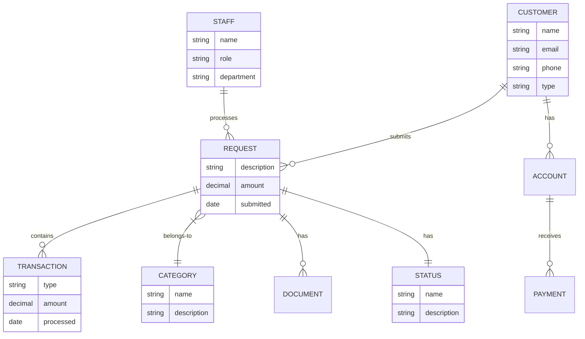

# Conceptual Data Model (CDM)

> **Project:** [Project Name]
> **Version:** [X.Y] | **Status:** [Draft | Under Review | Approved]
> **Last Updated:** [YYYY-MM-DD]

---

## 1. Purpose

> High-level, technology-independent view of business entities and their relationships — the business perspective of data.

## 2. Conceptual Model

## 3. Entity Descriptions

| Entity | Description | Business Owner | Cardinality |
|--------|-----------|---------------|------------|
| [Customer] | [Individual or organization using the service] | [Sales] | [1:N with Request] |
| [Request] | [Formal submission for service] | [Operations] | [N:1 with Customer] |
| [Transaction] | [Financial or operational event] | [Finance] | [N:1 with Request] |
| [Category] | [Classification of requests] | [Operations] | [1:N with Request] |
| [Document] | [Attached files] | [Operations] | [N:1 with Request] |
| [Account] | [Customer account] | [Sales] | [N:1 with Customer] |
| [Payment] | [Payment transaction] | [Finance] | [N:1 with Account] |
| [Staff] | [Employee processing requests] | [HR] | [1:N with Request] |
| [Status] | [Lifecycle state] | [Operations] | [1:N with Request] |

## 4. Key Relationships

| Relationship | Type | Cardinality | Business Rule |
|-------------|------|-----------|--------------|
| [Customer → Request] | [One-to-Many] | [1:N] | [Customer submits multiple requests] |
| [Request → Transaction] | [One-to-Many] | [1:N] | [Request has multiple transactions] |
| [Category → Request] | [One-to-Many] | [1:N] | [Category contains multiple requests] |
| [Staff → Request] | [One-to-Many] | [1:N] | [Staff processes multiple requests] |
| [Request → Status] | [Many-to-One] | [N:1] | [Request has one current status] |

## 5. Business Rules

| # | Rule | Entities |
|---|------|---------|
| 1 | [Every request must belong to a customer] | [Request, Customer] |
| 2 | [Every request must have a category] | [Request, Category] |
| 3 | [Every request must have a status] | [Request, Status] |
| 4 | [Payments link to accounts] | [Payment, Account] |
| 5 | [Documents link to requests] | [Document, Request] |

---

## Related Documents

| Document | Relationship |
|----------|-------------|
| [[Enterprise-Data-Model-EDM]] | Enterprise context |
| [[Logical-Data-Model-LDM]] | Logical implementation |
| [[Business-Glossary]] | Term definitions |

---

> **Template Standard:** Based on DMBOK v2
> **Usage:** The CDM is the *business view*. No technical details — just entities, relationships, and business rules.
