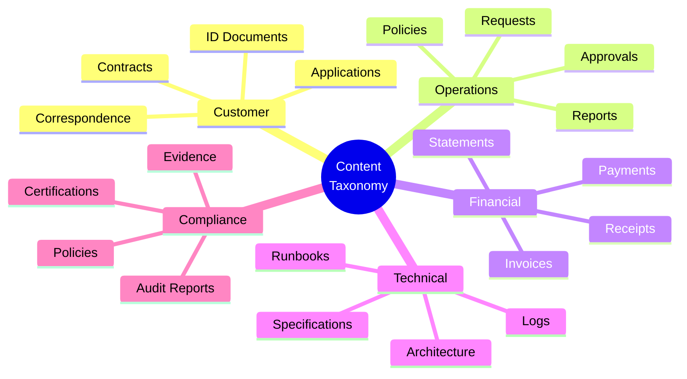

# Content Classification & Taxonomy

> **Project:** [Project Name]
> **Version:** [X.Y] | **Status:** [Draft | Under Review | Approved]
> **Last Updated:** [YYYY-MM-DD]

---

## 1. Purpose

> Defines how content is categorized, tagged, and organized — enabling search, retrieval, and governance.

## 2. Content Taxonomy

## 3. Content Categories

| Category | Description | Examples | Classification | Retention |
|---------|-----------|---------|---------------|----------|
| [Customer Documents] | [Customer-submitted content] | [Contracts, ID, applications] | 🔴 L1 | [7 years] |
| [Operational Documents] | [Business process content] | [Requests, approvals, reports] | 🟡 L2 | [5 years] |
| [Financial Documents] | [Financial records] | [Invoices, payments, receipts] | 🔴 L1 | [7 years] |
| [Technical Documents] | [Technical documentation] | [Architecture, specs, runbooks] | 🟡 L2 | [3 years] |
| [Compliance Documents] | [Regulatory content] | [Audit reports, certifications] | 🔴 L1 | [7 years] |

## 4. Metadata Schema

| Field | Required | Type | Description |
|-------|---------|------|-----------|
| [title] | ✅ | [String] | [Document title] |
| [category] | ✅ | [Enum] | [Content category] |
| [classification] | ✅ | [Enum] | [L1/L2/L3/L4] |
| [author] | ✅ | [String] | [Who created] |
| [created_date] | ✅ | [Date] | [Creation date] |
| [retention_date] | ✅ | [Date] | [When to dispose] |
| [tags] | 🟡 | [Array] | [Searchable tags] |
| [related_entity] | 🟡 | [UUID] | [Linked entity ID] |
| [version] | ✅ | [String] | [Document version] |

## 5. Tagging Guidelines

| Guideline | Description | Example |
|----------|-----------|---------|
| [Use controlled vocabulary] | [Predefined tags only] | [contract, invoice, report] |
| [Be specific] | [Use specific tags] | [customer-contract, not just document] |
| [Use consistent naming] | [Lowercase, hyphenated] | [customer-contract, not Customer Contract] |
| [Tag at creation] | [Tag when content is created] | [Auto-tag + manual review] |

## 6. Search & Retrieval

| Feature | Implementation | Coverage |
|---------|---------------|---------|
| [Full-text search] | [Elasticsearch] | [All content] |
| [Metadata search] | [Database queries] | [All metadata] |
| [Category filter] | [Faceted search] | [All categories] |
| [Classification filter] | [Faceted search] | [All classifications] |
| [Date range filter] | [Faceted search] | [All dates] |

---

## Related Documents

| Document | Relationship |
|----------|-------------|
| [[ECM-Strategy]] | Content management strategy |
| [[Data-Classification-Schema]] | Data classification |
| [[Business-Glossary]] | Terminology |

---

> **Template Standard:** Based on DMBOK v2
> **Usage:** Taxonomy is the *filing system*. Without it, content is a pile of files nobody can find.
