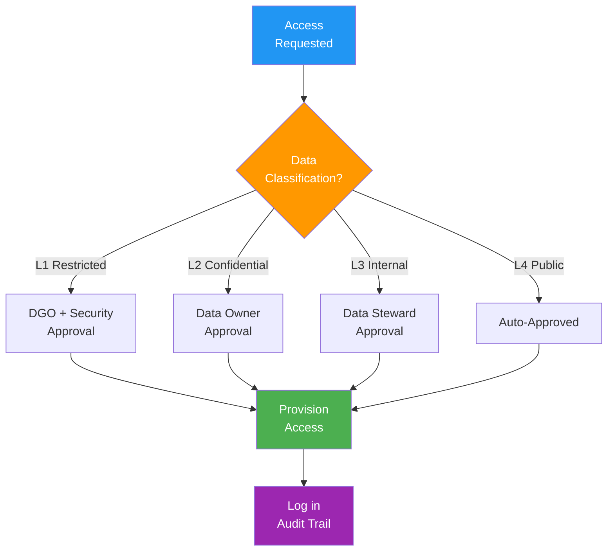

# Data Access Control Policy

> **Project:** [Project Name]
> **Version:** [X.Y] | **Status:** [Draft | Under Review | Approved]
> **Last Updated:** [YYYY-MM-DD]

---

## 1. Purpose

> Defines how access to data is requested, approved, provisioned, monitored, and revoked.

## 2. Access Principles

| Principle | Description | Implementation |
|----------|-------------|---------------|
| [Least Privilege] | [Minimum access required for role] | [RBAC with explicit grants] |
| [Need to Know] | [Access only data required for function] | [Data classification + controls] |
| [Separation of Duties] | [No single person controls data lifecycle] | [Distinct create/approve roles] |
| [Default Deny] | [No access unless explicitly granted] | [IAM deny-by-default] |

## 3. Access Levels

| Level | Description | Data Types | Approval |
|-------|-----------|----------|---------|
| [Read] | [View data] | [Based on classification] | [Data Steward] |
| [Write] | [Create/modify data] | [Based on classification] | [Data Owner] |
| [Admin] | [Full CRUD + schema changes] | [Based on classification] | [DGO + Data Owner] |
| [Export] | [Extract data from system] | [Based on classification] | [Data Owner + Security] |

## 4. Access by Classification

| Access Type | L1 Restricted | L2 Confidential | L3 Internal | L4 Public |
|------------|--------------|----------------|------------|----------|
| [Read] | [MFA + need-to-know + approval] | [MFA + role-based] | [Authentication] | [Anyone] |
| [Write] | [MFA + dual approval] | [MFA + approval] | [Authentication] | [N/A] |
| [Export] | [MFA + DGO + Security approval] | [MFA + Data Owner approval] | [Authentication] | [N/A] |
| [Share] | [Prohibited without DGO] | [Data Owner approval] | [Internal only] | [Anyone] |

## 5. Access Request Process

## 6. Access Review

| Review Type | Frequency | Scope | Owner |
|------------|----------|-------|-------|
| [User access review] | [Quarterly] | [All data access] | [Data Stewards] |
| [Privileged access review] | [Monthly] | [Admin/export access] | [DGO] |
| [L1 data access review] | [Monthly] | [Restricted data access] | [Security Officer] |
| [Dormant account review] | [Monthly] | [Inactive > 90 days] | [Admin] |

## 7. Access Termination

| Trigger | Action | Timeline |
|---------|--------|---------|
| [Employee departure] | [Revoke all access] | [Same day] |
| [Role change] | [Review and adjust] | [Within 3 days] |
| [Contractor end] | [Revoke all access] | [Same day] |
| [Security incident] | [Lock and investigate] | [Immediate] |

---

## Related Documents

| Document | Relationship |
|----------|-------------|
| [[Access-Control-Policy]] | Overall access control |
| [[Data-Classification-Schema]] | Classification driving access |
| [[Data-Policy]] | Data policies |

---

> **Template Standard:** Based on DMBOK v2
> **Usage:** Data access is *classification-driven*. L1 data needs executive approval. L3 data needs a pulse.
