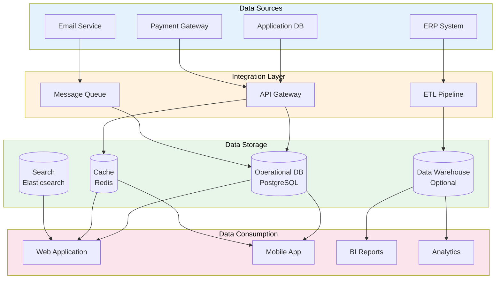

# Data Architecture Blueprint

> **Project:** [Project Name]
> **Version:** [X.Y] | **Status:** [Draft | Under Review | Approved]
> **Last Updated:** [YYYY-MM-DD]

---

## 1. Purpose

> Defines the overall data architecture — how data flows, is stored, processed, and consumed across the enterprise.

## 2. Data Architecture Overview

## 3. Data Stores

| Store | Technology | Purpose | Classification | Retention |
|-------|-----------|---------|---------------|----------|
| [Operational DB] | [PostgreSQL] | [Primary application data] | 🟡 Confidential | [7 years] |
| [Cache] | [Redis] | [Session, temp data] | 🟢 Internal | [24 hours] |
| [Search] | [Elasticsearch] | [Full-text search] | 🟡 Confidential | [1 year] |
| [Data Warehouse] | [Optional] | [Analytics, reporting] | 🟡 Confidential | [5 years] |
| [File Storage] | [S3/MinIO] | [Documents, uploads] | 🟡 Confidential | [7 years] |

## 4. Data Flow Patterns

| Pattern | Source | Destination | Method | Frequency |
|---------|--------|-----------|--------|----------|
| [Real-time sync] | [Application] | [Cache] | [Event-driven] | [Real-time] |
| [Batch sync] | [ERP] | [Data Warehouse] | [ETL] | [Nightly] |
| [Event streaming] | [Application] | [Queue] | [AMQP] | [Real-time] |
| [API calls] | [External] | [Application] | [REST] | [On-demand] |

## 5. Data Integration Points

| System | Direction | Data | Protocol | Frequency |
|--------|----------|------|---------|----------|
| [ERP] | [Inbound] | [Customer data, orders] | [REST API] | [Nightly] |
| [Payment] | [Inbound/Outbound] | [Payments, refunds] | [REST API] | [Real-time] |
| [Email] | [Outbound] | [Notifications] | [SMTP/API] | [Real-time] |
| [SMS] | [Outbound] | [Notifications] | [REST API] | [On-demand] |

## 6. Architecture Principles

| # | Principle | Description |
|---|----------|-------------|
| 1 | [Single source of truth] | [Each data element mastered in one system] |
| 2 | [Data ownership] | [Every data entity has a clear owner] |
| 3 | [Separation of concerns] | [OLTP for transactions, DW for analytics] |
| 4 | [Event-driven] | [Use events for real-time data propagation] |
| 5 | [API-first] | [All data access through well-defined APIs] |

---

## Related Documents

| Document | Relationship |
|----------|-------------|
| [[Enterprise-Data-Model-EDM]] | Data entities |
| [[Data-Flow-Diagram]] | Flow details |
| [[Data-Integration-Architecture]] | Integration details |

---

> **Template Standard:** Based on DMBOK v2
> **Usage:** The blueprint is the *big picture*. Every data decision should align with this architecture.
