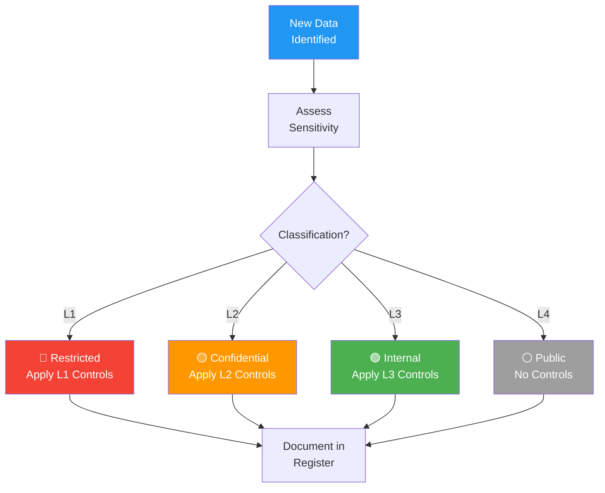

# Data Classification Schema

> **Project:** [Project Name]
> **Version:** [X.Y] | **Status:** [Draft | Under Review | Approved]
> **Last Updated:** [YYYY-MM-DD]

---

## 1. Purpose

> Defines classification levels for all data — driving security controls, access policies, and retention decisions.

## 2. Classification Levels

| Level | Label | Description | Examples | Color |
|-------|-------|-----------|---------|-------|
| [L1] | 🔴 **Restricted** | [Highest sensitivity — breach causes severe harm] | [PII, financial data, credentials, health data] | [Red] |
| [L2] | 🟡 **Confidential** | [Sensitive — breach causes significant harm] | [Business data, contracts, internal reports] | [Yellow] |
| [L3] | 🟢 **Internal** | [Internal use — breach causes minor harm] | [Policies, procedures, meeting notes] | [Green] |
| [L4] | ⚪ **Public** | [Publicly available — no harm from disclosure] | [Marketing materials, public website] | [White] |

## 3. Classification Criteria

| Criterion | L1 Restricted | L2 Confidential | L3 Internal | L4 Public |
|----------|--------------|----------------|------------|----------|
| [Impact if disclosed] | [Severe] | [Significant] | [Minor] | [None] |
| [Regulatory requirement] | [Yes] | [Possible] | [No] | [No] |
| [Business value] | [Critical] | [High] | [Medium] | [Low] |
| [Access restriction] | [Need-to-know] | [Role-based] | [All employees] | [Anyone] |

## 4. Controls by Classification

| Control | L1 Restricted | L2 Confidential | L3 Internal | L4 Public |
|---------|--------------|----------------|------------|----------|
| [Encryption at rest] | ✅ Required | ✅ Required | 🟡 Optional | ❌ Not needed |
| [Encryption in transit] | ✅ Required | ✅ Required | ✅ Required | ❌ Not needed |
| [Access control] | [MFA + need-to-know] | [RBAC] | [Authentication] | [None] |
| [Audit logging] | ✅ Required | ✅ Required | 🟡 Optional | ❌ Not needed |
| [Data masking] | ✅ Required | 🟡 Optional | ❌ Not needed | ❌ Not needed |
| [Backup encryption] | ✅ Required | ✅ Required | 🟡 Optional | ❌ Not needed |
| [Retention control] | ✅ Required | ✅ Required | 🟡 Optional | ❌ Not needed |
| [Disposal verification] | ✅ Required | ✅ Required | 🟡 Optional | ❌ Not needed |

## 5. Data Classification Register

| Data Element | Classification | Justification | Owner | Last Review |
|-------------|---------------|--------------|-------|------------|
| [Customer PII] | 🔴 L1 | [GDPR, privacy] | [Customer Steward] | [YYYY-MM-DD] |
| [Financial data] | 🔴 L1 | [Financial regulation] | [Financial Steward] | [YYYY-MM-DD] |
| [Credentials] | 🔴 L1 | [Security] | [Security Officer] | [YYYY-MM-DD] |
| [Request data] | 🟡 L2 | [Business sensitive] | [Operations Steward] | [YYYY-MM-DD] |
| [Internal reports] | 🟡 L2 | [Business sensitive] | [Data Steward] | [YYYY-MM-DD] |
| [Policies] | 🟢 L3 | [Internal use] | [DGO] | [YYYY-MM-DD] |
| [Public website] | ⚪ L4 | [Public] | [Marketing] | [YYYY-MM-DD] |

## 6. Classification Process

## 7. Reclassification

| Trigger | Action | Owner |
|---------|--------|-------|
| [Regulatory change] | [Reassess affected data] | [DGO] |
| [Business change] | [Reassess affected data] | [Data Steward] |
| [Annual review] | [Review all classifications] | [DGO] |
| [Incident] | [Reassess affected data] | [Security Officer] |

---

## Related Documents

| Document | Relationship |
|----------|-------------|
| [[Data-Policy]] | Policy backing classification |
| [[Access-Control-Policy]] | Access driven by classification |
| [[Data-Retention-Archival-Policy]] | Retention driven by classification |

---

> **Template Standard:** Based on DMBOK v2
> **Usage:** Classification drives *everything* — security, access, retention, disposal. Classify first, then apply controls.
