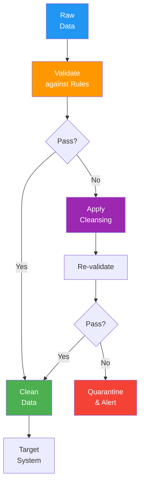

# Data Cleansing Specification

> **Project:** [Project Name]
> **Version:** [X.Y] | **Status:** [Draft | Under Review | Approved]
> **Last Updated:** [YYYY-MM-DD]

---

## 1. Purpose

> Defines rules and procedures for cleansing dirty data — fixing quality issues found during profiling and monitoring.

## 2. Cleansing Rules

### Customer Data Cleansing

| # | Issue | Rule | Before | After | Method |
|---|-------|------|--------|-------|--------|
| 1 | [Email case] | [Lowercase] | [John@Example.COM] | [john@example.com] | [SQL: LOWER(email)] |
| 2 | [Phone format] | [E.164 normalization] | [081-234-5678] | [+66812345678] | [Application logic] |
| 3 | [Name trim] | [Trim whitespace] | [ John Doe ] | [John Doe] | [SQL: TRIM(name)] |
| 4 | [Duplicate emails] | [Keep latest, merge] | [Duplicate records] | [Single record] | [Dedup script] |
| 5 | [Null phone] | [Set to NULL] | [Empty string] | [NULL] | [SQL: NULLIF(phone, '')] |

### Request Data Cleansing

| # | Issue | Rule | Before | After | Method |
|---|-------|------|--------|-------|--------|
| 1 | [Amount precision] | [2 decimal places] | [100.123] | [100.12] | [SQL: ROUND(amount, 2)] |
| 2 | [Description trim] | [Trim whitespace] | [ Request ] | [Request] | [SQL: TRIM(description)] |
| 3 | [Status normalization] | [Uppercase] | [pending] | [PENDING] | [SQL: UPPER(status)] |
| 4 | [Date standardization] | [ISO 8601] | [Various formats] | [ISO 8601] | [Application logic] |

## 3. Cleansing Pipeline

## 4. Cleansing Scripts

| Script | Purpose | Frequency | Input | Output |
|--------|---------|----------|-------|--------|
| [clean_customers.sql] | [Customer data cleansing] | [Nightly] | [Raw customers] | [Clean customers] |
| [dedup_customers.sql] | [Customer deduplication] | [Weekly] | [All customers] | [Deduplicated] |
| [normalize_phones.py] | [Phone normalization] | [On input] | [Raw phones] | [E.164 phones] |
| [standardize_dates.py] | [Date standardization] | [On input] | [Various dates] | [ISO 8601] |

## 5. Cleansing Metrics

| Metric | Before | After | Improvement |
|--------|--------|-------|------------|
| [Email format compliance] | [95%] | [100%] | [+5%] |
| [Phone format compliance] | [80%] | [100%] | [+20%] |
| [Duplicate rate] | [2%] | [0.1%] | [-1.9%] |
| [Null rate (required fields)] | [5%] | [0%] | [-5%] |

---

## Related Documents

| Document | Relationship |
|----------|-------------|
| [[Data-Quality-Rules]] | Quality rules |
| [[Data-Profiling-Report]] | Issues found |
| [[Data-Quality-Issue-Log]] | Issue tracking |

---

> **Template Standard:** Based on DMBOK v2
> **Usage:** Cleansing is *reactive*. Prevention (validation at input) is better. But when dirty data exists, cleanse systematically.
