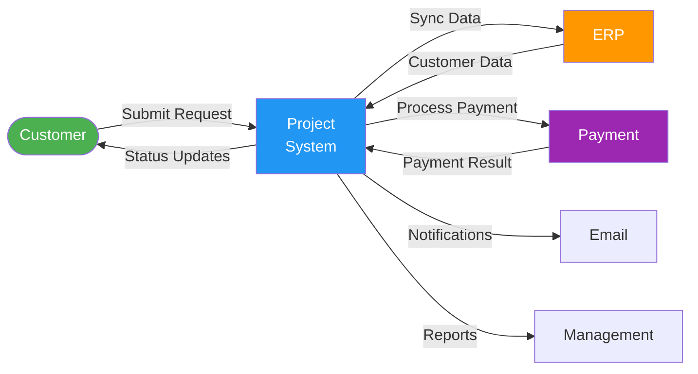
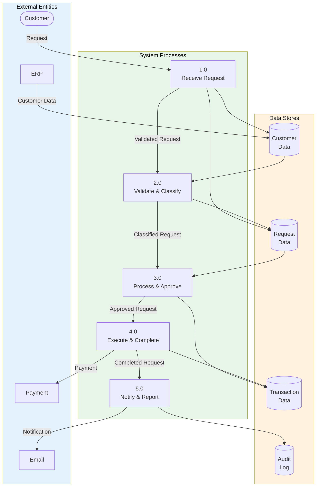

# Data Flow Diagram

> **Project:** [Project Name]
> **Version:** [X.Y] | **Status:** [Draft | Under Review | Approved]
> **Last Updated:** [YYYY-MM-DD]

---

## 1. Purpose

> Visualizes how data moves through the system — from sources to destinations, through transformations.

## 2. Context Diagram (Level 0)

## 3. Level 1 Data Flow

## 4. Data Flow Details

| Flow | Source | Destination | Data Elements | Volume | Frequency |
|------|--------|-----------|--------------|--------|----------|
| [Submit Request] | [Customer] | [System] | [Request details, documents] | [X/day] | [Real-time] |
| [Validate Request] | [System] | [System] | [Validated request, risk score] | [X/day] | [Real-time] |
| [Process Request] | [System] | [System] | [Decision, approval] | [X/day] | [Real-time] |
| [Sync Customer] | [ERP] | [System] | [Customer data] | [X records] | [Nightly] |
| [Process Payment] | [System] | [Payment] | [Amount, account] | [X/day] | [Real-time] |
| [Send Notification] | [System] | [Email] | [Recipient, message] | [X/day] | [Real-time] |

## 5. Data Transformation Rules

| Transformation | Input | Output | Rule |
|---------------|-------|--------|------|
| [Request Classification] | [Raw request] | [Classified request] | [Business rules engine] |
| [Risk Scoring] | [Request + Customer] | [Risk score] | [Risk algorithm] |
| [Notification Generation] | [Status change] | [Notification message] | [Template engine] |

---

## Related Documents

| Document | Relationship |
|----------|-------------|
| [[Data-Architecture-Blueprint]] | Architecture context |
| [[Data-Lineage-Documentation]] | Detailed lineage |
| [[Data-Integration-Architecture]] | Integration details |

---

> **Template Standard:** Based on DMBOK v2
> **Usage:** Data flows show *where data goes*. If you can't trace the flow, you can't protect or quality-check it.
