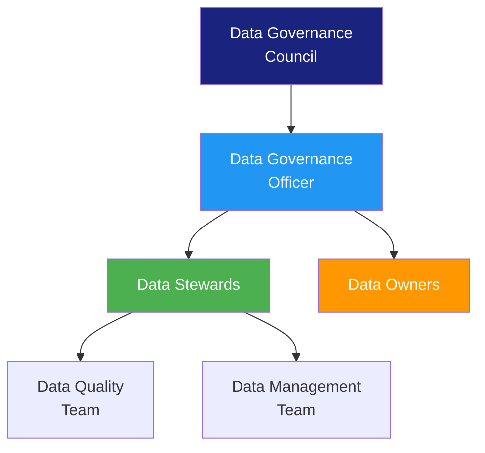

# Data Governance Charter

> **Project:** [Project Name]
> **Version:** [X.Y] | **Status:** [Draft | Under Review | Approved]
> **Last Updated:** [YYYY-MM-DD]

---

## 1. Purpose

> Establishes the authority, scope, and objectives for data governance — the foundation for managing data as an asset.

## 2. Governance Vision

> [Organization] recognizes data as a strategic asset. This charter establishes the framework for managing data quality, security, privacy, and lifecycle to maximize business value while ensuring compliance.

## 3. Governance Objectives

| # | Objective | Success Metric | Target |
|---|----------|---------------|--------|
| 1 | [Ensure data quality] | [Data quality score] | [≥ 95%] |
| 2 | [Protect data privacy] | [Compliance incidents] | [0] |
| 3 | [Maximize data value] | [Data-driven decisions] | [≥ 80%] |
| 4 | [Ensure regulatory compliance] | [Audit findings] | [0 critical] |
| 5 | [Enable data sharing] | [Data access requests fulfilled] | [≥ 90%] |

## 4. Governance Scope

| In Scope | Out of Scope |
|---------|-------------|
| [Customer data] | [Third-party vendor data] |
| [Transaction data] | [Public data] |
| [Operational data] | [Personal devices] |
| [Analytics data] | — |

## 5. Governance Organization

| Role | Responsibilities | Appointment |
|------|-----------------|-----------|
| [Data Governance Council] | [Strategic direction, policy approval, dispute resolution] | [Executive sponsors] |
| [Data Governance Officer] | [Day-to-day governance, policy implementation] | [Data Architect] |
| [Data Stewards] | [Data quality, metadata, standards enforcement] | [Domain experts] |
| [Data Owners] | [Accountability for data domains] | [Business leaders] |

## 6. Governance Principles

| # | Principle | Description |
|---|----------|-------------|
| 1 | [Data as Asset] | [Data has value and should be managed accordingly] |
| 2 | [Data Quality] | [Data must be accurate, complete, timely, and consistent] |
| 3 | [Data Security] | [Data must be protected from unauthorized access] |
| 4 | [Data Privacy] | [Personal data must be handled per regulations] |
| 5 | [Data Transparency] | [Data lineage and usage must be traceable] |
| 6 | [Data Accountability] | [Clear ownership and stewardship for all data] |

## 7. Governance Meetings

| Meeting | Frequency | Participants | Purpose |
|---------|----------|-------------|---------|
| [Governance Council] | [Monthly] | [Executives] | [Strategic decisions] |
| [Stewardship Meeting] | [Bi-weekly] | [Data Stewards] | [Quality, standards, issues] |
| [Data Review] | [Weekly] | [Data team] | [Operational data issues] |

---

## Related Documents

| Document | Relationship |
|----------|-------------|
| [[Data-Governance-Strategy]] | Strategic implementation |
| [[Data-Governance-Operating-Framework]] | Operating model |
| [[Data-Policy]] | Policy framework |

---

> **Template Standard:** Based on DMBOK v2
> **Usage:** The charter is the *authority*. Without it, governance is just a good idea. Get executive sponsorship.
