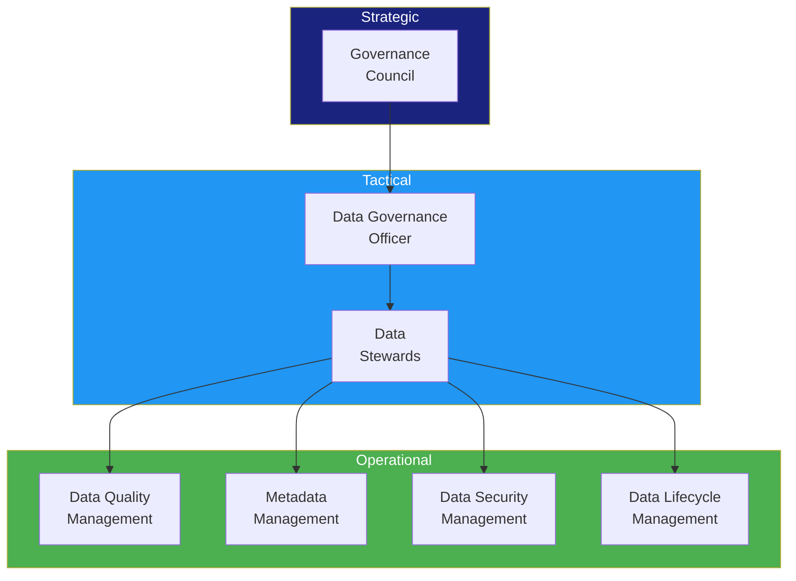

# Data Governance Operating Framework

> **Project:** [Project Name]
> **Version:** [X.Y] | **Status:** [Draft | Under Review | Approved]
> **Last Updated:** [YYYY-MM-DD]

---

## 1. Purpose

> Defines how data governance operates day-to-day — processes, roles, decision rights, and accountability.

## 2. Operating Model

## 3. Decision Rights Matrix (RACI)

| Decision | Council | DGO | Stewards | Owners | IT |
|---------|---------|-----|---------|--------|-----|
| [Data policy approval] | [A] | [R] | [C] | [C] | [I] |
| [Data standards] | [A] | [R] | [C] | [I] | [C] |
| [Data quality rules] | [I] | [A] | [R] | [C] | [C] |
| [Access grants] | [I] | [A] | [R] | [C] | [R] |
| [Data classification] | [I] | [A] | [R] | [C] | [I] |
| [Retention decisions] | [A] | [R] | [C] | [C] | [I] |
| [Incident response] | [I] | [A] | [R] | [C] | [R] |

## 4. Governance Processes

| Process | Frequency | Owner | Inputs | Outputs |
|---------|----------|-------|--------|---------|
| [Data quality review] | [Weekly] | [Data Steward] | [Quality reports] | [Remediation actions] |
| [Access review] | [Quarterly] | [DGO] | [Access logs] | [Access adjustments] |
| [Policy review] | [Annual] | [Council] | [Compliance reports] | [Policy updates] |
| [Incident review] | [As needed] | [DGO] | [Incident reports] | [Corrective actions] |
| [Maturity assessment] | [Annual] | [DGO] | [Assessment results] | [Improvement plan] |

## 5. Escalation Path

| Level | Escalation To | When |
|-------|-------------|------|
| [L1] | [Data Steward] | [Data quality issues, access requests] |
| [L2] | [Data Governance Officer] | [Cross-domain issues, policy questions] |
| [L3] | [Governance Council] | [Strategic decisions, disputes] |

## 6. Tools & Platforms

| Function | Tool | Purpose |
|---------|------|---------|
| [Data Catalog] | [Apache Atlas / DataHub] | [Metadata management] |
| [Data Quality] | [Great Expectations / dbt] | [Quality rules and monitoring] |
| [Data Lineage] | [Apache Atlas / OpenLineage] | [Lineage tracking] |
| [Access Management] | [IAM / RBAC] | [Access control] |

---

## Related Documents

| Document | Relationship |
|----------|-------------|
| [[Data-Governance-Charter]] | Authority |
| [[Data-Governance-Strategy]] | Strategy |
| [[Data-Stewardship-Assignment]] | Role assignments |

---

> **Template Standard:** Based on DMBOK v2
> **Usage:** The operating framework is the *how*. Without it, governance is just policy on paper.
