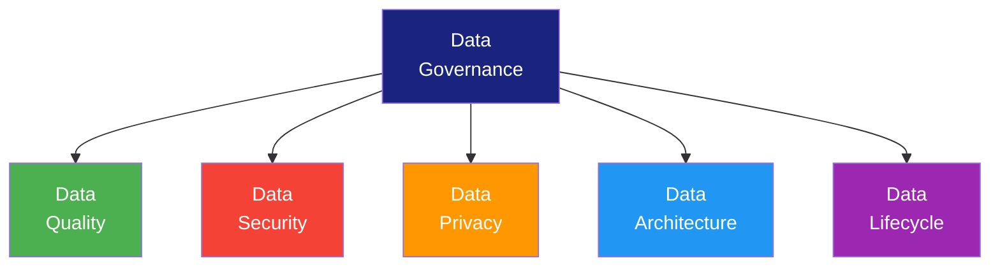
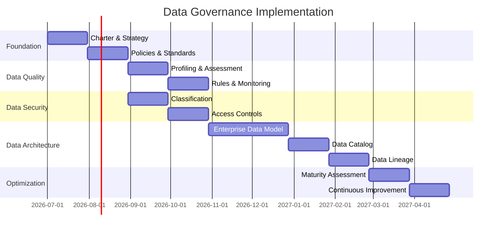

# Data Governance Strategy

> **Project:** [Project Name]
> **Version:** [X.Y] | **Status:** [Draft | Under Review | Approved]
> **Last Updated:** [YYYY-MM-DD]

---

## 1. Purpose

> Defines the strategic implementation of data governance — how the charter will be realized.

## 2. Strategic Pillars

## 3. Strategic Objectives

| Pillar | Objective | Key Results | Timeline |
|--------|----------|------------|---------|
| [Data Quality] | [Achieve 95% data quality score] | [Implement profiling, rules, monitoring] | [6 months] |
| [Data Security] | [Zero data breaches] | [Encryption, access controls, monitoring] | [3 months] |
| [Data Privacy] | [Full regulatory compliance] | [GDPR compliance, consent management] | [6 months] |
| [Data Architecture] | [Unified data model] | [EDM, data catalog, lineage] | [12 months] |
| [Data Lifecycle] | [Automated lifecycle management] | [Retention, archival, disposal policies] | [9 months] |

## 4. Implementation Roadmap

## 5. Success Metrics

| Metric | Baseline | Target | Timeline |
|--------|---------|--------|---------|
| [Data quality score] | [X%] | [≥ 95%] | [6 months] |
| [Data incidents] | [X] | [0] | [3 months] |
| [Compliance score] | [X%] | [100%] | [6 months] |
| [Data catalog coverage] | [0%] | [100%] | [12 months] |
| [Stewardship coverage] | [0%] | [100%] | [6 months] |

## 6. Investment

| Category | Cost | Timeline |
|---------|------|---------|
| [Tools] | [$X] | [Year 1] |
| [People] | [$X/year] | [Ongoing] |
| [Training] | [$X] | [Year 1] |
| **Total** | **[$X]** | |

---

## Related Documents

| Document | Relationship |
|----------|-------------|
| [[Data-Governance-Charter]] | Authority |
| [[Data-Governance-Operating-Framework]] | Operating model |
| [[Data-Management-Maturity-Assessment]] | Maturity baseline |

---

> **Template Standard:** Based on DMBOK v2
> **Usage:** Strategy without execution is hallucination. Track progress monthly. Adjust quarterly.
