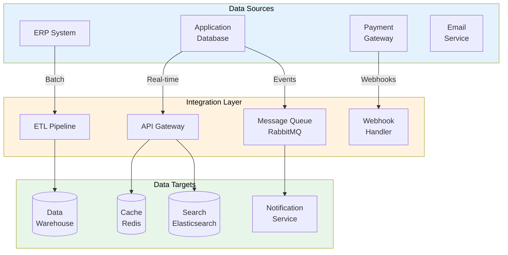

# Data Integration Architecture

> **Project:** [Project Name]
> **Version:** [X.Y] | **Status:** [Draft | Under Review | Approved]
> **Last Updated:** [YYYY-MM-DD]

---

## 1. Purpose

> Defines how data is integrated across systems — patterns, protocols, and architecture for data movement.

## 2. Integration Architecture

## 3. Integration Patterns

| Pattern | Use Case | Latency | Reliability | Implementation |
|---------|---------|---------|------------|---------------|
| [Synchronous API] | [Real-time queries] | [Low] | [Medium] | [REST API] |
| [Asynchronous Events] | [Event-driven processing] | [Low] | [High] | [RabbitMQ] |
| [Batch ETL] | [Bulk data transfer] | [High] | [High] | [dbt + Airflow] |
| [Webhooks] | [External notifications] | [Low] | [Medium] | [HTTP callbacks] |
| [CDC] | [Change data capture] | [Low] | [High] | [Debezium] |

## 4. Integration Points

| System | Direction | Data | Pattern | Frequency | Protocol |
|--------|----------|------|---------|----------|---------|
| [ERP] | [Inbound] | [Customer, orders] | [Batch ETL] | [Nightly] | [REST API] |
| [Payment] | [Inbound/Outbound] | [Payments] | [Webhooks] | [Real-time] | [HTTPS] |
| [Email] | [Outbound] | [Notifications] | [Async Events] | [Real-time] | [SMTP/API] |
| [SMS] | [Outbound] | [Notifications] | [Async Events] | [On-demand] | [REST API] |
| [Analytics] | [Outbound] | [Events] | [CDC] | [Real-time] | [Kafka] |

## 5. Data Transformation

| Transformation | Source Format | Target Format | Location |
|---------------|-------------|--------------|---------|
| [Phone normalization] | [Various] | [E.164] | [API layer] |
| [Currency conversion] | [Local currency] | [USD] | [ETL] |
| [Date standardization] | [Various] | [ISO 8601] | [API layer] |
| [Data enrichment] | [Minimal] | [Enriched] | [ETL] |

## 6. Error Handling

| Error Type | Handling | Retry | Alert |
|-----------|---------|-------|-------|
| [Connection failure] | [Retry with backoff] | [3 attempts] | [After 3 failures] |
| [Data validation error] | [Quarantine + alert] | [Manual review] | [Immediate] |
| [Transformation error] | [Log + skip] | [No retry] | [Daily summary] |
| [Timeout] | [Retry with backoff] | [3 attempts] | [After 3 failures] |

---

## Related Documents

| Document | Relationship |
|----------|-------------|
| [[Data-Flow-Diagram]] | Data flow details |
| [[ETL-ELT-Specification]] | ETL implementation |
| [[API-Data-Contract]] | API contracts |

---

> **Template Standard:** Based on DMBOK v2
> **Usage:** Integration architecture is the *big picture* of data movement. Every integration should align with this architecture.
