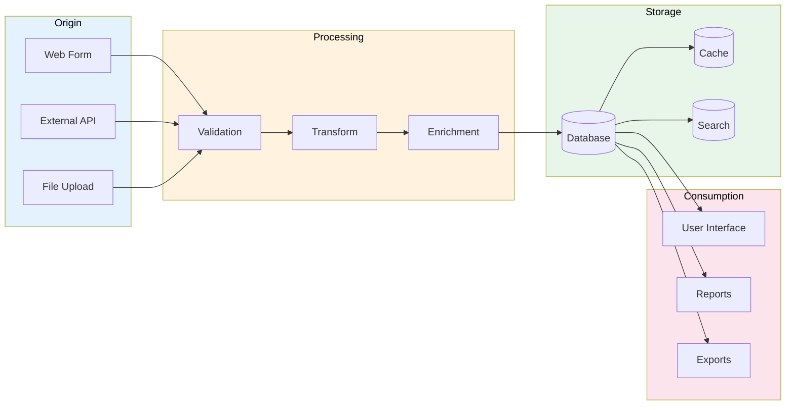

# Data Lineage Documentation

> **Project:** [Project Name]
> **Version:** [X.Y] | **Status:** [Draft | Under Review | Approved]
> **Last Updated:** [YYYY-MM-DD]

---

## 1. Purpose

> Tracks data from origin to consumption — where it comes from, how it's transformed, and where it goes.

## 2. Lineage Overview

## 3. Entity Lineage

### Customer Entity

| Stage | System | Transformation | Quality Rules |
|-------|--------|---------------|-------------|
| [Source] | [Web Form] | [Raw input] | [Format validation] |
| [Validate] | [API] | [Email format, phone format] | [Zod schema] |
| [Transform] | [API] | [Normalize phone to E.164] | [Phone standardization] |
| [Store] | [PostgreSQL] | [Persisted] | [Unique constraint] |
| [Cache] | [Redis] | [Cached for 1 hour] | [TTL = 3600] |
| [Display] | [Web UI] | [Formatted for display] | [PII masking] |

### Request Entity

| Stage | System | Transformation | Quality Rules |
|-------|--------|---------------|-------------|
| [Source] | [Web Form] | [Raw input] | [Required fields] |
| [Validate] | [API] | [Business rules validation] | [Amount > 0] |
| [Classify] | [Rules Engine] | [Auto-classification] | [Category mapping] |
| [Risk Score] | [Risk Engine] | [Calculate risk score] | [Score = 0-100] |
| [Store] | [PostgreSQL] | [Persisted] | [FK to customer] |
| [Process] | [Workflow] | [Status transitions] | [Valid state machine] |
| [Report] | [Analytics] | [Aggregated] | [No PII in reports] |

## 4. Transformation Catalog

| # | Transformation | Input | Output | Location | Purpose |
|---|---------------|-------|--------|----------|---------|
| 1 | [Phone Normalization] | [Raw phone] | [E.164 phone] | [API layer] | [Consistent format] |
| 2 | [Email Validation] | [Raw email] | [Valid email] | [API layer] | [Data quality] |
| 3 | [Request Classification] | [Request details] | [Category] | [Rules engine] | [Automation] |
| 4 | [Risk Scoring] | [Request + Customer] | [Score 0-100] | [Risk engine] | [Risk management] |
| 5 | [PII Masking] | [Full data] | [Masked data] | [API response] | [Privacy protection] |
| 6 | [Status Transition] | [Current + Action] | [New status] | [Workflow] | [State management] |

## 5. Lineage for Compliance

| Data Element | Source | Processing | Storage | Retention | Disposal |
|-------------|--------|-----------|---------|----------|---------|
| [Customer PII] | [Web Form] | [Validated, encrypted] | [Encrypted DB] | [7 years] | [Secure deletion] |
| [Financial Data] | [API] | [Validated, logged] | [Encrypted DB] | [7 years] | [Secure deletion] |
| [Audit Logs] | [System] | [Structured] | [Log store] | [1 year] | [Automated cleanup] |
| [Session Data] | [System] | [Tokenized] | [Redis] | [30 min] | [Auto-expire] |

## 6. Lineage Tools

| Tool | Purpose | Coverage |
|------|---------|---------|
| [Data Catalog] | [Metadata + lineage] | [All entities] |
| [dbt] | [Transformation lineage] | [Data warehouse] |
| [OpenLineage] | [Pipeline lineage] | [ETL pipelines] |

---

## Related Documents

| Document | Relationship |
|----------|-------------|
| [[Data-Flow-Diagram]] | Flow visualization |
| [[Data-Architecture-Blueprint]] | Architecture context |
| [[Data-Quality-Rules]] | Quality checks |

---

> **Template Standard:** Based on DMBOK v2
> **Usage:** Lineage answers "where did this data come from?" — essential for debugging, compliance, and trust.
