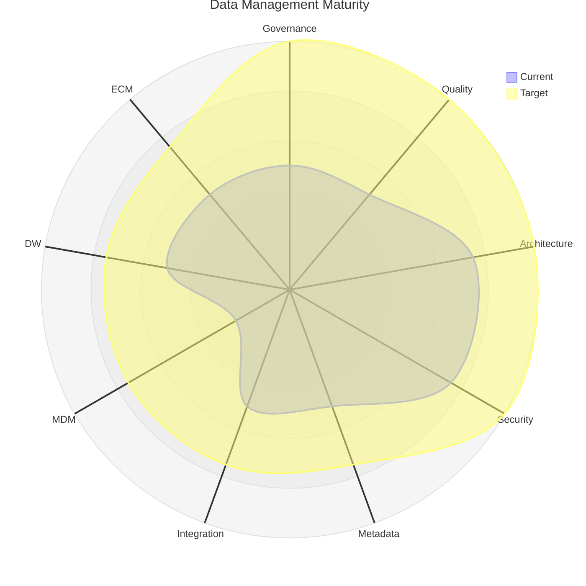
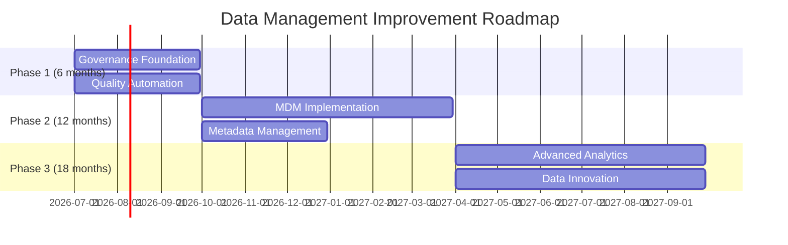

# Data Management Maturity Assessment

> **Project:** [Project Name]
> **Version:** [X.Y] | **Status:** [Draft | Under Review | Approved]
> **Last Updated:** [YYYY-MM-DD]

---

## 1. Purpose

> Assesses current data management maturity and identifies improvement opportunities — the baseline for the data strategy.

## 2. Maturity Model

| Level | Name | Description |
|-------|------|-----------|
| [1] | [Initial] | [Ad hoc, no formal processes] |
| [2] | [Managed] | [Repeatable processes, some documentation] |
| [3] | [Defined] | [Standardized processes, organization-wide] |
| [4] | [Quantitative] | [Measured and controlled, data-driven decisions] |
| [5] | [Optimizing] | [Continuous improvement, innovation] |

## 3. Assessment Results

| Domain | Current Level | Target Level | Gap | Priority |
|--------|-------------|-------------|-----|---------|
| [Data Governance] | [2 — Managed] | [4 — Quantitative] | [2 levels] | 🔴 High |
| [Data Quality] | [2 — Managed] | [4 — Quantitative] | [2 levels] | 🔴 High |
| [Data Architecture] | [3 — Defined] | [4 — Quantitative] | [1 level] | 🟡 Medium |
| [Data Security] | [3 — Defined] | [4 — Quantitative] | [1 level] | 🟡 Medium |
| [Metadata Management] | [2 — Managed] | [3 — Defined] | [1 level] | 🟡 Medium |
| [Data Integration] | [2 — Managed] | [3 — Defined] | [1 level] | 🟡 Medium |
| [Master Data] | [1 — Initial] | [3 — Defined] | [2 levels] | 🔴 High |
| [Data Warehousing] | [2 — Managed] | [3 — Defined] | [1 level] | 🟡 Medium |
| [Document Management] | [2 — Managed] | [3 — Defined] | [1 level] | 🟢 Low |

## 4. Assessment Radar

## 5. Strengths

| # | Strength | Domain | Evidence |
|---|---------|--------|---------|
| 1 | [Data security controls in place] | [Security] | [Encryption, access controls] |
| 2 | [Architecture documented] | [Architecture] | [EDM, data flow diagrams] |
| 3 | [Quality monitoring active] | [Quality] | [Quality rules, scorecards] |

## 6. Improvement Opportunities

| # | Opportunity | Domain | Action | Priority |
|---|-----------|--------|--------|---------|
| 1 | [Formalize data governance] | [Governance] | [Charter, strategy, operating framework] | 🔴 High |
| 2 | [Implement MDM] | [MDM] | [MDM strategy, golden records] | 🔴 High |
| 3 | [Improve metadata management] | [Metadata] | [Data catalog, metadata standards] | 🟡 Medium |
| 4 | [Automate data quality] | [Quality] | [Automated rules, monitoring] | 🟡 Medium |

## 7. Improvement Roadmap

---

## Related Documents

| Document | Relationship |
|----------|-------------|
| [[Data-Governance-Strategy]] | Strategy driven by assessment |
| [[Data-Technology-Roadmap]] | Technology roadmap |
| [[Data-Asset-Valuation-Report]] | Data value assessment |

---

> **Template Standard:** Based on DMBOK v2
> **Usage:** You can't improve what you haven't measured. Assess maturity, set targets, create roadmap, execute.
