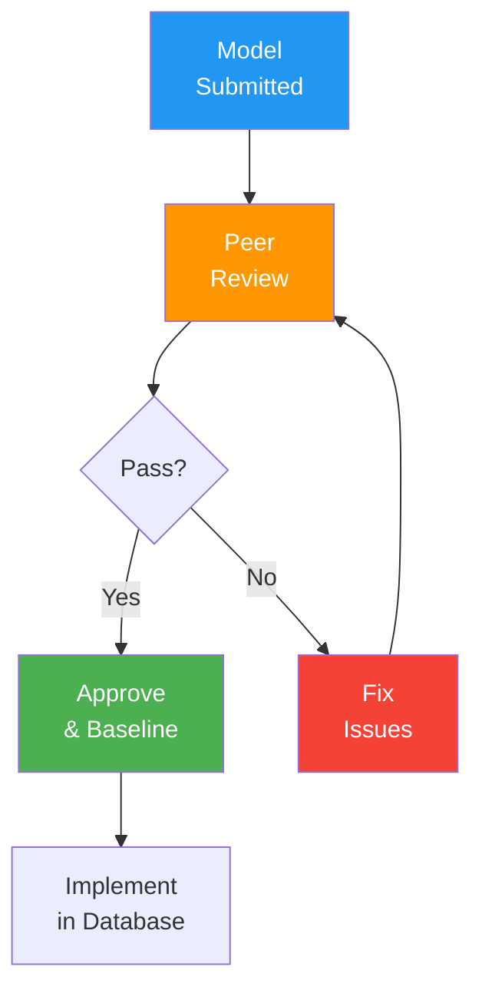

# Data Model Review Records

> **Project:** [Project Name]
> **Version:** [X.Y] | **Status:** [Active]
> **Last Updated:** [YYYY-MM-DD]

---

## 1. Purpose

> Records peer review outcomes for data models — ensuring quality, standards compliance, and correctness.

## 2. Review Process

## 3. Review Register

| # | Model | Reviewer | Date | Findings | Disposition |
|---|-------|---------|------|---------|-----------|
| 1 | [CDM v1.0] | [Data Architect] | [YYYY-MM-DD] | [2 minor] | ✅ Approved with comments |
| 2 | [LDM v1.0] | [Data Architect] | [YYYY-MM-DD] | [1 major, 3 minor] | ✅ Approved after fix |
| 3 | [PDM v1.0] | [DBA] | [YYYY-MM-DD] | [2 minor] | ✅ Approved with comments |
| 4 | [Star Schema v1.0] | [Data Architect] | [YYYY-MM-DD] | [0] | ✅ Approved |

## 4. Review Template

### Review: [Model Name] v[X.Y]

| Field | Detail |
|-------|--------|
| **Model** | [Model name and version] |
| **Author** | [Who created the model] |
| **Reviewer** | [Who reviewed the model] |
| **Date** | [YYYY-MM-DD] |
| **Scope** | [What was reviewed] |

### Findings

| # | Finding | Severity | Category | Resolution |
|---|--------|---------|---------|-----------|
| 1 | [Finding description] | [Major/Minor] | [Naming/Structure/Type/Constraint] | [How resolved] |

### Disposition

- [ ] ✅ Approved — no changes required
- [ ] ✅ Approved with comments — minor changes noted
- [ ] ⚠️ Approved after fix — major changes required and verified
- [ ] ❌ Not approved — significant issues, requires re-review

### Sign-off

| Role | Name | Date | Signature |
|------|------|------|----------|
| [Author] | [Name] | [YYYY-MM-DD] | — |
| [Reviewer] | [Name] | [YYYY-MM-DD] | — |

## 5. Review Statistics

| Metric | Value |
|--------|-------|
| [Total reviews] | [4] |
| [First-pass approval] | [50%] |
| [Average findings per review] | [2.0] |
| [Major findings] | [1] |

---

## Related Documents

| Document | Relationship |
|----------|-------------|
| [[Data-Modeling-Standards]] | Standards being enforced |
| [[Physical-Data-Model-PDM]] | Models being reviewed |

---

> **Template Standard:** Based on DMBOK v2
> **Usage:** Every data model gets reviewed before implementation. No exceptions. Review catches issues before they become production problems.
