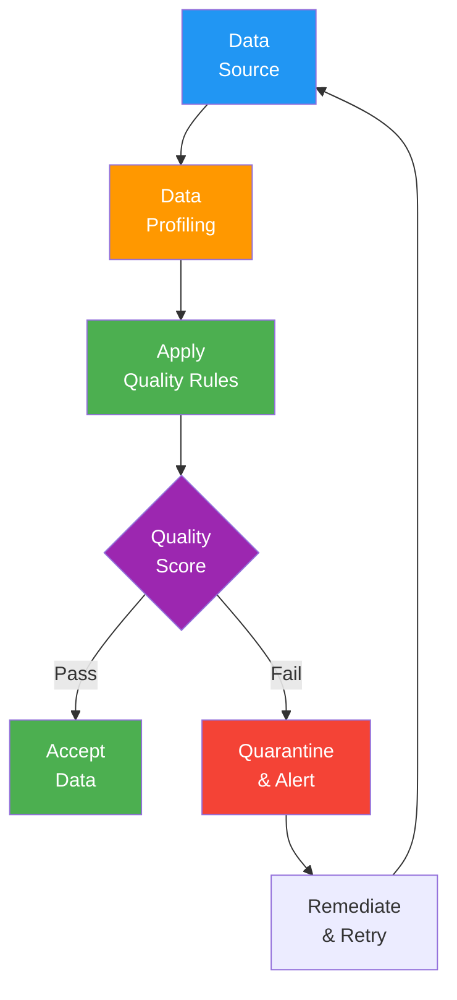

# Data Quality Strategy

> **Project:** [Project Name]
> **Version:** [X.Y] | **Status:** [Draft | Under Review | Approved]
> **Last Updated:** [YYYY-MM-DD]

---

## 1. Purpose

> Defines how data quality is measured, monitored, and improved — ensuring data is fit for purpose.

## 2. Data Quality Dimensions

| Dimension | Definition | Threshold | Measurement |
|----------|-----------|----------|-----------|
| [Accuracy] | [Data correctly represents reality] | [≥ 99%] | [Validation rules, cross-checks] |
| [Completeness] | [All required fields populated] | [≥ 95%] | [Null check] |
| [Consistency] | [Same data across systems] | [≥ 99%] | [Cross-system comparison] |
| [Timeliness] | [Data available when needed] | [< 1 hour lag] | [Freshness monitoring] |
| [Uniqueness] | [No duplicate records] | [≥ 99%] | [Deduplication check] |
| [Validity] | [Data conforms to rules] | [≥ 99%] | [Format validation] |

## 3. Quality Rules

| # | Rule | Dimension | Entity | Field | Threshold |
|---|------|----------|--------|-------|----------|
| 1 | [Email format valid] | [Validity] | [Customer] | [email] | [100%] |
| 2 | [Phone E.164 format] | [Validity] | [Customer] | [phone] | [100%] |
| 3 | [Amount > 0] | [Validity] | [Request] | [amount] | [100%] |
| 4 | [No null in required fields] | [Completeness] | [All] | [Required] | [100%] |
| 5 | [No duplicate emails] | [Uniqueness] | [Customer] | [email] | [100%] |
| 6 | [Status is valid enum] | [Validity] | [Request] | [status] | [100%] |
| 7 | [Customer exists] | [Referential] | [Request] | [customer_id] | [100%] |
| 8 | [Category exists] | [Referential] | [Request] | [category_id] | [100%] |

## 4. Quality Monitoring

## 5. Quality Scorecard

| Entity | Accuracy | Completeness | Consistency | Timeliness | Uniqueness | Validity | Overall |
|--------|---------|-------------|------------|-----------|-----------|---------|--------|
| [Customer] | [99.5%] | [98%] | [99%] | [99%] | [99.8%] | [99.5%] | [99.1%] |
| [Request] | [99%] | [97%] | [99%] | [99%] | [100%] | [99%] | [98.8%] |
| [Transaction] | [99.9%] | [99%] | [99.5%] | [99%] | [100%] | [99.9%] | [99.5%] |

## 6. Quality Improvement

| # | Issue | Root Cause | Improvement | Owner | Status |
|---|-------|-----------|------------|-------|--------|
| 1 | [Phone format inconsistent] | [No validation at input] | [Add E.164 validation] | [Dev] | ✅ Fixed |
| 2 | [Duplicate customers] | [No dedup on registration] | [Add email uniqueness check] | [Dev] | ✅ Fixed |
| 3 | [Missing optional fields] | [Not enforced] | [Consider making required] | [BA] | 🔄 Review |

## 7. Quality Metrics

| Metric | Definition | Target | Current |
|--------|-----------|--------|---------|
| [Overall DQ score] | [Average across all dimensions] | [≥ 95%] | [X%] |
| [DQ issues per month] | [Count of quality issues] | [< 10] | [X] |
| [DQ issue resolution time] | [Avg days to resolve] | [< 3 days] | [X days] |
| [DQ rules pass rate] | [Rules passing / Total rules] | [≥ 99%] | [X%] |

---

## Related Documents

| Document | Relationship |
|----------|-------------|
| [[Data-Quality-Rules]] | Specific rules |
| [[Data-Quality-Scorecard]] | Quality metrics |
| [[Data-Profiling-Report]] | Profiling results |

---

> **Template Standard:** Based on DMBOK v2
> **Usage:** Data quality is *measured*, not assumed. Profile regularly, monitor continuously, improve systematically.
