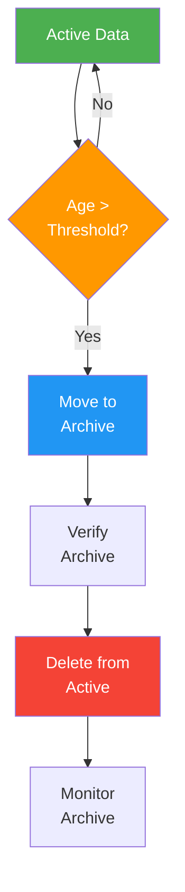

# Data Retention & Archival Policy

> **Project:** [Project Name]
> **Version:** [X.Y] | **Status:** [Draft | Under Review | Approved]
> **Last Updated:** [YYYY-MM-DD]

---

## 1. Purpose

> Defines how long data is retained, when it's archived, and when it's disposed — balancing business needs, compliance, and cost.

## 2. Retention Schedule

| Data Type | Active Retention | Archive After | Archive Retention | Dispose After | Legal Basis |
|----------|-----------------|--------------|------------------|--------------|------------|
| [Customer PII] | [Active account] | [Account closure + 30 days] | [7 years] | [7 years after closure] | [GDPR, tax law] |
| [Request data] | [2 years] | [2 years] | [5 years] | [7 years total] | [Business need] |
| [Transaction data] | [2 years] | [2 years] | [5 years] | [7 years total] | [Tax law, audit] |
| [Audit logs] | [1 year] | [1 year] | [2 years] | [3 years total] | [Compliance] |
| [Session data] | [30 days] | — | — | [30 days] | [No retention needed] |
| [Temp data] | [24 hours] | — | — | [24 hours] | [No retention needed] |
| [Documents] | [Active request] | [Request closure + 30 days] | [7 years] | [7 years after closure] | [Business need] |

## 3. Archival Process

## 4. Archive Storage

| Data Type | Archive Location | Compression | Encryption | Access |
|----------|-----------------|------------|-----------|--------|
| [Customer PII] | [S3 Glacier] | [gzip] | [AES-256] | [DBA only] |
| [Request data] | [S3 Glacier] | [gzip] | [AES-256] | [DBA + BA] |
| [Transaction data] | [S3 Glacier] | [gzip] | [AES-256] | [DBA + Finance] |
| [Audit logs] | [S3 Standard-IA] | [gzip] | [AES-256] | [Security] |
| [Documents] | [S3 Glacier] | [None] | [AES-256] | [DBA + BA] |

## 5. Disposal Procedures

| Step | Action | Verification | Documentation |
|------|--------|-------------|--------------|
| 1 | [Confirm retention period expired] | [Date check] | [Log entry] |
| 2 | [Verify no legal hold] | [Legal check] | [Confirmation] |
| 3 | [Delete from archive] | [Deletion command] | [Deletion certificate] |
| 4 | [Verify deletion] | [Access check] | [Verification log] |
| 5 | [Document disposal] | [Disposal record] | [Retention log] |

## 6. Legal Hold Process

| Step | Action | Owner |
|------|--------|-------|
| 1 | [Legal hold notice received] | [Legal] |
| 2 | [Identify affected data] | [Data Steward] |
| 3 | [Suspend retention/disposal] | [DBA] |
| 4 | [Document hold] | [Data Governance Officer] |
| 5 | [Release hold when cleared] | [Legal → DBA] |

## 7. Compliance

| Regulation | Requirement | Implementation |
|-----------|------------|---------------|
| [GDPR] | [Data minimization, right to erasure] | [Retention schedules + deletion process] |
| [Tax Law] | [7-year financial records] | [7-year retention for transactions] |
| [Audit] | [Audit trail retention] | [3-year retention for logs] |

---

## Related Documents

| Document | Relationship |
|----------|-------------|
| [[Data-Policy]] | Overall data policy |
| [[Data-Classification-Schema]] | Classification driving retention |
| [[Backup-Recovery-Plan]] | Backup retention |

---

> **Template Standard:** Based on DMBOK v2
> **Usage:** Retention is *not* "keep everything forever." Store what you need, archive what you might need, delete what you don't.
