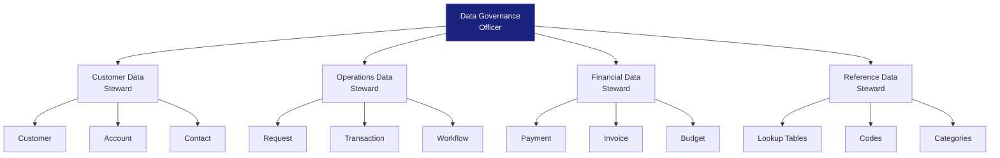

# Data Stewardship Assignment

> **Project:** [Project Name]
> **Version:** [X.Y] | **Status:** [Draft | Under Review | Approved]
> **Last Updated:** [YYYY-MM-DD]

---

## 1. Purpose

> Assigns data stewards and owners to data domains — ensuring accountability for data quality, security, and lifecycle.

## 2. Stewardship Model

## 3. Stewardship Assignments

| Data Domain | Data Owner | Data Steward | Backup Steward |
|------------|-----------|-------------|---------------|
| [Customer] | [VP Sales] | [Customer Data Steward] | [Operations Steward] |
| [Operations] | [VP Operations] | [Operations Data Steward] | [Customer Steward] |
| [Financial] | [CFO] | [Financial Data Steward] | [Operations Steward] |
| [Reference] | [Data Governance Officer] | [Reference Data Steward] | [Any Steward] |
| [System] | [CTO] | [System Data Steward] | [Operations Steward] |

## 4. Steward Responsibilities

| Responsibility | Frequency | Description |
|---------------|----------|-------------|
| [Data quality monitoring] | [Daily] | [Monitor DQ dashboards, investigate issues] |
| [Data issue resolution] | [As needed] | [Triage and resolve data quality issues] |
| [Metadata maintenance] | [Weekly] | [Update data catalog, glossary, definitions] |
| [Access request review] | [As needed] | [Review and approve data access requests] |
| [Policy compliance] | [Monthly] | [Ensure domain compliance with data policies] |
| [Stewardship reporting] | [Monthly] | [Report on domain data quality metrics] |

## 5. RACI Matrix

| Activity | Owner | Steward | IT | DGO |
|---------|-------|---------|-----|-----|
| [Data quality rules] | [A] | [R] | [C] | [I] |
| [Access approvals] | [A] | [R] | [R] | [I] |
| [Metadata updates] | [I] | [R] | [C] | [A] |
| [Issue resolution] | [I] | [R] | [R] | [A] |
| [Policy compliance] | [A] | [R] | [C] | [R] |

## 6. Stewardship Metrics

| Metric | Definition | Target |
|--------|-----------|--------|
| [Domain data quality score] | [Quality rules pass rate] | [≥ 95%] |
| [Issue resolution time] | [Avg days to resolve DQ issues] | [< 3 days] |
| [Metadata completeness] | [Fields with definitions / Total] | [100%] |
| [Access review completion] | [Reviews completed on time] | [100%] |

---

## Related Documents

| Document | Relationship |
|----------|-------------|
| [[Data-Governance-Operating-Framework]] | Operating model |
| [[Data-Policy]] | Policies to enforce |
| [[Data-Quality-Scorecard]] | Quality metrics |

---

> **Template Standard:** Based on DMBOK v2
> **Usage:** Without stewardship, data governance is just policy on paper. Stewards are the *hands and feet* of governance.
