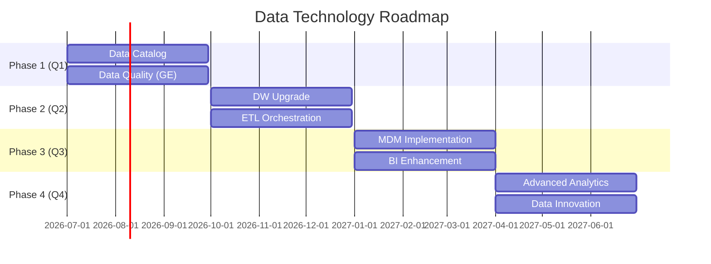

# Data Technology Roadmap

> **Project:** [Project Name]
> **Version:** [X.Y] | **Status:** [Draft | Under Review | Approved]
> **Last Updated:** [YYYY-MM-DD]

---

## 1. Purpose

> Plans data technology evolution — what tools and platforms to adopt, upgrade, or retire.

## 2. Current State

| Category | Current Tool | Version | Status | Issues |
|---------|-------------|---------|--------|--------|
| [OLTP Database] | [PostgreSQL] | [16] | ✅ Good | [None] |
| [Cache] | [Redis] | [7] | ✅ Good | [None] |
| [Search] | [Elasticsearch] | [8] | ✅ Good | [None] |
| [Message Queue] | [RabbitMQ] | [3.12] | ✅ Good | [None] |
| [Data Warehouse] | [PostgreSQL] | [16] | 🟡 Adequate | [Limited analytics] |
| [ETL] | [dbt + custom] | [—] | 🟡 Adequate | [Manual orchestration] |
| [BI Tool] | [Metabase] | [—] | 🟡 Adequate | [Limited features] |
| [Data Catalog] | [None] | [—] | 🔴 Gap] | [No catalog] |
| [Data Quality] | [Custom] | [—] | 🟡 Adequate | [Manual checks] |
| [MDM] | [None] | [—] | 🔴 Gap] | [No MDM] |

## 3. Target State

| Category | Target Tool | Rationale | Priority |
|---------|------------|----------|---------|
| [OLTP Database] | [PostgreSQL 17] | [Latest features, performance] | 🟡 Medium |
| [Data Warehouse] | [DuckDB / ClickHouse] | [Analytics performance] | 🟡 Medium |
| [ETL] | [dbt + Airflow] | [Orchestration, scheduling] | 🟡 Medium |
| [BI Tool] | [Metabase / Superset] | [Self-service analytics] | 🟢 Low |
| [Data Catalog] | [DataHub / OpenMetadata] | [Discovery, governance] | 🔴 High |
| [Data Quality] | [Great Expectations] | [Automated quality] | 🔴 High |
| [MDM] | [Custom solution] | [Golden records] | 🟡 Medium |

## 4. Technology Roadmap

## 5. Technology Decisions

| Decision | Options | Choice | Rationale |
|---------|---------|--------|----------|
| [Data Catalog] | [DataHub, OpenMetadata, Amundsen] | [DataHub] | [Active community, LinkedIn backing] |
| [Data Quality] | [Great Expectations, dbt tests, Deequ] | [Great Expectations] | [Python-native, active community] |
| [DW Analytics] | [DuckDB, ClickHouse, BigQuery] | [DuckDB] | [Embedded, fast, no infra] |
| [ETL Orchestration] | [Airflow, Prefect, Dagster] | [Airflow] | [Mature, widely adopted] |

## 6. Investment

| Phase | Investment | Timeline | Expected Benefit |
|-------|-----------|---------|-----------------|
| [Phase 1] | [$X] | [Q1] | [Discovery, quality automation] |
| [Phase 2] | [$X] | [Q2] | [Analytics performance] |
| [Phase 3] | [$X] | [Q3] | [Master data, self-service BI] |
| [Phase 4] | [$X] | [Q4] | [Advanced analytics, innovation] |
| **Total** | **[$X]** | **[12 months]** | |

---

## Related Documents

| Document | Relationship |
|----------|-------------|
| [[Data-Management-Maturity-Assessment]] | Maturity baseline |
| [[Data-Architecture-Blueprint]] | Architecture context |
| [[Data-Governance-Strategy]] | Strategy alignment |

---

> **Template Standard:** Based on DMBOK v2
> **Usage:** Technology evolves. Plan for it. Don't let tech debt accumulate. Review roadmap quarterly.
