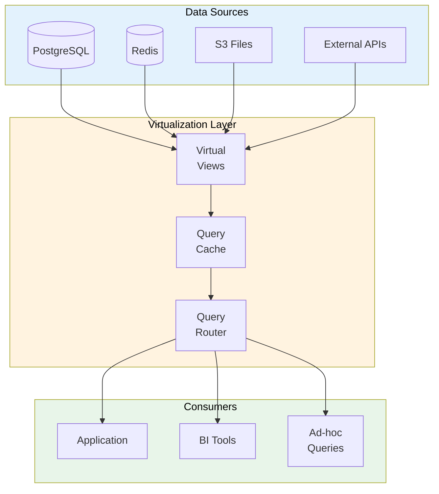

# Data Virtualization Specification

> **Project:** [Project Name]
> **Version:** [X.Y] | **Status:** [Draft | Under Review | Approved]
> **Last Updated:** [YYYY-MM-DD]

---

## 1. Purpose

> Defines data virtualization strategy — providing unified access to data across multiple sources without physical movement.

## 2. Data Virtualization Architecture

## 3. Virtual Views

| View | Sources | Purpose | Caching |
|------|---------|---------|--------|
| [vw_customer_360] | [customers + requests + transactions] | [Complete customer view] | [5 min] |
| [vw_request_details] | [requests + categories + statuses] | [Request with context] | [1 min] |
| [vw_staff_workload] | [requests + staff] | [Staff performance] | [5 min] |
| [vw_financial_summary] | [transactions + requests] | [Financial overview] | [15 min] |

## 4. Query Routing

| Query Type | Source | Cache | Latency |
|-----------|--------|-------|---------|
| [Real-time data] | [PostgreSQL] | [None] | [< 100ms] |
| [Recent data (< 1h)] | [Redis cache] | [1 min] | [< 10ms] |
| [Historical data] | [Data Warehouse] | [15 min] | [< 1s] |
| [External data] | [External APIs] | [15 min] | [< 5s] |

## 5. Benefits

| Benefit | Description | Value |
|---------|-----------|-------|
| [No data movement] | [Query data where it lives] | [Reduced ETL] |
| [Real-time access] | [Always current data] | [Better decisions] |
| [Unified view] | [Single interface for all data] | [Simpler queries] |
| [Reduced complexity] | [No ETL pipelines for every query] | [Lower maintenance] |

## 6. Limitations

| Limitation | Impact | Mitigation |
|-----------|--------|-----------|
| [Performance] | [Complex queries slow] | [Caching, materialized views] |
| [Source availability] | [Down if source is down] | [Fallback to cache] |
| [Write operations] | [Read-only by design] | [Direct writes to source] |

---

## Related Documents

| Document | Relationship |
|----------|-------------|
| [[Data-Integration-Architecture]] | Integration context |
| [[Data-Architecture-Blueprint]] | Architecture context |
| [[ETL-ELT-Specification]] | ETL alternative |

---

> **Template Standard:** Based on DMBOK v2
> **Usage:** Virtualization is *not* a replacement for a DW. Use for real-time unified access, not heavy analytics.
