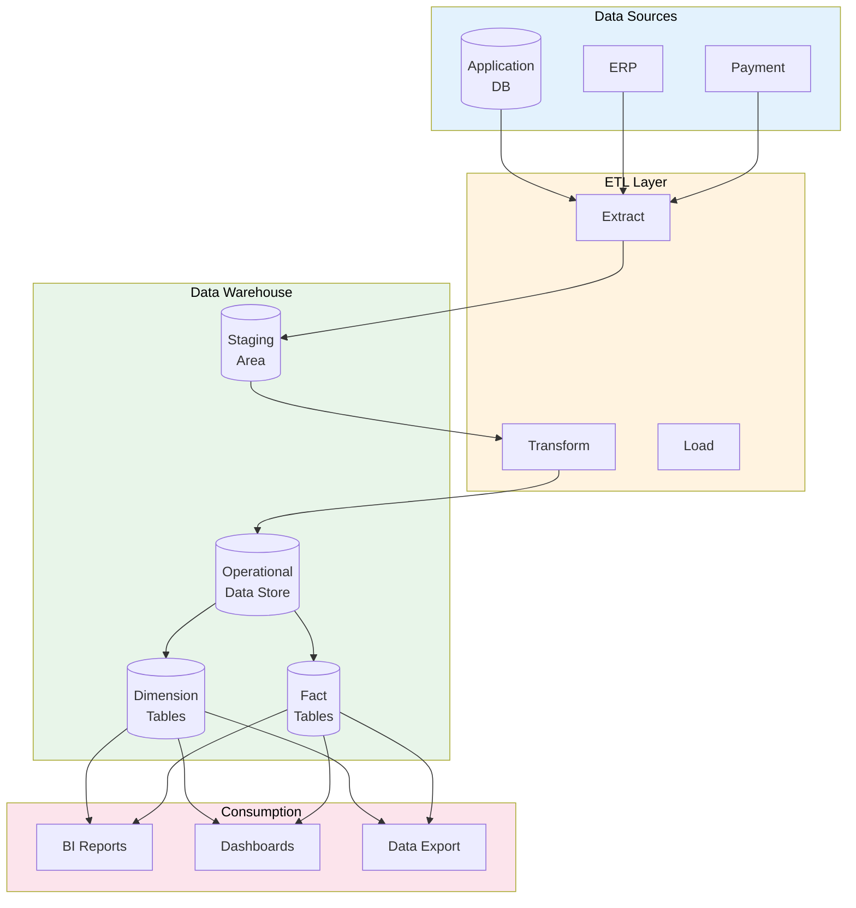

# Data Warehouse Architecture

> **Project:** [Project Name]
> **Version:** [X.Y] | **Status:** [Draft | Under Review | Approved]
> **Last Updated:** [YYYY-MM-DD]

---

## 1. Purpose

> Defines the data warehouse architecture — how data is extracted, transformed, stored, and consumed for analytics.

## 2. DW Architecture

## 3. DW Layers

| Layer | Purpose | Storage | Retention |
|-------|---------|--------|----------|
| [Staging] | [Raw data from sources] | [Temporary] | [7 days] |
| [ODS] | [Cleaned, integrated data] | [Persistent] | [1 year] |
| [Dimension] | [Reference/lookup data] | [Persistent] | [Indefinite] |
| [Fact] | [Transactional measures] | [Persistent] | [5 years] |
| [Data Mart] | [Department-specific views] | [Persistent] | [3 years] |

## 4. Schema Design

| Schema | Type | Purpose | Tables |
|--------|------|---------|--------|
| [staging] | [Transient] | [Raw data landing] | [stg_*] |
| [ods] | [Persistent] | [Cleaned data] | [ods_*] |
| [dim] | [Persistent] | [Dimensions] | [dim_*] |
| [fact] | [Persistent] | [Facts] | [fact_*] |
| [mart] | [Persistent] | [Department views] | [mart_*] |

## 5. ETL Schedule

| Pipeline | Source | Target | Frequency | Duration |
|---------|--------|--------|----------|---------|
| [Customer sync] | [Application DB] | [dim_customer] | [Nightly 02:00] | [15 min] |
| [Request sync] | [Application DB] | [fact_requests] | [Nightly 02:30] | [30 min] |
| [Transaction sync] | [Application DB] | [fact_transactions] | [Nightly 03:00] | [30 min] |
| [ERP sync] | [ERP API] | [dim_product] | [Nightly 03:30] | [15 min] |

## 6. Data Quality in DW

| Check | Layer | Rule | Action on Fail |
|-------|-------|------|---------------|
| [Null check] | [Staging] | [No nulls in required fields] | [Quarantine] |
| [Referential check] | [ODS] | [FK references exist] | [Quarantine] |
| [Duplicate check] | [Dimension] | [No duplicate keys] | [Merge] |
| [Range check] | [Fact] | [Amounts within range] | [Flag] |

## 7. BI & Reporting

| Report | Audience | Data Source | Refresh |
|--------|---------|-----------|--------|
| [Executive Dashboard] | [Management] | [fact_requests, dim_*] | [Daily] |
| [Operational Report] | [Operations] | [fact_requests] | [Hourly] |
| [Financial Report] | [Finance] | [fact_transactions] | [Daily] |
| [Customer Analytics] | [Marketing] | [fact_requests, dim_customer] | [Weekly] |

---

## Related Documents

| Document | Relationship |
|----------|-------------|
| [[Dimensional-Model]] | Star schema |
| [[ETL-ELT-Specification]] | ETL pipelines |
| [[BI-Semantic-Layer-Definition]] | BI layer |

---

> **Template Standard:** Based on DMBOK v2
> **Usage:** The DW is the *single source of truth for analytics*. Don't report from operational databases — use the DW.
