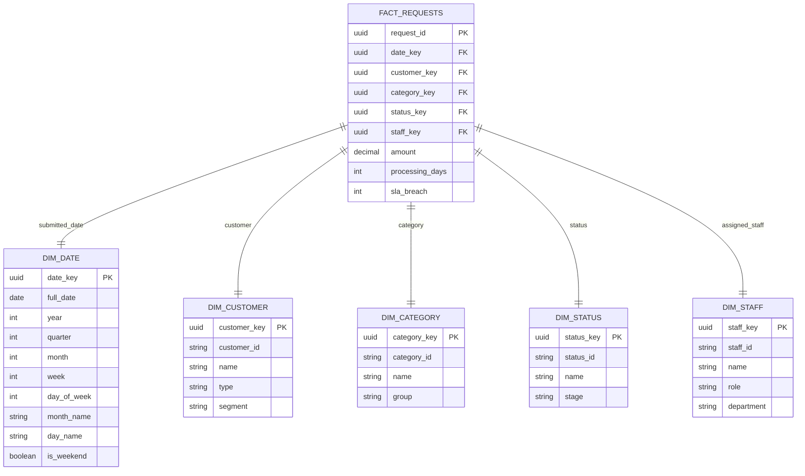

# Dimensional Model (Star/Snowflake)

> **Project:** [Project Name]
> **Version:** [X.Y] | **Status:** [Draft | Under Review | Approved]
> **Last Updated:** [YYYY-MM-DD]

---

## 1. Purpose

> Defines the dimensional model for analytics and reporting — fact tables and dimension tables optimized for queries.

## 2. Star Schema



## 3. Fact Table

### fact_requests

| Column | Type | Description | Aggregation |
|--------|------|-----------|------------|
| [request_id] | [UUID] | [Degenerate dimension] | — |
| [date_key] | [UUID] | [FK → dim_date] | — |
| [customer_key] | [UUID] | [FK → dim_customer] | — |
| [category_key] | [UUID] | [FK → dim_category] | — |
| [status_key] | [UUID] | [FK → dim_status] | — |
| [staff_key] | [UUID] | [FK → dim_staff] | — |
| [amount] | [DECIMAL] | [Request amount] | [SUM, AVG] |
| [processing_days] | [INT] | [Days to complete] | [AVG] |
| [sla_breach] | [INT] | [1 if SLA breached] | [SUM, COUNT] |

**Grain:** One row per request.

## 4. Dimension Tables

### dim_date

| Column | Type | Description |
|--------|------|-----------|
| [date_key] | [UUID] | [Primary key] |
| [full_date] | [DATE] | [Calendar date] |
| [year] | [INT] | [Year (2026)] |
| [quarter] | [INT] | [Quarter (1-4)] |
| [month] | [INT] | [Month (1-12)] |
| [week] | [INT] | [ISO week number] |
| [day_of_week] | [INT] | [Day (1=Mon, 7=Sun)] |
| [month_name] | [VARCHAR] | [January, February, ...] |
| [day_name] | [VARCHAR] | [Monday, Tuesday, ...] |
| [is_weekend] | [BOOLEAN] | [True if Sat/Sun] |

### dim_customer

| Column | Type | Description |
|--------|------|-----------|
| [customer_key] | [UUID] | [Surrogate key] |
| [customer_id] | [VARCHAR] | [Business key] |
| [name] | [VARCHAR] | [Customer name] |
| [type] | [VARCHAR] | [Customer type] |
| [segment] | [VARCHAR] | [Customer segment] |

## 5. Sample Queries

```sql
-- Requests by month and category
SELECT
    d.month_name,
    c.name AS category,
    COUNT(*) AS request_count,
    SUM(f.amount) AS total_amount,
    AVG(f.processing_days) AS avg_processing_days
FROM fact_requests f
JOIN dim_date d ON f.date_key = d.date_key
JOIN dim_category c ON f.category_key = c.category_key
WHERE d.year = 2026
GROUP BY d.month_name, c.name
ORDER BY d.month, total_amount DESC;

-- SLA breach rate by staff
SELECT
    s.name AS staff,
    COUNT(*) AS total_requests,
    SUM(f.sla_breach) AS breaches,
    ROUND(SUM(f.sla_breach)::NUMERIC / COUNT(*) * 100, 2) AS breach_rate
FROM fact_requests f
JOIN dim_staff s ON f.staff_key = s.staff_key
GROUP BY s.name
ORDER BY breach_rate DESC;
```

## 6. ETL Process

| Step | Source | Target | Transformation |
|------|--------|--------|---------------|
| 1 | [requests] | [dim_date] | [Generate date records] |
| 2 | [customers] | [dim_customer] | [SCD Type 2] |
| 3 | [categories] | [dim_category] | [Direct mapping] |
| 4 | [requests] | [fact_requests] | [Calculate measures] |

---

## Related Documents

| Document | Relationship |
|----------|-------------|
| [[Physical-Data-Model-PDM]] | Source model |
| [[Data-Warehouse-Architecture]] | DW architecture |
| [[ETL-ELT-Specification]] | ETL process |

---

> **Template Standard:** Based on DMBOK v2
> **Usage:** Dimensional models are *query-optimized*. Star schema for simplicity, snowflake for storage efficiency.
