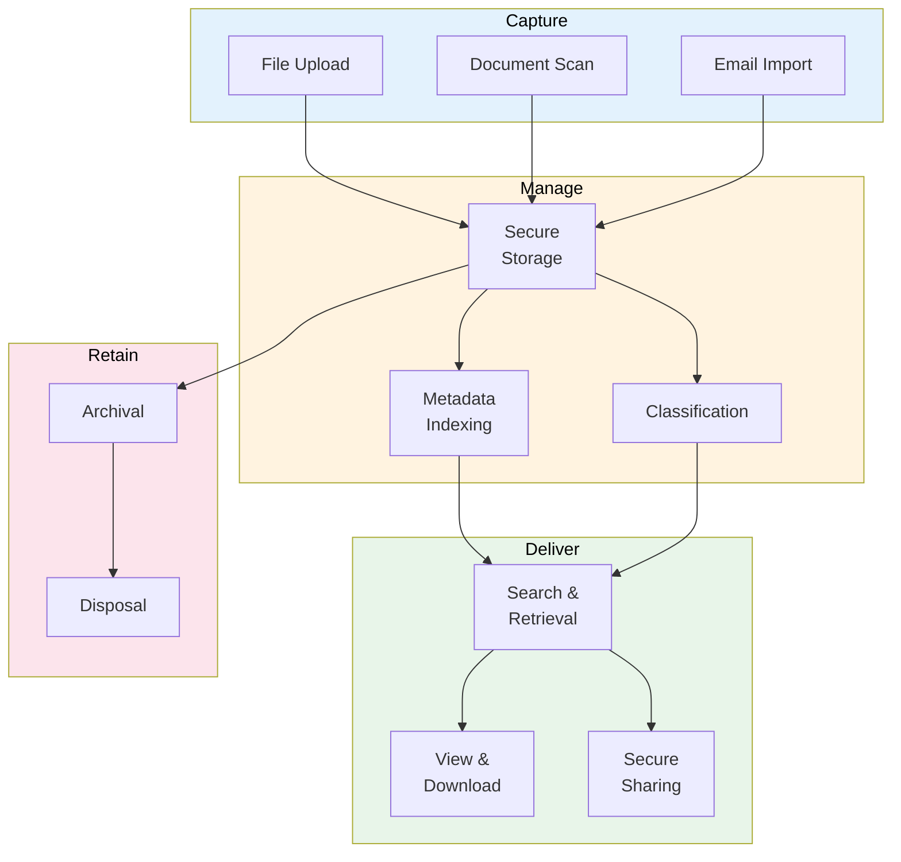

# ECM Strategy (Enterprise Content Management)

> **Project:** [Project Name]
> **Version:** [X.Y] | **Status:** [Draft | Under Review | Approved]
> **Last Updated:** [YYYY-MM-DD]

---

## 1. Purpose

> Defines strategy for managing unstructured content — documents, files, images, and records.

## 2. Content Types

| Content Type | Volume | Storage | Retention | Classification |
|-------------|--------|--------|----------|---------------|
| [Customer documents] | [X files/month] | [S3] | [7 years] | 🔴 L1 |
| [Request attachments] | [X files/month] | [S3] | [7 years] | 🟡 L2 |
| [Internal documents] | [X files/month] | [S3] | [3 years] | 🟢 L3 |
| [Emails] | [X/day] | [Email server] | [3 years] | 🟡 L2 |
| [Reports] | [X/month] | [S3] | [5 years] | 🟡 L2 |

## 3. ECM Architecture

## 4. Content Management Rules

| Rule | Implementation |
|------|---------------|
| [All content classified] | [Auto-classification + manual review] |
| [Metadata required] | [Mandatory metadata fields] |
| [Version control] | [All versions retained] |
| [Access control] | [Based on classification] |
| [Encryption] | [At rest + in transit] |
| [Audit trail] | [All access logged] |

## 5. Content Lifecycle

| Phase | Duration | Action | Owner |
|-------|---------|--------|-------|
| [Active] | [During use] | [Store, index, protect] | [Data Steward] |
| [Archive] | [After active period] | [Move to archive storage] | [Automated] |
| [Dispose] | [After retention period] | [Secure deletion] | [Automated] |

## 6. Storage Strategy

| Tier | Storage | Cost | Use Case |
|------|---------|------|---------|
| [Hot] | [S3 Standard] | [$$] | [Active content, < 1 year] |
| [Warm] | [S3 Standard-IA] | [$] | [Archive, 1-3 years] |
| [Cold] | [S3 Glacier] | [¢] | [Long-term archive, 3-7 years] |
| [Delete] | [Secure deletion] | [Free] | [After retention period] |

---

## Related Documents

| Document | Relationship |
|----------|-------------|
| [[Data-Retention-Archival-Policy]] | Retention rules |
| [[Data-Classification-Schema]] | Classification |
| [[Content-Classification-Taxonomy]] | Content taxonomy |

---

> **Template Standard:** Based on DMBOK v2
> **Usage:** ECM is about *managing unstructured content*. If you can't find it, classify it, or dispose of it, you have a problem.
