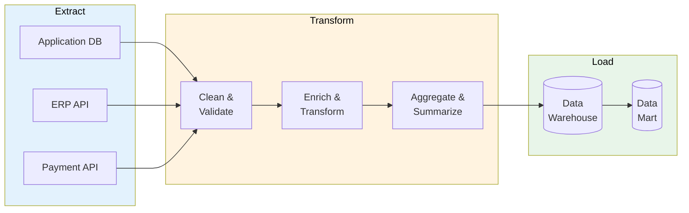

# ETL/ELT Specification

> **Project:** [Project Name]
> **Version:** [X.Y] | **Status:** [Draft | Under Review | Approved]
> **Last Updated:** [YYYY-MM-DD]

---

## 1. Purpose

> Defines Extract, Transform, Load (ETL) and Extract, Load, Transform (ELT) pipelines — moving and transforming data between systems.

## 2. Pipeline Architecture

## 3. Pipeline Definitions

### Pipeline 1: Customer Data Sync

| Field | Detail |
|-------|--------|
| [Source] | [Application DB — customers table] |
| [Target] | [Data Warehouse — dim_customer] |
| [Frequency] | [Nightly at 02:00] |
| [Method] | [ELT — extract, load raw, transform in DW] |
| [Incremental] | [Yes — based on updated_at] |

### Pipeline 2: Request Data Sync

| Field | Detail |
|-------|--------|
| [Source] | [Application DB — requests table] |
| [Target] | [Data Warehouse — fact_requests] |
| [Frequency] | [Nightly at 02:30] |
| [Method] | [ELT] |
| [Incremental] | [Yes — based on updated_at] |

### Pipeline 3: ERP Data Import

| Field | Detail |
|-------|--------|
| [Source] | [ERP API] |
| [Target] | [Application DB] |
| [Frequency] | [Nightly at 03:00] |
| [Method] | [ETL — extract, transform, load] |
| [Incremental] | [Yes — based on last_sync timestamp] |

## 4. Transformation Rules

| # | Transformation | Input | Output | Rule |
|---|---------------|-------|--------|------|
| 1 | [Phone normalization] | [Raw phone] | [E.164 format] | [Strip non-digits, add country code] |
| 2 | [Email lowercase] | [Raw email] | [Lowercase email] | [tolower()] |
| 3 | [Date standardization] | [Various formats] | [ISO 8601] | [Parse and format] |
| 4 | [Currency conversion] | [Local currency] | [USD] | [Apply exchange rate] |
| 5 | [Customer dedup] | [Multiple records] | [Single record] | [Match on email, merge] |

## 5. Data Quality Checks

| Check | Pipeline | Rule | Action on Fail |
|-------|---------|------|---------------|
| [Null check] | [All] | [No nulls in required fields] | [Quarantine record] |
| [Format check] | [Customer] | [Valid email format] | [Quarantine record] |
| [Range check] | [Request] | [Amount > 0] | [Quarantine record] |
| [Referential check] | [Request] | [Customer exists] | [Quarantine record] |
| [Duplicate check] | [Customer] | [No duplicate emails] | [Merge records] |

## 6. Error Handling

| Error | Handling | Notification |
|-------|---------|-------------|
| [Connection failure] | [Retry 3x with backoff] | [Slack alert] |
| [Data quality failure] | [Quarantine + log] | [Daily summary] |
| [Transformation failure] | [Log + skip record] | [Daily summary] |
| [Pipeline failure] | [Alert + manual intervention] | [PagerDuty] |

## 7. Monitoring

| Metric | Threshold | Alert |
|--------|----------|-------|
| [Pipeline duration] | [< 30 min] | [Slack if > 60 min] |
| [Records processed] | [± 20% of avg] | [Slack] |
| [Error rate] | [< 1%] | [Slack if > 5%] |
| [Data freshness] | [< 24 hours] | [PagerDuty if > 24h] |

---

## Related Documents

| Document | Relationship |
|----------|-------------|
| [[Data-Integration-Architecture]] | Architecture context |
| [[Data-Flow-Diagram]] | Data flow details |
| [[Data-Quality-Rules]] | Quality checks |

---

> **Template Standard:** Based on DMBOK v2
> **Usage:** ETL/ELT is the *data plumbing*. If the pipeline breaks, downstream systems starve. Monitor everything.
