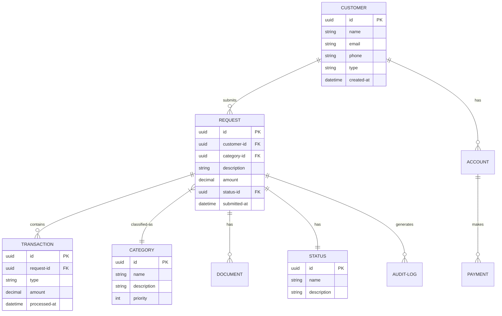

# Enterprise Data Model (EDM)

> **Project:** [Project Name]
> **Version:** [X.Y] | **Status:** [Draft | Under Review | Approved]
> **Last Updated:** [YYYY-MM-DD]

---

## 1. Purpose

> High-level, enterprise-wide view of data entities and their relationships — the blueprint for all data structures.

## 2. Enterprise Data Model

## 3. Entity Summary

| Entity | Description | Domain | Owner | Classification |
|--------|-----------|--------|-------|---------------|
| [Customer] | [Individual or organization submitting requests] | [Customer] | [Customer Steward] | 🔴 Restricted |
| [Request] | [Formal submission for service or action] | [Operations] | [Operations Steward] | 🟡 Confidential |
| [Transaction] | [Financial or operational transaction] | [Financial] | [Financial Steward] | 🔴 Restricted |
| [Category] | [Classification of requests] | [Reference] | [Reference Steward] | 🟢 Internal |
| [Document] | [Attached files and documents] | [Operations] | [Operations Steward] | 🟡 Confidential |
| [Account] | [Customer account information] | [Customer] | [Customer Steward] | 🔴 Restricted |
| [Payment] | [Payment transactions] | [Financial] | [Financial Steward] | 🔴 Restricted |
| [Status] | [Lifecycle states] | [Reference] | [Reference Steward] | 🟢 Internal |
| [Audit-Log] | [System action records] | [System] | [System Steward] | 🟡 Confidential |

## 4. Business Rules

| # | Rule | Entities Affected |
|---|------|------------------|
| 1 | [Every request must have a customer] | [Request, Customer] |
| 2 | [Every request must have a status] | [Request, Status] |
| 3 | [Transactions link to requests] | [Transaction, Request] |
| 4 | [Documents link to requests] | [Document, Request] |
| 5 | [Payments link to accounts] | [Payment, Account] |

## 5. Model Governance

| Rule | Description |
|------|-----------|
| [Review frequency] | [Quarterly] |
| [Change process] | [Data Architecture Review Board] |
| [Version control] | [Git repository] |
| [Documentation] | [Data catalog + glossary] |

---

## Related Documents

| Document | Relationship |
|----------|-------------|
| [[Data-Architecture-Blueprint]] | Architecture context |
| [[Logical-Data-Model-LDM]] | Logical implementation |
| [[Physical-Data-Model-PDM]] | Physical implementation |
| [[Business-Glossary]] | Term definitions |

---

> **Template Standard:** Based on DMBOK v2
> **Usage:** The EDM is the *master blueprint*. All physical data models derive from it. Changes to the EDM affect everything.
